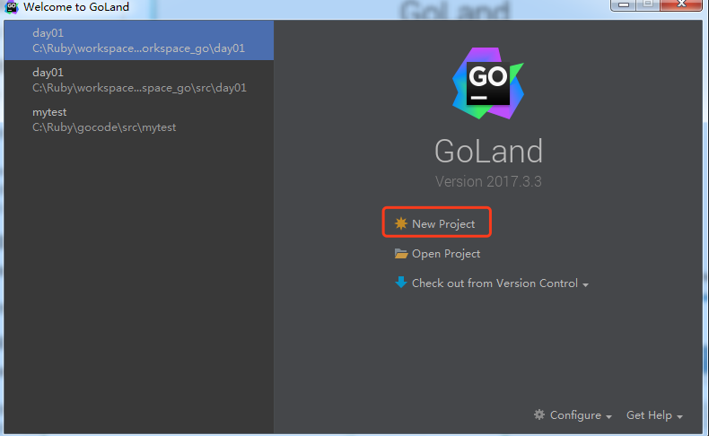
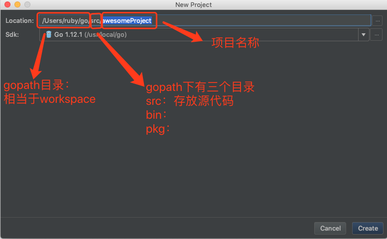
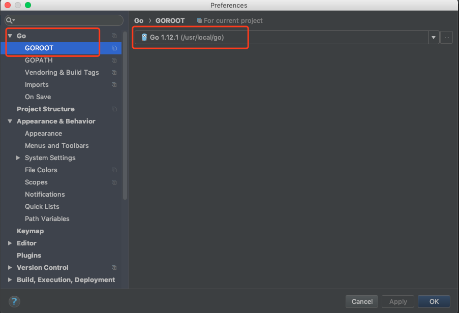
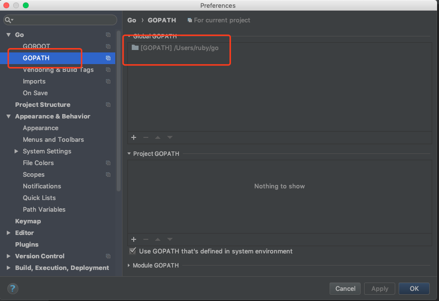
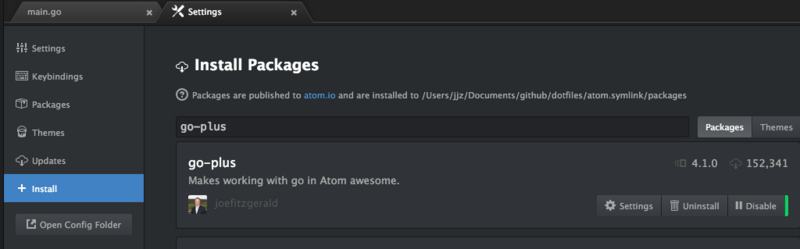
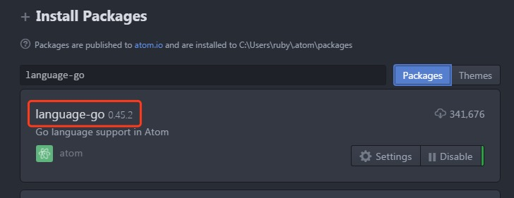
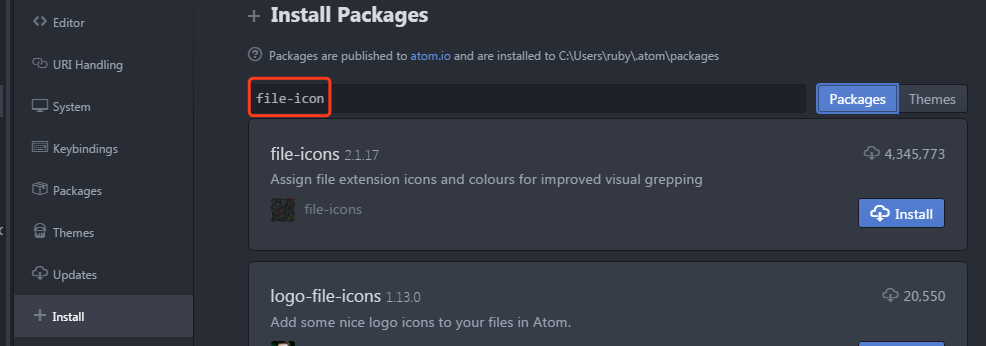
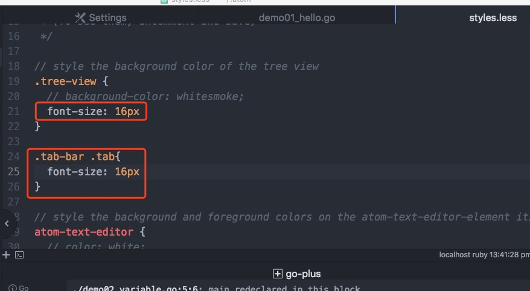

# Install Goland development tools

> @author：Han Ru
> Copyright: Beijing Qianfeng Internet Technology Co., Ltd.

development tools:

Text editors: notepad, notepad, sublime text, atom. . .

​ Execute the program by command

IED: integrated development environment (integrated development environment)

​ goland


## 1.1 Using Goland

Goland is the Go language IDE launched by JetBrains. It is a powerful and easy-to-use product.

download link:
   
    

For Mac and Windows, there are direct installation files, after double-clicking directly, the fool-like installation, all the way to next, until it is completed.


Open Goland tool, goland activation code: http://idea.iblue.me


New Go project:




Create project:




Goland configuration goroot:




Configure gopath:




```
Goland commonly used shortcut keys
File related shortcuts:

CTRL+E, open the recently browsed file.
CTRL+SHIFT+E, open the recently changed file.
CTRL+N, you can quickly open the struct structure.
CTRL+SHIFT+N, you can quickly open the file.
Code formatting:

CTRL+ALT+T, you can wrap the code in a block, such as if{...}else{...}.
CTRL+ALT+L, format the code.
CTRL+Space, code prompt.
CTRL+/, single-line comment. CTRL+SHIFT+/, make multi-line comments.
CTRL+B, quickly open the structure or method at the cursor (jump to the definition).
CTRL+"+/-", you can expand or collapse the current method.
Find and locate
CTRL+R, replace text.
CTRL+F, search for text.
CTRL+SHIFT+F, perform a global search.
CTRL+G, quickly locate a certain line.
Code edit

ALT+Q, you can see the declaration of the current method.
CTRL+Backspace, delete by word.
SHIFT+ENTER, you can insert a new line down, even if the cursor is in the middle of the current line.
CTRL+X, delete the line where the current cursor is located.
CTRL+D, copy the line where the current cursor is located.
ALT+SHIFT+UP/DOWN can move the code of the line where the cursor is up and down.
CTRL+SHIFT+U, you can convert the selected content to case.


```


**Install GoLand tool under Ubuntu**

First download the GoLand software to the download folder. Then enter the following command in the terminal:

```shell
ruby@ubuntu:~/download$ sudo tar -xzf goland-2017.3.3.tar.gz -C /opt
```

Enter the bin directory and execute the following command:

```shell
ruby@ubuntu:/opt/GoLand-2017.3.3/bin$ sh goland.sh
```


## 1.2 Using atom

Install the atom tool, and then install the go-plus plug-in and atom-terminal-panel and other plug-ins.

1. Install the go-plus plugin. This plugin provides support for almost all go language development in Atom, including tools, build flows, linters, vet and coverage tools. It also contains many code snippets and some other features.




2.language-go




3. Install the file-icon plug-in, which provides a large number of icon displays for files with different suffixes.




4. Set font size, etc.




## 1.3 Other development tools

Such as sublime text, editplus, notpad++, eclipse and so on. .


Qianfeng Go language learning group: 784190273

Corresponding video address:

https://www.bilibili.com/video/av56018934

https://www.bilibili.com/video/av47467197

Source code:

https://github.com/rubyhan1314/go_foundation


# 
   

