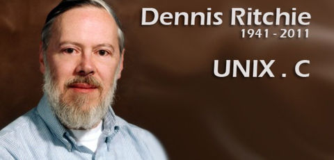
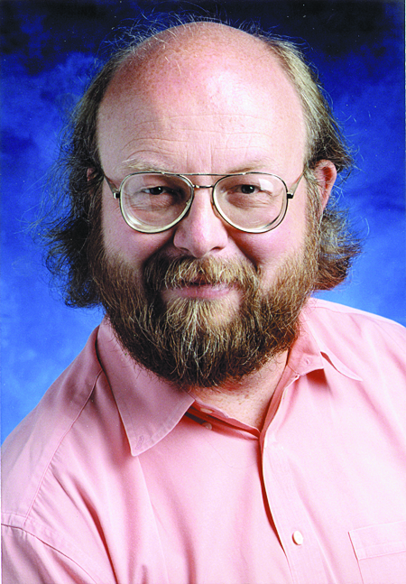

# A brief history of the development of well-known programming languages ​​or systems

> @author：Han Ru
> Copyright: Beijing Qianfeng Internet Technology Co., Ltd.

## One, B language

Father of B language: Ken Thompson (Ken Thompson). B language is a universal programming language developed by Bell Labs. It was designed by Ken Thompson around 1969 with the support of Dennis Ritchie Dennis Ritchie. The language is named after Thomson's wife Bonnie. It was a language developed in the mid-1960s, and now there are very few users.

## Two, C language

The father of the C language: Dennis Ritchie (Dennis Ritchie). Famous American computer expert, inventor of C language, father of UNIX. The C language and Unix operating system were invented during 1969-1973.

In the 1970s, a very important language was born, which is today's famous C language. The father of the C language is a well-known computer expert in the United States. Dennis Leach.
When the C language was developed, it was actually based on the B language. The reason why the C language was invented was actually because these two people, Ken Thompson and Dennis Rich, the father of the B language just now, wrote an operating system together, which is the Unix system. In the process of writing a Unix system, a convenient language was needed, and the B language could not meet this requirement, so Dennis Ritchie transformed the B language and invented the C language. At present, C language is one of the most commonly used programming languages ​​in the world. Since being replaced by C language, B language has almost been abandoned.

## Three, Unix system

Father of Unix: Dennis Ritchie and Ken Thompson

When it comes to the C language, I have to talk about the Unix system. The father of Unix is ​​naturally these two people, and the one on the left is Ken Thomson, the father of the B language. On the right is Dennis Rich, the father of the C language. What's interesting is that Ken Thompson's original intention of developing Unix was to run a computer game he wrote, Space Travel, which simulates the movement of celestial bodies in the solar system. Players drive a spacecraft, watch the scenery and try to land on various planets and moons. He experimented on multiple systems, but the results were not very satisfactory, so he decided to develop his own operating system. In this way, Unix was born. The prefix Uni in English means small, small and clever. This is the original intention of Unix, and this concept has been influential to this day.
Because the two of them invented the Unix operating system around 1973, they won the Turing Award in 1983. This award is equivalent to the Nobel Prize in the IT industry.

## Four, C++ language

Father of C++: Bjarne Stroustrup. In 1982, Dr. Bjarne Stroustrup of Bell Labs in the United States introduced and expanded the object-oriented concept on the basis of the C language, and invented a new programming language. In order to express the relationship between the language and the c language, it was named C++.

## Five, Python language

Father of Python: Guido van Rossum. In 1989, in order to pass the Christmas holiday, Guido began to write a compiler/interpreter for the Python language. Version 1.0 was released in 1994. Python 3.5 was released in September 1995.

The philosophy of the python language is: life is short, I use python. Guido praises simplicity, generosity, beauty, and refinement. Guido has always believed that python is an excellent language. In fact, python can indeed be used in various industries, whether it is web development, server-side maintenance, crawlers, etc., but it has not done it in every direction. The most refined, so it hasn't been reflected in some places. But Guido has always believed that the aroma of wine is not afraid of deep alleys, so there is no vigorous publicity. But in recent years, artificial intelligence has also become well-known to the public.

## Six, Java language

The father of Java is James Gosling (James Gosling). Developed Oak in 1991 and changed its name to Java in 1994. It was officially released in May 1995.

In fact, python came into being a bit earlier than java. The emergence of java was the time when the Internet was vigorously rising, and because of the language characteristics, java has a great advantage on the Internet, and its release was extremely popular at the beginning, which obscured the momentum of python. The original model of java was developed in 1991 by his founder James Gosling. At that time, it was also called Oak Oak. Later, James hoped that using the Java language would be as easy and enjoyable as drinking coffee. Renamed to java.

## Seven, JavaScript language

The father of Javascript is Brendan Eich. JavaScript is a scripting language that runs on the browser side. This language was released by Netscape in 1995. At that time, Netscape was mainly working on the browser side. They wanted to apply the Java language on the browser side to achieve some tasks such as user login and verification. A new employee was recruited, named Brandon Eich. Brandon had no interest in java. In order to cope with the company's tasks, he designed the JavaScript language in only 10 days. But JavaScript has been developed so far, and with the extremely popular front-end development, it has become the leading language on the browser side.

8. Golang: The three authors of Go are: Rob Pike, Ken Thompson and Robert Griesemer

All pictures in this article are from the Internet, invaded

Qianfeng Go language learning group: 784190273

Corresponding video address:

https://www.bilibili.com/video/av47467197

https://www.bilibili.com/video/av56018934/

Source code:

https://github.com/rubyhan1314/go_foundation

