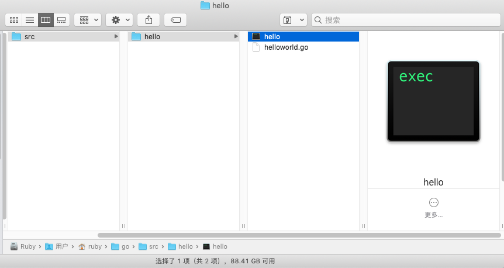
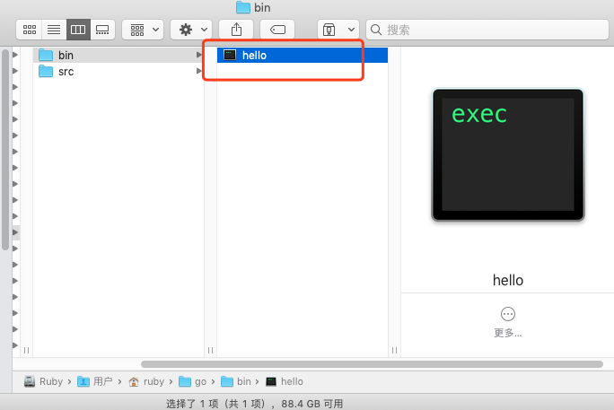
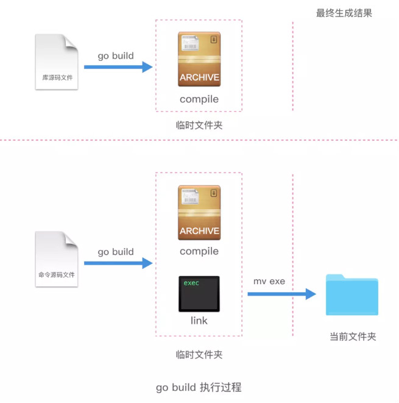
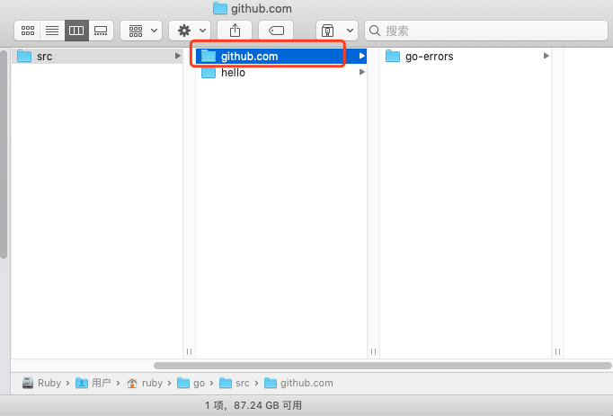

# Go's execution principle and Go's commands

> @author：Han Ru
> Copyright: Beijing Qianfeng Internet Technology Co., Ltd.

## One, Go source code file

 Go source file classification:


As shown in the figure above, it is divided into three categories:

**1. Command source code file: **

Declare that you belong to the main code package and include the main function with no parameter declaration and result declaration.

After the command source file is installed, if GOPATH has only one workspace, the corresponding executable file will be stored in the bin folder of the current workspace; if there are multiple workspaces, it will be installed in the directory pointed to by GOBIN.

The command source file is the entry point of the Go program.

It is best not to put multiple command source code files in the same code package. Although multiple command source files can be run separately with go run, they cannot be run through go build and go install.


We first open the hello directory of the last lesson, then copy helloworld.go to the helloworld2.go file, and modify the content inside:

```go
package main
import "fmt"
func main(){
	fmt.Println("I am the second helloworld file")
	fmt.Print("Go Go Go !!!")
}
```

There are two go files in the hello directory, one is helloworld.go and the other is helloworld2.go. First of all, I have put two command source code files in the above folder, and both declare that they belong to the main code package.


Open the terminal and enter the hello directory, you can also see these two files:

```shell
localhost:~ ruby ​​cd go/src/hello
localhost:hello ruby ​​ls
helloworld.go helloworld2.go
```

Then we execute the go run command separately, and we can see that both go files can be executed:

```shell
localhost:hello ruby$ go run helloworld.go
HelloWorld
Go Go Go !!!localhost:hello ruby$ go run helloworld2.go
I am the second helloworld file
Go Go Go !!!
```


Next execute go build and go install to see what happens:

```shell
localhost:hello ruby$ go build 
# hello
./helloworld2.go:3:6: main redeclared in this block
	previous declaration at ./helloworld.go:3:6
localhost:hello ruby$ go install
# hello
./helloworld2.go:3:6: main redeclared in this block
	previous declaration at ./helloworld.go:3:6
localhost:hello ruby$ 
```

Running effect chart:


This also proves that although multiple command source files can be run separately by go run, they cannot be run through go build and go install.

In the same way, if the command source file and library source file also have this problem, the library source file cannot be compiled and installed by the conventional methods of go build and go install. The specific example is similar to the above, so the code will not be posted here.

So the command source file should be placed in a code package separately.

**2, library source code files**

Library source files are source files that do not have the above two characteristics of command source files. Ordinary source code files that exist in a certain code package.

After the library source file is installed, the corresponding archive file (.a file) will be stored in the platform-related directory of pkg in the current workspace.


**3. Test source code file**

A code file whose name is suffixed with _test.go, and must contain functions prefixed with the Test or Benchmark name:

```go
func TestXXX( t *testing.T) {

}
```

Functions whose names are prefixed with Test can only accept *testing.T parameters. Such test functions are functional test functions.

```go
func BenchmarkXXX( b *testing.B) {

}

```

Functions whose names are prefixed with Benchmark can only accept *testing.B parameters. This kind of test function is a performance test function.

Now the answer is obvious:

The command source file can be run separately. You can use the go run command to run directly, or you can use the go build or go install commands to get the corresponding executable file. So the command source file can be run in any directory of the machine.

Give a chestnut:

For example, we usually write algorithmic questions on LeetCode. At this time, we write a program. This is the command source code file. You can create a go file in any folder on the computer to start writing the questions. After writing it, you can run it. Compare After the execution result, the code can be submitted if the answer is correct.

But the code in the company project can't do this, it can only be stored in the GOPATH directory. Because a company project cannot have only command source code files, it must include library source code files and even test source code files.


## Two, Go commands

Currently there are 17 basic commands in the latest version of Go 1.12.

We can open the terminal and enter: go help to see these commands and introduction of Go.

```shell
	bug start a bug report
	build compile packages and dependencies
	clean remove object files and cached files
	doc show documentation for package or symbol
	env print Go environment information
	fix update packages to use new APIs
	fmt gofmt (reformat) package sources
	generate generate Go files by processing source
	get download and install packages and dependencies
	install compile and install packages and dependencies
	list list packages or modules
	mod module maintenance
	run compile and run Go program
	test test packages
	tool run specified go tool
	version print Go version
	vet report likely mistakes in packages
```


Among them, there are 4 build, get, install, and run related to compilation. Next, let's look at the functions of these four in turn.

Before analyzing these 4 commands in detail, let's list the common command flags. The following commands are applicable:

| Name | Description |
| ----- | ------------------------------------------- ----------------- |
| -a | Used to force all involved Go language code packages (including code packages in the Go language standard library) to be recompiled, even if they are already the latest. This mark gives us the opportunity to do some experiments by changing the underlying code package. |
| -n | Make the command only print all the commands used during its execution, without actually executing them. If you don't just want to view or verify the execution of the command, but don't want to change anything, it is just right. |
| -race | Used to detect and report data race problems in the specified Go language program. This is one of the most important detection methods when writing concurrent programs in Go language. |
| -v | Used to print the code package involved in the execution of the command. This must include the target code package we specify, and sometimes it also includes those code packages that the code package directly or indirectly depends on. This will let you know which code packages have been executed. |
| -work | Used to print the name of the temporary working directory generated and used when the command is executed, and it will not be deleted after the command is executed. The files in this directory may be useful to you, and you can also understand the execution process of the command from the side. If this flag is not added, the temporary working directory will be deleted before the command is executed. |
| -x | Causes the command to print all the commands used in its execution and execute them at the same time. |

### 1. go run

A command specifically used to run command source files. **Note, this command is not used to run all Go source files! **

The go run command can only accept one command source file and several library source files (must belong to the main package) as file parameters, and **cannot accept test source files**. It checks the type of source file when it is executed. If there are multiple or no command source files in the parameters, the go run command will only print an error message and exit, but will not continue execution.

What exactly did this command do? To analyze and analyze, we first create a new file: mytest.go, and add the following code:

```go
package main
import "fmt"
func main(){
	fmt.Println("HelloWorld")
	fmt.Println("Hello, Go!!!")
}
```


Execute go run with -n:

```shell
localhost:hello ruby$ go run -n mytest.go 

#
# command-line-arguments
#

mkdir -p $WORK/b001/
cat >$WORK/b001/importcfg <<'EOF' # internal
# import config
packagefile fmt=/usr/local/go/pkg/darwin_amd64/fmt.a
packagefile runtime=/usr/local/go/pkg/darwin_amd64/runtime.a
EOF
cd /Users/ruby/go/src/hello
/usr/local/go/pkg/tool/darwin_amd64/compile -o $WORK/b001/_pkg_.a -trimpath $WORK/b001 -p main -complete -buildid ieg41NOobNF0eqq3xgnP/ieg41NOobNF0eqq3xgnP -dwarf=false -goversion go1.12.1- D _/Users/ruby/go/src/hello -importcfg $WORK/b001/importcfg -pack -c=4 ./mytest.go
/usr/local/go/pkg/tool/darwin_amd64/buildid -w $WORK/b001/_pkg_.a # internal
cat >$WORK/b001/importcfg.link <<'EOF' # internal
... # omitted here
EOF
mkdir -p $WORK/b001/exe/
cd.
/usr/local/go/pkg/tool/darwin_amd64/link -o $WORK/b001/exe/mytest -importcfg $WORK/b001/importcfg.link -s -w -buildmode=exe -buildid=vpgT856LhbZPXp6WeHib/ieg41NOobNF0eqq3xgnP/ieg41NOobNF0eqq3xgnP/ieg41NOobNF0eqq3xgnP/ieg41NOobNF0 /vpgT856LhbZPXp6WeHib -extld=clang $WORK/b001/_pkg_.a
$WORK/b001/exe/mytest
localhost:hello ruby$ 

```

Running effect chart:


Here you can see that two temporary folders b001 and exe are created. The compile command is executed first, and then link is generated to generate the archive file .a and the final executable file. The final executable file is placed in the exe folder. The last step of the command is to execute the executable file.

Summarize the following figure:


For example, the generated temporary files can be seen with `go run -work`, for example, the currently generated temporary folder is the following path:

```shell
localhost:hello ruby$ go run -work mytest.go 
WORK=/var/folders/kt/nlhsnpgn6lgd_q16f8j83sbh0000gn/T/go-build593750496
HelloWorld
Hello, Go!!!
localhost:hello ruby$ 
```

We enter: `/var/folders/kt/nlhsnpgn6lgd_q16f8j83sbh0000gn/T/go-build593750496` directory, you can see the following directory structure:


As you can see, the final `go run` command generates 2 files, one is an archive file and the other is an executable file.

When the go run command is executed for the second time, if it is found that the imported code package has not changed, then go run will not compile the imported code package again. Directly link in statically.

```shell
localhost:hello ruby$ go run -n mytest.go 
mkdir -p $WORK/b001/
cat >$WORK/b001/importcfg.link <<'EOF' # internal
packagefile command-line-arguments=/Users/ruby/Library/Caches/go-build/6b/6b9577027c8da20b0ae6da790267f558b3b71eea1feb44039fb933b35eaef6f9-d
packagefile fmt=/usr/local/go/pkg/darwin_amd64/fmt.a
...
EOF
mkdir -p $WORK/b001/exe/
cd.
/usr/local/go/pkg/tool/darwin_amd64/link -o $WORK/b001/exe/mytest -importcfg $WORK/b001/importcfg.link -s -w -buildmode=exe -buildid=goiqf_1cemqljgOYzSRA/ieg41NOobNF0eqq3KxgnO/MV4bHd6 /goiqf_1cemqljgOYzSRA -extld=clang /Users/ruby/Library/Caches/go-build/6b/6b9577027c8da20b0ae6da790267f558b3b71eea1feb44039fb933b35eaef6f9-d
$WORK/b001/exe/mytest
localhost:hello ruby$ 

```


### 2. go build

The go build command is mainly used for test compilation. During the compilation of the package, if necessary, the associated package will be compiled at the same time.

1. If it is a normal package, when you execute the go build command, no files will be generated.
2. If it is the main package, when only the go build command is executed, an executable file will be generated in the current directory. If you need to generate the corresponding exe file in the $GOPATH/bin directory, you need to execute go install or use go build -o path/executable file.
3. If there are multiple files in a folder and you only want to compile one of them, you can add the file name after go build, for example, go build a.go; the go build command will compile the files in the current directory by default All go files.
4. You can also specify the file name of the compiled output. For example, we can specify go build -o executable file name, the default is your package name (not the main package), or the file name of the first source file (main package).
5. go build will ignore go files that start with "_" or "." in the directory.
6. If your source code needs different processing for different operating systems, then you can name the files according to different operating system suffixes.


When there is one and only one command source file in the code package, execute the go build command in the directory where the folder is located, and an executable file with the same name as the directory will be generated in the directory.

```shell
// Assuming the current folder name is hello
localhost:hello ruby$ pwd
/Users/ruby/go/src/hello
localhost:hello ruby$ ls
helloworld.go
localhost:hello ruby$ go build
localhost:hello ruby$ ls
hello helloworld.go
localhost:hello ruby$ 
```


So an executable file named after the current folder is directly generated in the current directory (Unix executable file under Mac platform, exe file under Windows platform)




But in this case, if you use the go install command, if there is only one workspace in GOPATH, the corresponding executable file will be generated in the bin directory of the current workspace. If there are multiple workspaces under GOPATH, the corresponding executable file is generated under GOBIN.

```shell
localhost:hello ruby$ go install
go install hello: open /usr/local/go/bin/hello: permission denied
localhost:hello ruby$ 
```


> This problem is because it needs to create a bin directory, and then put the executable file in it, and currently we do not have a bin directory under gopath, then we need to create this file first, and ordinary users do not create a folder directly Permission, this has nothing to do with Go language commands. We can add sodu to execute this command, which means to execute it as an administrator, and then enter the password, then the bin folder can be created.


Execute again:

```shell
localhost:hello ruby$ sudo go install
Password:
localhost:hello ruby$ 

```

After executing go install, you will find that the executable file is missing! Where did you go? In fact, it has been moved to the bin directory (if there are multiple workspaces under GOPATH, they will be placed in the GOBIN directory).

View catalog:




So what exactly do go build and go install do?

Let me talk about go build first. go build is used to compile the source files or code packages we specify and their dependent packages. But **note that if it is used to compile non-command source files, that is, library source files, go build will not produce any results after execution. In this case, the go build command only checks the validity of the library source files, it will only perform check compilation, and will not output any result files. **

Go build compiles the command source file, and an executable file is generated in the execution directory of the command. The above example also confirms this process.

If the directory path is not appended after go build, it will use the current directory as a code package and compile it. If the go build command is followed by the code package import path as a parameter, then the code package and its dependencies will be compiled.

What exactly does the go build command do? We can execute the -n command to view:

```shell
localhost:hello ruby$ go build -n

#
# hello
#

mkdir -p $WORK/b001/
cat >$WORK/b001/importcfg <<'EOF' # internal
# import config
packagefile fmt=/usr/local/go/pkg/darwin_amd64/fmt.a
packagefile runtime=/usr/local/go/pkg/darwin_amd64/runtime.a
EOF
cd /Users/ruby/go/src/hello
/usr/local/go/pkg/tool/darwin_amd64/compile -o $WORK/b001/_pkg_.a -trimpath $WORK/b001 -p main -complete -buildid PXDetO1R1NhLFMK5QGUc/PXDetO1R1NhLFMK5QGUc -go" go" version -1.12.1 -D " importcfg $WORK/b001/importcfg -pack -c=4 ./helloworld.go
/usr/local/go/pkg/tool/darwin_amd64/buildid -w $WORK/b001/_pkg_.a # internal
cat >$WORK/b001/importcfg.link <<'EOF' # internal
packagefile hello=$WORK/b001/_pkg_.a
...
EOF
mkdir -p $WORK/b001/exe/
cd.
/usr/local/go/pkg/tool/darwin_amd64/link -o $WORK/b001/exe/a.out -importcfg $WORK/b001/importcfg.link -buildmode=exe -buildid=diTh1q6kcbGRIX3aj3mU/PGUXDetO1R1NhLFMK5QdiKdiK1Q3GUhetFM -extld=clang $WORK/b001/_pkg_.a
/usr/local/go/pkg/tool/darwin_amd64/buildid -w $WORK/b001/exe/a.out # internal
mv $WORK/b001/exe/a.out hello
localhost:hello ruby$ 

```

As you can see, the execution process is roughly the same as go run. The only difference is that in the last step, go run executes the executable file, but the go build command just compiles the library source file and then moves the executable file to In the folder of the current directory.

Summarize the following figure:




at last:


### 3. go install

The go install command is used to compile and install code packages or source files.

The go install command is actually divided into two steps internally: the first step is to generate the result file (executable file or .a package), and the second step will move the compiled result to `$GOPATH/pkg` or ​` $GOPATH/bin`.

Executable file: Generally, it is generated by go install file with main function, which has function entry, all of which can be run directly.

.a application package: Generally, it is generated by go install file that does not contain the main function. There is no function entry and can only be called.

go install is used to compile and install the specified code packages and their dependent packages. When the dependent package of the specified code package has not been compiled and installed, this command will process the dependent package first. Like the go build command, the code package parameters passed to the go install command should be provided in the form of the import path. And, most of the tags of the go build command can also be used
In fact, the go install command only does one more thing than the go build command, which is: install the compiled result file to the specified directory.

The installation code package will generate an archive file (ie. a file) in the platform-related directory of the pkg in the current workspace.
The installation command source code file will generate an executable file in the bin directory of the current workspace (if there are multiple workspaces under GOPATH, they will be placed in the GOBIN directory).

Similarly, if no parameters are appended to the go install command, it will use the current directory as a code package and install it. This is exactly the same as the go build command.

If the go install command is followed by the code package import path as a parameter, then the code package and its dependencies will be installed.

If the go install command is followed by command source files and related library source files as parameters, only these files will be compiled and installed.

What exactly does the go install command do?

```shell
localhost:hello ruby$ go install -n

#
# hello
#

mkdir -p $WORK/b001/
cat >$WORK/b001/importcfg <<'EOF' # internal
# import config
packagefile fmt=/usr/local/go/pkg/darwin_amd64/fmt.a
packagefile runtime=/usr/local/go/pkg/darwin_amd64/runtime.a
EOF
cd /Users/ruby/go/src/hello
/usr/local/go/pkg/tool/darwin_amd64/compile -o $WORK/b001/_pkg_.a -trimpath $WORK/b001 -p main -complete -buildid E1CTs4eXkD5M28s_FQXT/E1CTs4eXkD5M28s_FQXT-"goversion -1.1" importcfg $WORK/b001/importcfg -pack -c=4 ./helloworld.go
/usr/local/go/pkg/tool/darwin_amd64/buildid -w $WORK/b001/_pkg_.a # internal
cat >$WORK/b001/importcfg.link <<'EOF' # internal
packagefile hello=$WORK/b001/_pkg_.a
packagefile fmt=/usr/local/go/pkg/darwin_amd64/fmt.a
...
EOF
mkdir -p $WORK/b001/exe/
cd.
/usr/local/go/pkg/tool/darwin_amd64/link -o $WORK/b001/exe/a.out -importcfg $WORK/b001/importcfg.link -buildmode=exe -buildid=FJ6kJTmN9rcWcwLhqfiQ/E1CTs4eXkD5eJk1CTs4eXkD5eJk1CTs4eXkD5eJk1CTs4eXkD5M28s_FQs4eXkD5M28s_FQs2 -extld=clang $WORK/b001/_pkg_.a
/usr/local/go/pkg/tool/darwin_amd64/buildid -w $WORK/b001/exe/a.out # internal
mkdir -p /usr/local/go/bin/
mv $WORK/b001/exe/a.out /usr/local/go/bin/hello
localhost:hello ruby$ 

```

The previous steps are still exactly the same as go run and go build, but the last step is the difference. go install will install the command source code file into the bin directory of the current workspace (if there are multiple workspaces under GOPATH, they will be placed in the GOBIN directory Down). If it is a library source file, it will be installed in the platform-related directory of pkg in the current workspace.


Summarize the following figure:


The following problems may be encountered when installing multiple library source files:

```shell
localhost:hello ruby$ go install envir.go fpath.go ipath.go pnode.go util.go
go install: no install location for .go files listed on command line (GOBIN not set)
```

Moreover, after we set the correct value for the environment variable GOBIN, this error message still appears. This is because only when the command source file is installed, the command program will use the value of the environment variable GOBIN as the storage directory for the result file. When installing the library source file, the variable that represents the directory path where the result file is stored in the command program will not be assigned. Finally, the command program will find that it is still an invalid null value. Therefore, the command program will also return an error about "No installation location". This leads to a conclusion that we can only install the library source files by installing the code package, but cannot list and install them in the go install command. In addition, the go install command currently cannot accept the flag `-o` to customize the storage location of the result file. This also explains from the side
 The go install command does not support installation operations for library source files.


### 4. go get

The go get command is used to download and install code packages from remote code repositories (such as Github). **Note that the go get command will download the current code package to the src directory of the first workspace in $GOPATH and install it. **

> When using go get to download a third-party package, it will still be downloaded to the first workspace of $GOPATH instead of the vendor directory. There is no real package dependency management in the current work chain, but fortunately there are many third-party tools to choose from.

If the `-d` flag is added during the go get download process, the download operation will only execute the download action, not the installation action. For example, some very special code packages need special processing during the installation process, so we need to download them first, so the `-d` flag will be used.

Another very useful flag is the `-u` flag, plus it can use the network to update existing code packages and their dependencies. If you have downloaded a code package, but the code package has been updated, then you can directly use the `-u` mark to update the local corresponding code package. If you do not add this `-u` mark and execute go get an existing code package, you will find that the command is not executed. Only with the `-u` flag, the command will execute the git pull command to pull the latest version of the latest code package, download and install it.

The command go get also has a commendable function-smart download. After using it to check out or update the code package, it will look for the tag or branch corresponding to the version number of the locally installed Go language. For example, if the version of the Go language installed on the machine is 1.x, then the go get command will look for a tag or branch named "go1" in the remote warehouse of the code package. If the specified tag or branch is found, the version of the local code package will be switched to this tag or branch. If the specified tag or branch is not found, the version of the local code package is switched to the latest version of the trunk.

Some commonly used tags for go get are as follows:

| Tag name | Tag description |
| --------- | --------------------------------------- --------------------- |
| -d | Let the command program only execute the download action, not the installation action. |
| -f | Only valid when the `-u` flag is used. This flag causes the command program to ignore the inspection of the import path of the downloaded code package. This is especially important if the project to which the downloaded and installed code package belongs is forked by someone else. |
| -fix | Let the command program execute the corrective action after downloading the code package, and then compile and install it. |
| -insecure | Allows the command program to use an insecure scheme (such as HTTP) to download the specified code package. If the code repository you use (such as the company's internal Gitlab) does not have HTTPS support, you can add this tag. Please use it under certain safety conditions. |
| -t | Let the command program download and install the dependent code package in the test source file in the specified code package at the same time. |
| -u | Let the command use the network to update existing code packages and their dependent packages. By default, this command will only download code packages that do not exist locally from the network, and will not update existing code packages. |

What exactly does the go get command do? Let's print out the execution process of each step.

```shell
localhost:hello ruby$ go get -x github.com/go-errors/errors
cd.
git clone https://github.com/go-errors/errors /Users/ruby/go/src/github.com/go-errors/errors
cd /Users/ruby/go/src/github.com/go-errors/errors
git submodule update --init --recursive
cd /Users/ruby/go/src/github.com/go-errors/errors
git show-ref
cd /Users/ruby/go/src/github.com/go-errors/errors
git submodule update --init --recursive
WORK=/var/folders/kt/nlhsnpgn6lgd_q16f8j83sbh0000gn/T/go-build188558329
localhost:hello ruby$ 
```

Effect picture:


It can be clearly seen here that after the go get command is executed, the git clone method will be called to download the source code and compile it. Finally, the library source code file will be compiled into an archive file and installed in the relevant platform directory corresponding to pkg.




Summarize the following figure:


### 5. Other commands

**go clean**

The go clean command is used to remove the compiled files in the current source package, these files include

-_obj/ old object directory, left over by Makefiles
-_test/ The old test directory, left over by Makefiles
-_testmain.go old gotest file, left over by Makefiles
-test.out old test records, left over by Makefiles
-build.out old test records, left over by Makefiles
-*.[568ao] object file, left over by Makefiles
-DIR(.exe) is generated by go build
-DIR.test(.exe) is generated by go test -c
-MAINFILE(.exe) is generated by go build MAINFILE.go


**go fmt**

The go fmt command is mainly used to format the written code file for you.

For example, we wrote a test.go file with a bad format. We only need to use the fmt go test.go command to let go format our code file for us. But we generally rarely use this command, because our development tools generally have the function of automatic formatting when saving. The bottom layer of this function is actually just calling the go fmt command.

Use the go fmt command, gofmt is more often used, and the parameter -w is required, otherwise the formatted result will not be written to the file. gofmt -w src, you can format the entire project.


**go test**

The go test command will automatically read the file named *_test.go in the source directory, generate and run the executable file for testing. By default, no parameters are required. It will automatically test all the test files under your source package. Of course, you can also bring parameters. For details, please refer to go help testflag


**go doc**

The go doc command is actually a very powerful documentation tool.

How to view the documentation of the corresponding package? For example, for the builtin package, execute go doc builtin; if it is an http package, execute go doc net/http; to view the functions in a package, execute go doc fmt Printf; you can also view the corresponding code and execute go doc -src fmt Printf;

```shell
# View net/http package
localhost:hello ruby$ go doc net/http
# View time package
localhost:hello ruby$ go doc time
# View the specified function in a package
localhost:hello ruby$ go doc fmt Printf
```


Execute go doc -http=:port number on the command line via commands, such as godoc -http=:8080. Then open 127.0.0.1:8080 in the browser, you will see a local copy version of golang.org, through which you can query pkg documents and other content. If you set GOPATH, under the pkg category, not only the standard package documents will be listed, but also the relevant documents of all projects in your local GOPATH. This is a good choice for users who are often restricted from accessing.

```shell
localhost:hello ruby$ godoc -http=:9527
```


go fix is ​​used to fix the code of the old version to the new version, for example, the code of the old version before go1 is converted to go1

go version View the current version of go

go env View current go environment variables

go list lists all currently installed packages


The text and pictures of this article are quoted from: https://www.jianshu.com/p/35a4ec1b3067


Qianfeng Go language learning group: 784190273

Corresponding video address:

https://www.bilibili.com/video/av56018934

https://www.bilibili.com/video/av47467197

Source code:

https://github.com/rubyhan1314/go_foundation

