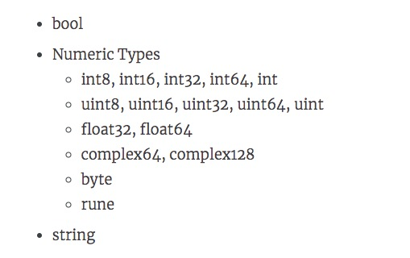

# Basic syntax-data type

> @author：Han Ru
>
> Copyright: Beijing Qianfeng Internet Technology Co., Ltd.

## One, basic data types

The following are the basic data types available in go




### 1.1 Boolean bool

The Boolean value can only be the constant true or false. A simple example: var b bool = true

### 1.2 Numerical

1. Integer type

-int8
  Signed 8-bit integer (-128 to 127)
Length: 8bit

-int16
  Signed 16-bit integer (-32768 to 32767)
-int32
  Signed 32-bit integer (-2147483648 to 2147483647)
-int64
  Signed 64-bit integer (-9223372036854775808 to 9223372036854775807)
-uint8
  Unsigned 8-bit integer (0 to 255)
8 bits are used to represent the value:

-uint16
  Unsigned 16-bit integer (0 to 65535)
-uint32
  Unsigned 32-bit integer (0 to 4294967295)
-uint64
  Unsigned 64-bit integer (0 to 18446744073709551615)
> int and uint: According to the underlying platform, it represents a 32- or 64-bit integer. Unless you need to use an integer of a specific size, you should usually use int to represent an integer.
> Size: 32-bit for 32-bit system, 64-bit for 64-bit system.
> Range: 32-bit systems from -2147483648 to 2147483647 and 64-bit systems from -9223372036854775808 to 9223372036854775807.

**2, floating point type**

-float32

  IEEE-754 32-bit floating point number

-float64

  IEEE-754 64-bit floating point number

-complex64

  32-bit real and imaginary numbers

-complex128

  64-bit real and imaginary numbers

**3, other**

-byte

  Similar to uint8

-rune

  Similar to int32

-uint

  32 or 64 bit

-int

  Same size as uint

-uintptr

  Unsigned integer, used to store a pointer

### 1.3 String type

A string is a sequence of characters connected by a string of fixed-length characters. Go strings are connected by single bytes. The bytes of Go language strings use UTF-8 encoding to identify Unicode text

```go
	var str string
	str = "Hello World"
```


### 1.4 Data type conversion: Type Convert

Syntax format: Type(Value)

Constant: When needed, it will automatically transform

Variable: Need to manually transform T(V)


Note: compatible types can be converted


## Two, composite type (derived type)

1. Pointer type (Pointer)
2. Array type
3. Structured type (struct)
4. Channel type
5. Function type
6. Slice type
7. Interface type (interface)
8. Map type


# Operator

Expression: (a + b) * c

	a, b, c are called operands
	
	+, *, called operators

## One, operator

### 1.1 Arithmetic operators

```go
+-* /% (Remainder) ++ -
```

### 1.2 Relational operators

```go
== !=> <>= <=
```

### 1.3 Logical operators

| Operator | Description |
| ------ | ------------------------------------------ ------------------ |
| && | The so-called logical AND operator. If both operands are non-zero, the condition becomes true |
| \|\| | The so-called logical OR operation. If any two operands are non-zero, the condition becomes true |
|! | The so-called logical negation operator. Use to reverse the logic state of the operand. If the condition is true, then the result after logical negation is false |

### 1.4 Bit operator

| A | B | A&B | A\|B | A^B |
| ---- | ---- | ---- | ---- | ---- |
| 0 | 0 | 0 | 0 | 0 |
| 0 | 1 | 0 | 1 | 1 |
| 1 | 1 | 1 | 1 | 0 |
| 1 | 0 | 0 | 1 | 1 |

The most difficult thing to understand here is ^. As long as you think that AB is the same, it is 0, and the others are 1.

Suppose A is 60 and B is 13

| Operation | Description | Example |
| ---- | -------------------------------------------- ---------------- | ------------------------------- |
| & | The result of binary AND operation copy bit, if it exists in two operands | (A & B) = 12, which is 0000 1100 |
| \| | Binary OR operation copy, if it has an operand | (A \| B) = 61, which is 0011 1101 |
| ^ | Binary XOR operation copy, if it is set in an operand, it is bitwise negated | (A ^ B) = 49, which is 0011 0001 |
| &^ | Clear binary bits &^ | (A&^B)=48, which is 110000 |
| << | Binary left shift operator. The value of the left operand is shifted to the left by the number of digits specified by the right operand | A << 2 =240 which is 1111 0000 |
| >> | Binary right shift operator. The value of the left operand is shifted to the right by the number of bits specified by the right operand | A >> 2 = 15 which is 0000 1111 |

### 1.5 Assignment operator

| Operator | Description | Example |
| ------ | ------------------------------------------ ------------------ | ---------------------------- |
| = | Simple assignment operator, assign the value from the right operand to the left operand | C = A + B will assign the value of A + B to C |
| += | Add and assignment operator, it adds right operand, left operand and assignment result, left operand | C += A is equivalent to C = C + A |
| -= | Subtraction and assignment operator, it subtracts the right operand from the left operand and assigns the result to the left operand | C -= A is equivalent to C = C-A |
| *= | Multiplication and assignment operator, which multiplies the right operand with the left operand and assigns the result to the left operand | C *= A is equivalent to C = C * A |
| /= | Division assignment operator, it combines the left operand with the right operand and assigns the result to the left operand | C /= A is equivalent to C = C / A |
| %= | Modulus and assignment operator, it needs to use the modulus of the two operands and assign the result to the left operand | C %= A is equivalent to C = C% A |
| <<= | Left shift and assignment operator | C <<= 2 is the same as C = C << 2 |
| >>= | Shift right and assignment operator | C >>= 2 is the same as C = C >> 2 |
| &= | Bitwise and assignment operator | C &= 2 is the same as C = C & 2 |
| ^= | Bitwise XOR and assignment operator | C ^= 2 is the same as C = C ^ 2 |
| \|= | Bitwise OR and assignment operator | C \|= 2 is the same as C = C \| 2 |

### 1.6 precedence operator precedence

Some operators have higher precedence, and the operation direction of binary operators is from left to right. The following table lists all operators and their precedence, from top to bottom representing the precedence from high to low:

| Precedence | Operator |
| ------ | ---------------- |
| 7 | ~! ++ - |
| 6 | * /% << >> & &^ |
| 5 | +-^ |
| 4 | == != <<= >=> |
| 3 | <- |
| 2 | && |
| 1 | \|\| |

Of course, you can temporarily increase the overall priority of an expression by using parentheses.


Qianfeng Go language learning group: 784190273

Author B station:

https://space.bilibili.com/353694001

Corresponding video address:

https://www.bilibili.com/video/av56018934

https://www.bilibili.com/video/av47467197

Source code:

https://github.com/rubyhan1314/go_foundation

