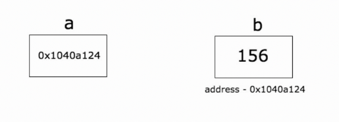

# One, pointer

> @author：Han Ru
> 
> Copyright: Beijing Qianfeng Internet Technology Co., Ltd.

## 1.1 The concept of pointers

A pointer is a variable that stores the memory address of another variable.

We all know that a variable is a convenient placeholder for referencing computer memory addresses.

A pointer variable can point to the memory address of any value and it points to the memory address of that value.

 

In the above figure, the value of variable b is 156, which is stored at memory address 0x1040a124. The variable a holds the address of b, and now a is considered to point to b.

## 1.2 Get the address of the variable

The address character of Go language is &, and it will return the memory address of the corresponding variable when it is used before a variable.

```go
package main

import "fmt"

func main() {
   var a int = 10   

   fmt.Printf("The address of the variable: %x\n", &a)
}
```

operation result:

```go
Variable address: 20818a220
```

## 1.3 Declaring pointers

Declare a pointer, *T is the type of a pointer variable, which points to a value of type T.

```go
var var_name *var-type
```

var-type is the pointer type, var_name is the name of the pointer variable, and * is used to specify that the variable is used as a pointer.

```go
var ip *int /* points to integer */
var fp *float32 /* point to floating point */
```

Sample code:

```go
package main

import "fmt"

func main() {
   var a int = 20 /* Declare actual variables*/
   var ip *int /* declare pointer variable*/

   ip = &a /* The storage address of the pointer variable*/

   fmt.Printf("The address of a variable is: %x\n", &a)

   /* Storage address of pointer variable*/
   fmt.Printf("Storage address of ip variable: %x\n", ip)

   /* Use pointer to access value */
   fmt.Printf("*ip variable value: %d\n", *ip)
}
```

operation result:

```go
The address of a variable is: 20818a220
Storage address of ip variable: 20818a220
*The value of the ip variable: 20
```

Sample code:

```go
package main

import "fmt"

type name int8
type first struct {
	a int
	b bool
	name
}

func main() {
	a := new(first)
	aa = 1
	a.name = 11
	fmt.Println(ab, aa, a.name)
}
```

operation result:

```go
false 1 11
```

> Uninitialized variables are automatically assigned initial values

```go
package main

import "fmt"

type name int8
type first struct {
	a int
	b bool
	name
}

func main() {
	var a = first{1, false, 2}
	var b *first = &a
	fmt.Println(ab, aa, a.name, &a, ba, &b, (*b).a)
}
```

operation result:

```go
false 1 2 &{1 false 2} 1 0xc042068018 1
```

> Get the pointer address and add & before the pointer variable

## 1.4 Null pointer

**Go Null Pointer**
When a pointer is defined and not assigned to any variable, its value is nil.
The nil pointer is also called a null pointer.
Conceptually, nil is the same as null, None, nil, and NULL in other languages. They all refer to zero or empty values.
A pointer variable is usually abbreviated as ptr.

Null pointer judgment:

```go
if(ptr != nil) /* ptr is not a null pointer*/
if(ptr == nil) /* ptr is a null pointer*/
```

## 1.5 Get the value of a pointer

Obtaining a pointer means accessing the value of the variable pointed to by the pointer. The syntax is: *a

Sample code:

```go
package main  
import (  
    "fmt"
)

func main() {  
    b := 255
    a := &b
    fmt.Println("address of b is", a)
    fmt.Println("value of b is", *a)
}
```

## 1.6 Operate the pointer to change the value of the variable

Sample code:

```go
package main

import (  
    "fmt"
)

func main() {  
    b := 255
    a := &b
    fmt.Println("address of b is", a)
    fmt.Println("value of b is", *a)
    *a++
    fmt.Println("new value of b is", b)
}
```

operation result

```
address of b is 0x1040a124  
value of b is 255  
new value of b is 256  
```


## 1.7 Use pointers to pass function parameters

Sample code

```go
package main

import (  
    "fmt"
)

func change(val *int) {  
    *val = 55
}
func main() {  
    a := 58
    fmt.Println("value of a before function call is",a)
    b := &a
    change(b)
    fmt.Println("value of a after function call is", a)
}
```

operation result

```
value of a before function call is 58  
value of a after function call is 55  
```

**Do not pass a pointer to an array to the function. Use slices. **

Suppose we want to make some changes to the array in the function, and the caller can see the changes made to the array in the function. One way is to pass a pointer to the array to the function.

```go
package main

import (  
    "fmt"
)

func modify(arr *[3]int) {  
    (*arr)[0] = 90
}

func main() {  
    a := [3]int{89, 90, 91}
    modify(&a)
    fmt.Println(a)
}
```

operation result

```
[90 90 91]
```

Sample code:

```go
package main

import (  
    "fmt"
)

func modify(arr *[3]int) {  
    arr[0] = 90
}

func main() {  
    a := [3]int{89, 90, 91}
    modify(&a)
    fmt.Println(a)
}
```

operation result

```
[90 90 91]
```

**Although passing a pointer to an array as a function parameter and modifying it, this is not the idiomatic way to achieve this goal. We have slices. **

Sample code:

```go
package main

import (  
    "fmt"
)

func modify(sls []int) {  
    sls[0] = 90
}

func main() {  
    a := [3]int{89, 90, 91}
    modify(a[:])
    fmt.Println(a)
}
```

operation result:

```
[90 90 91]
```


>Go does not support pointer arithmetic.
>
>package main
>
>func main() {  
> b := [...]int{109, 110, 111}
> p := &b
> p++
>}
>
>nvalid operation: p++ (non-numeric type *[3]int)


**Pointer array**

```go
package main

import "fmt"

const MAX int = 3

func main() {

   a := []int{10,100,200}
   var i int

   for i = 0; i <MAX; i++ {
      fmt.Printf("a[%d] = %d\n", i, a[i])
   }
}
```

`Results`

```go
a[0] = 10
a[1] = 100
a[2] = 200
```

There is a situation where we may need to save the array, so we need to use pointers.

```go
package main

import "fmt"

const MAX int = 3

func main() {
   a := []int{10,100,200}
   var i int
   var ptr [MAX]*int;

   for i = 0; i <MAX; i++ {
      ptr[i] = &a[i] /* Assign the integer address to the pointer array*/
   }

   for i = 0; i <MAX; i++ {
      fmt.Printf("a[%d] = %d\n", i,*ptr[i])
   }
}
```

`Results`

```go
a[0] = 10
a[1] = 100
a[2] = 200
```

## 1.8 Pointers of pointers

**Pointer pointer**

If a pointer variable stores the address of another pointer variable, then this pointer variable is called a pointer variable that points to a pointer.

```go
var ptr **int;
```

```go
package main

import "fmt"

func main() {

   var a int
   var ptr *int
   var pptr **int

   a = 3000

   /* Pointer ptr address*/
   ptr = &a

   /* Point to pointer ptr address*/
   pptr = &ptr

   /* Get the value of pptr*/
   fmt.Printf("variable a = %d\n", a)
   fmt.Printf("Pointer variable *ptr = %d\n", *ptr)
   fmt.Printf("Pointer variable pointing to pointer **pptr = %d\n", **pptr)
}
```

`Results`

```go
Variable a = 3000
Pointer variable *ptr = 3000
Pointer variable to pointer **pptr = 3000
```

**Pointer as function parameter**

```go
package main

import "fmt"

func main() {
   /* Define local variables*/
   var a int = 100
   var b int = 200

   fmt.Printf("The value of a before exchange: %d\n", a)
   fmt.Printf("The value of b before the exchange: %d\n", b)

   /* Call the function to exchange values
   * &a points to the address of a variable
   * &b points to the address of the b variable
   */
   swap(&a, &b);

   fmt.Printf("The value of a after exchange: %d\n", a)
   fmt.Printf("The value of b after exchange: %d\n", b)
}

func swap(x *int, y *int) {
   var temp int
   temp = *x /* save the value of x address*/
   *x = *y /* assign y to x */
   *y = temp /* assign temp to y */
}
```

`Results`

```go
The value of a before the exchange: 100
The value of b before the exchange: 200
The value of a after exchange: 200
The value of b after exchange: 100
```


Qianfeng Go language learning group: 784190273

Author B station:

https://space.bilibili.com/353694001

Corresponding video address:

https://www.bilibili.com/video/av56018934

https://www.bilibili.com/video/av47467197

Source code:

https://github.com/rubyhan1314/go_advanced

