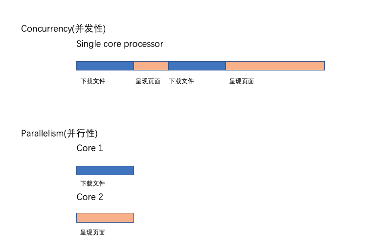
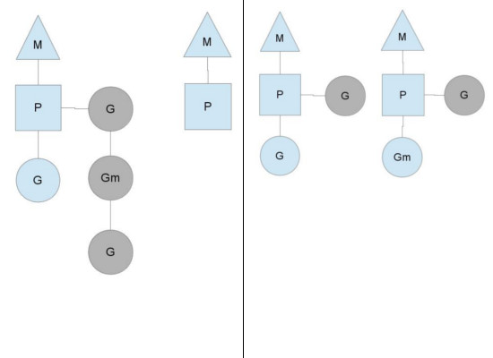
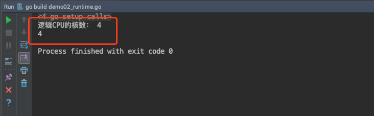
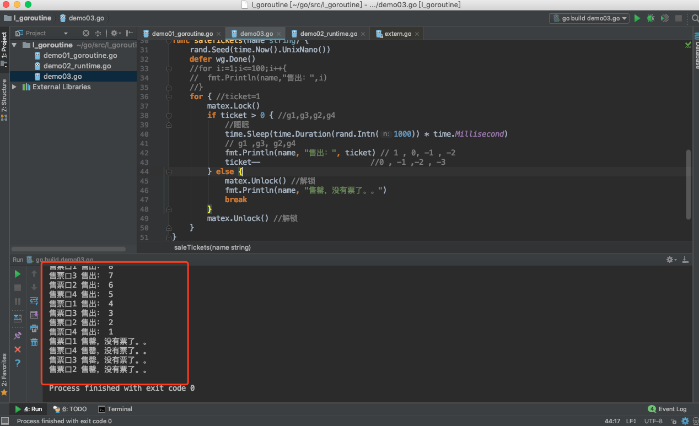
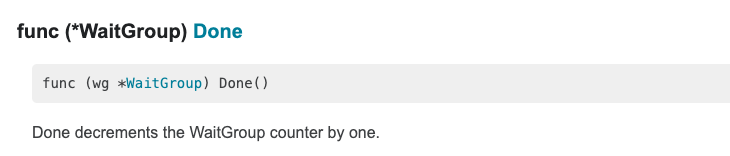
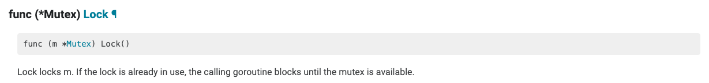
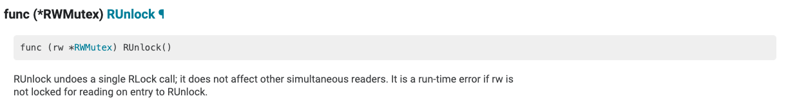
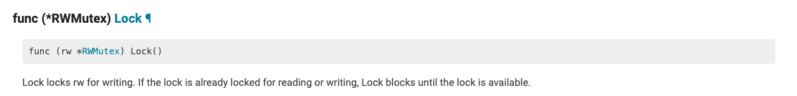

# One, Concurrency

> @author：Han Ru
> Copyright: Beijing Qianfeng Internet Technology Co., Ltd.

## 1.1 Multitasking

How to understand multitasking? In fact, it means that our operating system can perform multiple tasks at the same time. For example, you listen to music, scan Weibo, chat QQ, and write homework in Markdown. This is multitasking. At least 4 tasks are running at the same time. There are still many tasks running in the background quietly at the same time, but there is no display on the interface.


The speed of the CPU is too fast. . .


## 1.2 What is concurrency

Go is a concurrent language, not a parallel language. Before discussing how to perform concurrent processing in Go, we must first understand what concurrency is and how it differs from parallelism. (Go is a concurrent language and not a parallel one.)

** Concurrency is the ability to handle many things at the same time. **

For example, suppose a person is running in the morning. During the morning jog, his shoe laces came loose. Now the person stopped running, laced his shoes, and then started running again. This is a typical example of concurrency. This person can handle running and tying shoelaces at the same time. This is a person who can handle many things at the same time.

What is parallelism, and how is it different from concurrency?
Parallel means doing many things at the same time. This may sound similar to concurrency, but it is actually different.

Let's use the same jogging example to understand it better. In this case, we assume that the person is jogging and uses his phone to listen to music. In this case, a person is jogging while listening to music, that is, he is doing many things at the same time. This is called parallelism.

Concurrency and parallelism-a technical point of view.
Suppose we are writing a web browser. The web browser has various components. Two of them are the web page presentation area and the downloader for downloading files from the internet. Suppose we build the browser code in such a way that each component can be executed independently. When this browser runs on a single core processor, the processor will switch context between the two components of the browser. It may download a file for a while, and then it may switch to render the html of the web page requested by the user. This is the so-called concurrency. Concurrent processes start at different points in time, and their execution cycles overlap. In this case, downloading and rendering start from different points in time, and their execution overlaps.

Assume that the same browser is running on a multi-core processor. In this case, the file download component and the HTML rendering component may run in different cores at the same time. This is the so-called parallelism.




Parallelism will not always lead to faster execution time. This is because components running in parallel may need to communicate with each other. For example, in our browser, when the file download is complete, it should be delivered to the user, such as using a pop-up window. This communication occurs between the component responsible for downloading and the component responsible for rendering the user interface. This communication overhead is very low in concurrent concurrent systems. When components run concurrently in multiple cores, this communication overhead is high. Therefore, parallel programs do not always lead to faster execution times!


## 1.3 Process, thread, coroutine

**Process (Process), thread (Thread), coroutine (Coroutine, also called lightweight thread)**

process
A process is a dynamic execution process of a program in a data set. It can be simply understood as a "program being executed", which is an independent unit of CPU resource allocation and scheduling. 
The process generally consists of three parts: a program, a data set, and a process control block. The program we write is used to describe what functions the process needs to complete and how to complete; the data set is the resource that the program needs to use in the execution process; the process control block is used to record the external characteristics of the process, describe the process of execution and change, and the system It can be used to control and manage the process, it is the only sign that the system perceives the existence of the process. **The limitation of the process is that the cost of creation, cancellation and switching is relatively large. **


Thread
Thread is a concept developed after the process. A thread is also called a lightweight process. It is a basic CPU execution unit and the smallest unit in the program execution process. It is composed of a thread ID, a program counter, a set of registers, and a stack. A process can contain multiple threads.
The advantage of thread is that it reduces the overhead of concurrent execution of the program and improves the concurrent performance of the operating system. The disadvantage is that the thread does not have its own system resources, and only has resources that are essential at runtime, but each thread of the same process can be shared The system resources owned by the process, if the process is compared to a workshop, then the thread is like a worker in the workshop. However, there is a lock mechanism for some exclusive resources, and improper handling may cause "deadlock".


Coroutine
A coroutine is a kind of user-mode lightweight thread, also known as a microthread, and its English name is Coroutine. The scheduling of a coroutine is completely controlled by the user. People usually compare and understand coroutines and subroutines (functions).
A subroutine call is always an entry, one return, once exited, the execution of the subroutine is completed. 

**Compared with traditional system-level threads and processes, the biggest advantage of coroutines is that they are "lightweight" and can easily create millions of them without causing system resource exhaustion, and threads and processes usually cannot exceed at most 10,000. This is why coroutines are also called lightweight threads. **

> Compared with multithreading, the advantages of coroutines are embodied in: the execution efficiency of coroutines is extremely high. Because subroutine switching is not thread switching, it is controlled by the program itself. Therefore, there is no thread switching overhead. Compared with multithreading, the greater the number of threads, the more obvious the performance advantage of the coroutine.


**Go language's implementation of concurrency relies on coroutines, Goroutine**


# Two, the concurrency model of the Go language

A big advantage of the Go language compared to Java is that it is convenient to write concurrent programs. Go language has built-in goroutine mechanism, using goroutine can quickly develop concurrent programs and make better use of multi-core processor resources. Next, let's take a look at the concurrency principle of the Go language.

## 2.1 Thread model

In modern operating systems, threads are the basic unit of processor scheduling and allocation, and processes are the basic unit of resource ownership. Each process is composed of private virtual address space, code, data, and various other system resources. A thread is an execution unit within a process. Each process has at least one main execution thread, which does not need to be actively created by the user, but is automatically created by the system. The user creates other threads in the application as needed, and multiple threads run concurrently in the same process.

Let's start with threads. No matter what concurrency model is at the language level, when it comes to the operating system level, it must exist in the form of threads. The operating system can be divided into user space and kernel space according to different resource access rights; the kernel space mainly operates to access hardware resources such as CPU resources, I/O resources, and memory resources, and provides the most basic basic resources for upper-level applications. , User space is the fixed activity space of upper-level applications. User space cannot directly access resources. It must call resources provided by kernel space through "system calls", "library functions" or "Shell scripts".

Our current computer languages ​​can be regarded as a kind of "software" in a narrow sense. The so-called "threads" in them are often user-mode threads, which are different from the operating system's own kernel-mode threads (KSE for short).

The Go concurrent programming model is supported by the thread library provided by the operating system at the bottom, so we still have to start with the thread implementation model.

A thread can be viewed as the flow of control in a process. A process will contain at least one thread, because at least one flow of control will continue to run. Therefore, the first thread of a process will be created with the start of the process, and this thread is called the main thread of the process. Of course, a process can also contain multiple threads. These threads are created by threads that already exist in the current process. The method of creation is to call system calls, or more precisely, to call
pthread create function. Processes with multiple threads can execute multiple tasks concurrently, and even if one or some tasks are blocked, it will not affect the normal execution of other tasks, which can greatly improve the response time and throughput of the program. On the other hand, threads cannot exist independently of processes. Its life cycle cannot exceed the life cycle of the process to which it belongs.

There are three main thread implementation models, namely: user-level thread model, kernel-level thread model and two-level thread model. The biggest difference between them lies in the correspondence between threads and Kernel Scheduling Entity (KSE). As the name implies, the kernel scheduling entity is an object that can be scheduled by the kernel's scheduler. In many documents and books, it is also called a kernel-level thread, which is the smallest scheduling unit of the operating system kernel.

#### 2.1.1 Kernel-level threading model

User thread and KSE have a one-to-one relationship (1:1). The thread libraries of most programming languages ​​(such as pthread of linux, java.lang.Thread of Java, std::thread of C++11, etc.) are a layer of encapsulation of threads (kernel-level threads) of the operating system. Each thread created is statically associated with a different KSE, so its scheduling is done entirely by the OS scheduler. This method is simple to implement, directly relying on the thread capabilities provided by the OS, and generally does not affect each other between different user threads. However, operations such as creation, destruction, and context switching between multiple threads are done directly by the OS level, which will have a great impact on the performance of the OS in scenarios that require a large number of threads.


Each thread is independently scheduled by the kernel scheduler, so if one thread is blocked, other threads are not affected.

Advantages: With the support of multi-core processor hardware, the kernel space thread model supports true parallelism. When one thread is blocked, another thread is allowed to continue execution, so the concurrency capability is strong.

Disadvantages: Every time a user-level thread is created, a kernel-level thread needs to be created to correspond to it. In this way, the overhead of creating a thread is relatively large, which will affect the performance of the application.

#### 2.1.2 User-level threading model

The user thread and KSE are in a many-to-one relationship (M:1). The creation, destruction and coordination of multiple threads are all responsible for the thread library implemented by the user, which is transparent to the OS kernel. All threads created in the process are dynamically associated with the same KSE at runtime. There are many languages ​​that implement **coroutine** basically in this way. This implementation is very lightweight compared to kernel-level threads, and consumes much less system resources. Therefore, the number of creations and the cost of context switching will be much smaller. But this model has a fatal shortcoming. If we call a blocking system call on a user thread (such as read network IO in blocking mode), once KSE is blocked by the kernel to dispatch the CPU, all the remaining corresponding All user threads will become blocked (the entire process hangs).
So the **coroutine library** of these languages ​​will repackage some of their blocking operations into a completely non-blocking form, and then actively give up themselves at the point where they were previously blocked, and notify or wake up others in some way The user thread to be executed runs on the KSE, thereby avoiding context switching by the kernel scheduler due to KSE blocking, so that the entire process will not be blocked.


Advantages: The advantage of this model is that thread context switching occurs in user space, avoiding mode switching, which has a positive impact on performance.

Disadvantages: All threads are based on a kernel scheduling entity, namely kernel threads, which means that only one processor can be used. This is not acceptable in a multi-processor environment. In essence, user threads only solve the concurrency problem. But it did not solve the parallel problem. If the thread falls into the kernel mode due to I/O operations, and the kernel mode thread blocks waiting for I/O data, all threads will be blocked. The user space can also use non-blocking and I/O, but performance and complexity cannot be avoided Degree problem.

#### 2.1.3 Two-level thread model

User thread and KSE are in a many-to-many relationship (M:N). This implementation combines the advantages of the first two models to create multiple KSEs in a process, and threads can be dynamically associated with different KSEs at runtime. When a certain KSE is dispatched from the CPU by the kernel due to the blocking operation of the thread working on it, the remaining user threads currently associated with it can re-establish an association relationship with other KSEs. Of course, the realization of this dynamic association mechanism is very complicated and requires users to implement it by themselves. This is one of its shortcomings. Concurrency in Go language is the implementation method used. In order to implement this model, Go implements a runtime scheduler to be responsible for the dynamic association between "threads" in Go and KSE. This model is sometimes called the **hybrid thread model**, **that is, the user scheduler realizes the "scheduling" of user threads to KSE, and the kernel scheduler realizes the scheduling of KSE to CPU**.


## 2.2 Go concurrent scheduling: GPM model

On top of the kernel threads provided by the operating system, Go builds a unique two-level threading model. The goroutine mechanism implements the M:N threading model. The goroutine mechanism is an implementation of coroutine. The built-in scheduler in golang allows each CPU in the multi-core CPU to execute a coroutine.

#### 2.2.1 How does the scheduler work?

With the above understanding, we can begin to truly introduce Go's concurrency mechanism. First, use a piece of code to show how to create a new "thread" in the Go language (called Goroutine in the Go language):

```go
// Add a function with the go keyword (an anonymous function is used here)
// The call is done to perform tasks concurrently in a new "thread"
go func() { 
    // do something in one new goroutine
}()
```

Functionally equivalent to Java8 code:

```java
new java.lang.Thread(() -> { 
    // do something in one new thread
}).start();
```

To understand the principle of the goroutine mechanism, the key is to understand the implementation of the Go language scheduler.

There are four important structures that support the implementation of the entire scheduler in the Go language, namely M, G, P, and Schedule. The first three are defined in runtime.h, and Schedule is defined in proc.c.

-The Sched structure is the scheduler, which maintains the queues storing M and G and some status information of the scheduler.
-The M structure is Machine, the system thread, which is managed by the operating system, and goroutine runs on top of M; M is a large structure that maintains small object memory cache (mcache), currently executing goroutine, and random numbers A lot of information such as generators.
-P structure is Processor, processor, its main purpose is to execute goroutine, it maintains a goroutine queue, namely runqueue. Processor is an important part of letting us go from N:1 scheduling to M:N scheduling.
-G is the core structure implemented by goroutine, which contains stack, instruction pointer, and other important information for scheduling goroutine, such as its blocked channel.

> The number of processors is set to the value of the environment variable GOMAXPROCS at startup, or is set by calling the function GOMAXPROCS() at runtime. The fixed number of processors means that only GOMAXPROCS threads are running go code at any time.

We use triangles, rectangles and circles to represent Machine Processor and Goroutine respectively.


In the scenario of a single-core processor, all goroutines run in the same M system thread, and each M system thread maintains a processor. At any time, there is only one goroutine in a processor, and other goroutines are waiting in the runqueue. After a goroutine runs its own time slice, it gives up the context and returns to the runqueue. In the multi-core processor scenario, in order to run goroutines, each M system thread will hold a Processor.


Under normal circumstances, the scheduler will schedule according to the above process, but the thread will be blocked, etc., look at the goroutine's processing of thread blocking.


#### 2.2.2 Thread blocking

When a running goroutine is blocked, such as making a system call, another system thread (M1) will be created. The current M thread abandons its Processor, and P goes to a new thread to run.


#### 2.2.3 runqueue execution completed

When the runqueue of one of the Processors is empty, no goroutine can be scheduled. It will steal half of the goroutine from another context.




> The G, P, and M in the figure are all Go language runtime systems (including memory allocator, concurrent scheduler, garbage collector and other components, which can be imagined as JVM in Java) abstract concepts and data structure objects:
> G: Short for Goroutine, the code above with the go keyword and function call creates a G object, which is an encapsulation of a task to be executed concurrently, and can also be called a user mode thread. It is a user-level resource, transparent to the OS, lightweight, can be created in a large amount, and the context switching cost is low.
> M: The abbreviation of Machine. It is created with clone system call on the Linux platform. It is essentially the same as the thread created with the linux pthread library. Both are OS thread entities created with system calls. The role of M is to perform concurrent tasks packaged in G. **The main responsibility of the scheduler in the Go runtime system is to arrange G to multiple Ms for execution in a fair and reasonable manner**. It is an OS resource, and the number that can be created is also limited by the OS. Generally, the number of G is more than that of active M.
> P: The abbreviation of Processor, logical processor, the main function is to manage G objects (each P has a G queue) and provide localized resources for the operation of G on M.

From the perspective of the two-level threading model, it seems that P's participation is not needed. G and M are enough, so why do you want to join P?
In fact, there is no concept of P in the early implementation of the Go language runtime system (Go1.0). The scheduler in Go directly assigns G to the appropriate M to run. But this has brought many problems. For example, different Gs may need to apply for resources (such as heap memory) from the system when running concurrently on different Ms. Since resources are global, there will be a lot of system performance losses due to resource competition. In order to solve similar problems, the following Go (Go1.1) runtime system adds P, allowing P to manage G objects. If M wants to run G, it must be bound to a P before it can run G managed by P . The advantage of this is that we can apply for some system resources (local resources) in the P object in advance. When G needs it, apply to its own local P first (without lock protection). If it is not enough or does not apply to the global system, And when you take it from the overall situation, you will take a part of it for efficient use in the future. Just like when we go to the government to do things now, we first go to the local government to see if it can be done, and if we can’t do it, we can go to the central government to improve efficiency.
And because P decouples the G and M objects, so even if M is blocked by the G running on it, the remaining Gs associated with the M can migrate to other active M along with P to continue running, thus Let G always find M in time and run itself, thereby improving the concurrency of the system.
The Go runtime system implements a user-mode concurrent scheduling system by constructing a GPM object model, which can manage and schedule its own concurrent tasks by itself, so it can be said that the Go language ** natively supports concurrency**. **The scheduler implemented by itself is responsible for assigning concurrent tasks to different kernel threads to run, and then the kernel scheduler takes over the execution and scheduling of the kernel threads on the CPU. **

You can see that Go's concurrency is very simple to use, and a syntactic sugar is used to pack the internal complex implementation sturdily. Its interior can be summarized with the following picture:


Written at the end, the complete scheduling system of Go runtime is very complicated, and it is difficult to describe it clearly in an article. Here we can only introduce it from a macro perspective, so that everyone has an overall understanding.

```go
// Goroutine1
func task1() {
    go task2()
    go task3()
}
```

If we have a G (Goroutine1) that has been scheduled to be executed on an M through P, and we create two Gs during the execution of Goroutine1, these two Gs will be immediately put into the local G of the same P as Goroutine1 In the task queue, the queue waits for the execution of M bound to the P. This is the most basic structure and is well understood. The key questions are:
**a. How to reasonably allocate G to multiple Ms on a multi-core system, make full use of multi-core, and improve concurrency? **
If we use the **go** keyword to create a large number of Gs in a Goroutine, these Gs will be placed in the same queue temporarily, but if there are free P at this time (the number of P in the system is equal to the system cpu core by default Number), the Go runtime system can always ensure that at least one (usually only one) active M is bound to idle P to various G queues to find runnable G tasks. This kind of M is called **spinning M**. The general search order is: the P queue bound to itself, the global queue, and then other P queues. If you find your own P queue, take it out and start running. Otherwise, go to the global queue. Because the global queue needs lock protection, if there are many tasks in it, a batch will be transferred to the local P queue to avoid competing for locks every time. If the global queue still doesn't exist, you will start playing hard and steal tasks from other P queues directly (stole half of the tasks back). This ensures that when there are still G tasks that can be run, there will always be an M+P combination equal to the number of CPU cores in the execution of the G task or on the way to execute the G (looking for the G task).
**b. What if a certain M is blocked by a system call in G during the execution of G? **
In this case, this M will be scheduled out of the CPU by the kernel scheduler and will be in a blocked state. Other Gs associated with this M will have no way to continue execution, but a monitoring thread (sysmon thread) of the Go runtime system can Detect such an M, and strip the P bound to the M, find other idle or new M to take over the P, and then continue to run the G in it. The general process is shown in the following figure. Then wait until the M recovers from the blocked state, you need to find a free P to continue to execute the original G. If the system does not have a free P at this time, put the original G in the global queue and wait for other M+P combinations to discover And execute.


**c. If a certain G runs for too long in M, is there a way to do preemptive scheduling so that other Gs on this M can get a certain running time to ensure the fairness of the scheduling system?**
We know that Linux's kernel scheduler is mainly based on time slice and priority for scheduling. For threads of the same priority, the kernel scheduler will try to ensure that each thread can get a certain amount of execution time. In order to prevent some threads from "starving to death", the kernel scheduler will initiate preemptive scheduling to interrupt long-running threads and give up CPU resources so that other threads can get execution opportunities. Of course, there is a similar preemption mechanism in Go's runtime scheduler, but there is no guarantee that the preemption can be successful, because the Go runtime system does not have the interrupt capability of the kernel scheduler. It can only be set in G that runs too long The method of preempting the flag gently allows the running G to voluntarily surrender the execution power of M.
Speaking of this, I have to mention the ability of Goroutine to dynamically expand its own thread stack during operation, which can be expanded from the initial 2KB size to the maximum 1G (on a 64bit system), so the function needs to be calculated before each call to the function The size of the stack space required for the call, and then expand as needed (exceeding the maximum value will cause a runtime exception). The mechanism of Go preemptive scheduling is to use the following own preemption flag when judging whether to expand the stack and decide whether to continue execution or give up yourself.
The monitoring thread of the runtime system accounts for the preemption flag and sets the preemption flag to the G that runs too long. Then G will check the preemption flag when there is a function call, and if it has been set, it will put itself into the global queue, so that the M is associated The other Gs will have a chance to execute. But if the G being executed is a time-consuming operation and there is no function call (such as just a calculation operation in the for loop), even if the preemption flag has been set, the G will continue to occupy the current M until the completion of its task .


# Three, runtime package

The official website document introduces the runtime package:

```
Package runtime contains operations that interact with Go's runtime system, such as functions to control goroutines. It also includes the low-level type information used by the reflect package; see reflect's documentation for the programmable interface to the run-time type system.
```


Although the Go compiler produces native executable code, these codes still run in the Go runtime (this part of the code can be found in the runtime package). This runtime is similar to the virtual machine used in Java and .NET languages. It is responsible for management including memory allocation, garbage collection (Section 10.8), stack processing, goroutine, channel, slice, map, reflection, and so on.

## 3.1 Common Functions

**The `runtime` scheduler is a very useful thing. There are several methods about the `runtime` package:**

-**NumCPU**: Returns the number of `CPU` cores in the current system

-**GOMAXPROCS**: Set the maximum number of `CPU` cores that can be used simultaneously

  Through the runtime.GOMAXPROCS function, how can the application set the maximum number of P in the runtime system during runtime. But this will cause "Stop the World". Therefore, it should be called at the earliest in the application. And it is best to set the environment variable GOMAXPROCS of the operating program before running the Go program, instead of calling the runtime.GOMAXPROCS function in the program.

  No matter what the integer value we pass to the function, the maximum value of P in the runtime system will always be between 1 and 256.

> After go1.8, the program runs on multiple cores by default, so you don't need to set it up
> Before go1.8, it is still necessary to set it up, which can benefit the cpu more efficiently


-**Gosched**: Let the current thread give up `cpu` to let other threads run, it will not suspend the current thread, so the current thread will continue to execute in the future

  The function of this function is to let the current `goroutine` give up the `CPU`. When a `goroutine` is blocked, `Go` will automatically transfer other `goroutines` that are in the same system thread as the `goroutine` to another system Thread up so that these `goroutine` do not block.

-**Goexit**: Exit the current `goroutine` (but the `defer` statement will be executed as usual)

-**NumGoroutine**: Returns the total number of tasks being executed and queued

  The runtime.NumGoroutine function will return the number of Goroutines in a specific state in the system after being called. The specific reference here refers to Grunnable\Gruning\Gsyscall\Gwaition. Groutine in these states is considered to be active or being scheduled.

  Note: If the status of the Groutine where the garbage collection is located is also within this range, it will also be included in the counter.

-**GOOS**: target operating system

-**runtime.GC**: Make the runtime system perform a mandatory garbage collection

  1. Forced garbage collection: garbage collection that must be carried out anyway.
  2. Non-mandatory garbage collection: garbage collection only under certain conditions (that is, during runtime, the unit of heap memory newly requested by the system since the last garbage collection (also called unit increment) reaches the specified value).

-**GOROOT**: Get the goroot directory

-**GOOS**: View the target operating system 
  Many times, we will implement different operations according to different platforms, so we just use GOOS:

-. . .


## 3.2 Sample code:

1. Get goroot and os:

 ```go
   //Get the goroot directory:
   	fmt.Println("GOROOT-->",runtime.GOROOT())
   
   	//Get the operating system
   	fmt.Println("os/platform-->",runtime.GOOS) // GOOS--> darwin, mac system
   
 ```

   

2. Get the number of CPUs, and set the number of CPUs:

```go
func init(){
	//1. Get the number of logical cpu
	fmt.Println("The number of cores of logical CPU:",runtime.NumCPU())
	//2. Set the largest execution of the go program: [1,256]
	n := runtime.GOMAXPROCS(runtime.NumCPU())
	fmt.Println(n)
}
```




3. Gosched():

```go
func main() {
	go func() {
		for i := 0; i <5; i++ {
			fmt.Println("goroutine...")
		}

	}()

	for i := 0; i <4; i++ {
		// Give up the time slice, let other protocols execute first, after it finishes executing, come back to execute this coroutine
		runtime.Gosched()
		fmt.Println("main..")
	}
}

```


4. Use of Goexit (terminate coroutine)

```go

func main() {
	//Create a new coroutine
	go func() {
		fmt.Println("The goroutine starts...")

		//Called another function
		fun()

		fmt.Println("The goroutine ends...")
	}() //do not forget()

	//Sleep for a while and don’t let the main coroutine end
	time.Sleep(3*time.Second)
}


func fun() {
	defer fmt.Println("defer...")

	//return //terminate this function
	runtime.Goexit() //The coroutine where the termination is located

	fmt.Println("fun function...")
}
```


# Fourth, the safety of critical resources

## 4.1 Critical Resources

**Critical resources:** Refers to resources shared by multiple processes/threads/coroutines in a concurrent environment.

However, improper handling of critical resources in concurrent programming often leads to data inconsistencies.

Sample code:

```go
package main

import (
	"fmt"
	"time"
)

func main() {
	a := 1
	go func() {
		a = 2
		fmt.Println("Sub goroutine...",a)
	}()
	a = 3
	time.Sleep(1)
	fmt.Println("main goroutine..",a)
}
```

We use the terminal command to execute:


Be able to find a place of data shared by multiple goroutines.


## 4.2 Critical resource safety issues


Concurrency itself is not complicated, but because of the problem of resource competition, it makes it complicated for us to develop good concurrent programs, because it will cause many inexplicable problems.

If multiple goroutines access the same data resource, one of the threads modifies the data, then this value is modified. For other goroutines, this value may be incorrect.

For example, we use concurrency to implement the train station ticketing program. A total of 100 tickets are sold at 4 ticket booths at the same time.

Let's take a look at the sample code first:

```go
package main

import (
	"fmt"
	"math/rand"
	"time"
)

//Global variables
var ticket = 10 // 100 tickets

func main() {
	/*
	4 goroutines simulate 4 ticket outlets, and 4 subroutines operate the same shared data.
	 */
	go saleTickets("Ticket 1") // g1,100
	go saleTickets("Ticket 2") // g2,100
	go saleTickets("Ticket 3") //g3,100
	go saleTickets("Ticket 4") //g4,100

	time.Sleep(5*time.Second)
}

func saleTickets(name string) {
	rand.Seed(time.Now().UnixNano())
	//for i:=1;i<=100;i++{
	// fmt.Println(name,"Sold:",i)
	//}
	for {//ticket=1
		if ticket> 0 {//g1,g3,g2,g4
			//Sleep
			time.Sleep(time.Duration(rand.Intn(1000)) * time.Millisecond)
			// g1 ,g3, g2,g4
			fmt.Println(name, "Sold:", ticket) // 1, 0, -1, -2
			ticket-- //0, -1 ,-2, -3
		} else {
			fmt.Println(name,"sold out, no tickets left...")
			break
		}
	}
}

```


In order to better observe the critical resource problem, each goroutine sleeps for a random number, and then sells tickets. We find the results of the program, and can also sell tickets with negative numbers.


**analyze:**

Our ticket selling logic is to first judge whether the ticket number is a negative number. If it is greater than 0, then we will sell the ticket, but the ticket price will sleep first, and then sell it. If it is said that the ticket has been sold until only the last is left There is one, and a certain goroutine holds the time slice of the CPU, then when it has a ticket in the slice, the condition is established, so it can sell the last ticket with the ticket number 1. But because it sleeps before it is sold, other goroutines will hold CPU time slices, and this ticket has not been sold yet, then when the second goroutine judges whether there is a ticket, the conditions It is also established, then it can sell this ticket, but it also goes to sleep. . The other third and fourth goroutines are based on this logic. When a goroutine wakes up, it will not judge whether there is a ticket, but directly sell it, so that the last ticket is sold, but the other When the goroutine wakes up, it will sell the 0th, -1, and -2 one after another.

This is the problem of insecurity of critical resources. When a certain goroutine accesses a certain data resource, it has judged the conditions according to the value, and then the resource is preempted by other goroutines, and the value is modified. When the goroutine continues to access the data, the value is no longer correct. NS.

## 4.3 Resolution of critical resource safety issues

To solve the problem of critical resource safety, many programming language solutions are synchronous. Through the lock method, only one goroutine can access the shared data in a certain period of time. After the current goroutine is accessed, other goroutines can access it after being unlocked.

We can use the lock operation under the sync package.

Sample code:

```go
package main

import (
	"fmt"
	"math/rand"
	"time"
	"sync"
)

//Global variables
var ticket = 10 // 100 tickets

var wg sync.WaitGroup
var matex sync.Mutex // Create lock

func main() {
	/*
	4 goroutines simulate 4 ticket outlets, and 4 subroutines operate the same shared data.
	 */
	wg.Add(4)
	go saleTickets("Ticket 1") // g1,100
	go saleTickets("Ticket 2") // g2,100
	go saleTickets("Ticket 3") //g3,100
	go saleTickets("Ticket 4") //g4,100
	wg.Wait() // main has to wait. . .

	//time.Sleep(5*time.Second)
}

func saleTickets(name string) {
	rand.Seed(time.Now().UnixNano())
	defer wg.Done()
	//for i:=1;i<=100;i++{
	// fmt.Println(name,"Sold:",i)
	//}
	for {//ticket=1
		matex.Lock()
		if ticket> 0 {//g1,g3,g2,g4
			//Sleep
			time.Sleep(time.Duration(rand.Intn(1000)) * time.Millisecond)
			// g1 ,g3, g2,g4
			fmt.Println(name, "Sold:", ticket) // 1, 0, -1, -2
			ticket-- //0, -1 ,-2, -3
		} else {
			matex.Unlock() //Unlock
			fmt.Println(name, "Sold out, no tickets left...")
			break
		}
		matex.Unlock() //Unlock
	}
}

```


operation result:




There is a classic saying in Go's concurrent programming: **Don't communicate in the way of shared memory, but share memory in the way of communication. **

In the Go language, it is not encouraged to use locks to protect shared state to share information among different Goroutines (to communicate in a shared memory way). Instead, it is encouraged to pass the shared state or shared state changes between each Goroutine through **channel** (to share memory by communication), so as to ensure that only one Goroutine accesses the share at the same time like a lock. state.

Of course, in order to ensure the security and consistency of shared data between multiple threads, mainstream programming languages ​​will provide a set of basic synchronization tools, such as locks, condition variables, atomic operations, and so on. Not surprisingly, the Go language standard library provides these synchronization mechanisms, and the usage is similar to other languages.


# Five, sync package

The official website document introduces the sync package:

```
Package sync provides basic synchronization primitives such as mutual exclusion locks. Other than the Once and WaitGroup types, most are intended for use by low-level library routines. Higher-level synchronization is better done via channels and communication.
```


Sync is an abbreviation of the word synchronization, so it is also called a synchronization package. Basic synchronization operations are provided here, such as mutexes and so on. Except for the Once and WaitGroup types, most types are used by low-level library routines. Higher-level synchronization is best done through channel and communication communication


## 5.1 WaitGroup

WaitGroup, synchronous waiting group.

In terms of type, it is a structure. The purpose of a WaitGroup is to wait for the execution of a collection of goroutines to complete. The main goroutine calls the Add() method to set the number of goroutines to wait. Then, each goroutine will be executed and the Done() method is called after the execution is complete. At the same time, you can use the Wait() method to block until all goroutines are executed.


### 5.1.1 Add() method:

The Add method is used to set the value of the counter to the WaitGroup. We can understand that there is a counter in each waitgroup
It is used to indicate the number of goroutins to be executed in this synchronous waiting group.

If the value of the counter becomes 0, it means that all blocked goroutines are released while waiting. If the value of the counter is negative, then a panic will occur and the program will report an error.


### 5.1.2 Done() method

The Done() method is to set the WaitGroup counter value minus 1 when the WaitGroup synchronously waits for a certain goroutine in the group to finish executing.



In fact, the underlying code of Done() calls the Add() method:

```go
// Done decrements the WaitGroup counter by one.
func (wg *WaitGroup) Done() {
	wg.Add(-1)
}
```


### 5.1.3 Wait() method

The Wait() method means to let the current goroutine wait and enter the blocking state. Until the counter of WaitGroup is zero. In order to unblock,
This goroutine can continue to execute.


### 5.1.4 Sample code:

We create and start two goroutines to print numbers and letters, and in the main goroutine, add these two child goroutines to a WaitGroup, and at the same time let the main goroutine enter Wait(), and let the two child goroutines execute first. After each child goroutine is executed, call the Done() method to set the WaitGroup counter minus 1. When the two child goroutines are executed, the value of the counter in the WaitGroup is zero, and the main goroutine is unblocked.

Sample code:

```go
package main

import (
	"fmt"
	"sync"
)
var wg sync.WaitGroup // Create a synchronization waiting group object
func main() {
	/*
	WaitGroup: Synchronous waiting group
		You can use Add() to set the number of child goroutines to be executed in the waiting group,
		
		In the main function, use wait() to put the main program in a waiting state. Until the completion of the subroutine in the waiting group. Unblock

		In the function corresponding to the child gorotuine. wg.Done(), used to reduce the number of subroutines in the waiting group by 1
	 */
	//Set the number of goroutines to be executed in the waiting group
	wg.Add(2)
	go fun1()
	go fun2()
	fmt.Println("main enters the blocking state...waiting for the end of the sub-goroutine in wg...")
	wg.Wait() //Indicating that the main goroutine enters waiting, which means blocking
	fmt.Println("main, unblock...")

}
func fun1() {
	for i:=1;i<=10;i++{
		fmt.Println("fun1...i:",i)
	}
	wg.Done() //Subtract 1 from the number of goroutines waiting to be executed in wg. Same as Add(-1)
}
func fun2() {
	defer wg.Done()
	for j:=1;j<=10;j++{
		fmt.Println("\tfun2..j,",j)
	}
}


```

operation result:


```
GOROOT=/usr/local/go #gosetup
GOPATH=/Users/ruby/go #gosetup
/usr/local/go/bin/go build -i -o /private/var/folders/kt/nlhsnpgn6lgd_q16f8j83sbh0000gn/T/___go_build_demo05_waitgroup_go /Users/ruby/go/src/l_goroutine/demo05_waitgroup.go #gosetup
/private/var/folders/kt/nlhsnpgn6lgd_q16f8j83sbh0000gn/T/___go_build_demo05_waitgroup_go #gosetup
fun1.. . i: 1
fun1.. . i: 2
fun1.. . i: 3
fun1.. . i: 4
fun1.. . i: 5
fun1.. . i: 6
fun1.. . i: 7
fun1.. . i: 8
fun1.. . i: 9
fun1.. . i: 10
main enters the blocking state. . . Wait for the end of the child goroutine in wg. .
	fun2..j, 1
	fun2..j, 2
	fun2..j, 3
	fun2..j, 4
	fun2..j, 5
	fun2..j, 6
	fun2..j, 7
	fun2..j, 8
	fun2..j, 9
	fun2..j, 10
main, unblock. .

Process finished with exit code 0

```


## 5.2 Mutex (mutual exclusion lock)

Through the previous section, we know that there will be critical resource problems in concurrent programs. That is, when multiple coroutines access shared data resources, then this shared resource is not safe. In order to solve the problem of coroutine synchronization, we use channels, but the Go language also provides traditional synchronization tools.

What is a lock? That is, when a certain coroutine (thread) accesses a certain resource, it is locked first to prevent other coroutines from accessing it. After the access is completed and unlocked, other coroutines will come to lock for access. Generally used to deal with the problem of critical resources in concurrency.

The sync package in the Go language package provides two lock types: sync.Mutex and sync.RWMutex.

Mutex is the simplest type of lock, mutual exclusion lock, but also more violent. When a goroutine acquires a Mutex, other goroutines can only wait until the goroutine releases the Mutex.

Each resource corresponds to a tag that can be called a "mutual exclusion lock". This tag is used to ensure that at any time, only one coroutine (thread) can access the resource. Other coroutines can only wait.

Mutex is the main method of traditional concurrent programming for access control of shared resources. It is represented by the Mutex structure type in the standard library sync. The sync.Mutex type has only two public pointer methods, Lock and Unlock. Lock locks the current shared resource, and Unlock unlocks it.

When using mutex locks, we must pay attention to: After the resource operation is completed, it must be unlocked, otherwise problems such as abnormal process execution and deadlock will occur. Usually with defer. After locking, immediately use the defer statement to ensure that the mutex is unlocked in time.


Part of the source code:

```go
/ A Mutex is a mutual exclusion lock.
// The zero value for a Mutex is an unlocked mutex.
//
// A Mutex must not be copied after first use.
type Mutex struct {
	state int32 //The enumeration value of the mutex lock state is as follows
	sema uint32 //Semaphore, send a signal to G in Gwaitting
}

// A Locker represents an object that can be locked and unlocked.
type Locker interface {
	Lock()
	Unlock()
}

const (
	mutexLocked = 1 << iota // mutex is locked, 1 mutex is locked
	mutexWoken // 2 wake lock
	mutexStarving
	mutexWaiterShift = iota // count the number of goroutines blocked on this mutex by the value that needs to be shifted
	starvationThresholdNs = 1e6
)

```


### 5.2.1 Lock() method:

Lock() This method locks m. If the lock is already in use, the call to the goroutine will block until the mutex is available.




### 5.2.2 Unlock() method

Unlock() method, unlock and unlock m. If m is not locked on the entry to be unlocked, it is a runtime error.

The locked mutex is not associated with a specific goroutine. Allow one goroutine to lock the mutex, and then arrange for another goroutine to unlock the mutex.


### 5.2.3 Sample code:

For the summary of the last course, we use goroutine to simulate the case of selling train tickets at 4 ticket outlets. When four ticket outlets sell tickets at the same time, critical resource data security issues will occur. Let's use a mutex to solve it. (Go language promotes the use of Channel to realize data sharing, but it also provides traditional synchronization processing methods)

Sample code:

```go
package main

import (
	"fmt"
	"time"
	"math/rand"
	"sync"
)

//Global variable, which means ticket
var ticket = 10 //100 tickets


var mutex sync.Mutex //Create lock

var wg sync.WaitGroup //Sync waiting group object
func main() {
	/*
	4 goroutines, simulating 4 ticket outlets,


	When using mutex locks, you must unlock the resources after you have finished operating them. Otherwise, problems such as program exceptions and deadlocks will occur.
	defer statement
	 */

	 wg.Add(4)
	go saleTickets("Ticket 1")
	go saleTickets("Ticket 2")
	go saleTickets("Ticket 3")
	go saleTickets("Ticket 4")

	wg.Wait() //main has to wait
	fmt.Println("The program is over...")

	//time.Sleep(5*time.Second)
}

func saleTickets(name string){
	rand.Seed(time.Now().UnixNano())
	defer wg.Done()
	for{
		//Locked
		mutex.Lock() //g2
		if ticket> 0{ //ticket 1 g1
			time.Sleep(time.Duration(rand.Intn(1000))*time.Millisecond)
			fmt.Println(name,"Sold:",ticket) // 1
			ticket-- // 0
		}else{
			mutex.Unlock() //The condition is not met, also unlock
			fmt.Println(name,"sold out, no tickets left...")
			break
		}
		mutex.Unlock() //Unlock
	}
}

```

operation result:


```
GOROOT=/usr/local/go #gosetup
GOPATH=/Users/ruby/go #gosetup
/usr/local/go/bin/go build -i -o /private/var/folders/kt/nlhsnpgn6lgd_q16f8j83sbh0000gn/T/___go_build_demo06_mutex_go /Users/ruby/go/src/l_goroutine/demo06_mutex.go #gosetup
/private/var/folders/kt/nlhsnpgn6lgd_q16f8j83sbh0000gn/T/___go_build_demo06_mutex_go #gosetup
Ticket booth 4 Sold: 10
Ticket booth 4 Sold: 9
Ticket booth 2 Sold: 8
Ticket booth 1 Sold: 7
Ticket booth 3 Sold: 6
Ticket booth 4 Sold: 5
Ticket Office 2 Sold: 4
Ticket booth 1 Sold: 3
Ticket booth 3 Sold: 2
Ticket booth 4 Sold: 1
Ticket booth 2 is sold out and there are no more tickets. .
Ticket booth 1 is sold out and there are no more tickets. .
Ticket booth 3 is sold out and there are no more tickets. .
Ticket booth 4 is sold out and there are no more tickets. .
The procedure is over. . .

Process finished with exit code 0

```


## 5.3 RWMutex (read-write lock)

Through the study of mutex locks, we already know the concept and purpose of locks. It is mainly used to deal with the problem of critical resources in concurrency.

The sync package in the Go language package provides two lock types: sync.Mutex and sync.RWMutex. Among them, RWMutex is implemented based on Mutex, and the realization of read-only lock uses a function similar to a reference counter.

RWMutex is a read/write mutex lock. The lock can be held by any number of readers or a single writer. The zero value of RWMutex is an unlocked mutex.

If a goroutine holds an rRWMutex for reading, and another goroutine may call lock, no goroutine should expect to be able to acquire the read lock before releasing the initial read lock. In particular, this prohibits recursive read locks. This is to ensure that the lock is eventually available; blocked lock calls will exclude the new reader from acquiring the lock.


How do we understand read-write locks? When a goroutine acquires a write lock, the others will block until the write is unlocked, whether it is a read lock or a write lock; when a goroutine acquires a read lock, other read locks can still continue; when there are one or any number of read locks, write locks It will wait for all read locks to be unlocked before writing locks can be performed. So the purpose of the read lock (RLock) here is actually to tell the write lock: there are a lot of people reading data, you stand aside and wait for them to read (read unlock) and then you can write (write lock). We can summarize it into the following three items:

1. Only one goroutine can obtain a write lock at the same time.
2. At the same time, any number of gorouinte can obtain read lock.
3. Only write lock or read lock can exist at the same time (read and write are mutually exclusive).

Therefore, the RWMutex read-write lock can add multiple read locks or one write lock, and it is often used in scenarios where the number of reads is far greater than the number of writes.

The write lock of the read-write lock can only be locked once, and cannot be locked multiple times before unlocking. The read lock can be multiple times, but the number of read unlocking can only be one more than the number of read locks. Under normal circumstances, we do not recommend that the number of read unlocks exceeds the number of read locks. frequency.

Basically follow two principles:

	1. You can read it casually, and multiple goroutines can read it at the same time.
	
	2. When writing, don't do anything. Can neither read nor write.

The read-write lock is a mutual exclusion lock for read-write operations. The biggest difference between it and ordinary mutex is that it can lock and unlock operations for read operations and write operations respectively. The access control rules that read-write locks follow are different from mutex locks. Within the jurisdiction of the read-write lock, it allows any number of read operations to be performed at the same time. But at the same time, it only allows one write operation in progress.

And in the process of a certain write operation, the read operation is not allowed. That is to say, multiple write operations under the control of the read-write lock are mutually exclusive, and write operations and read operations are also mutually exclusive. However, there is no mutual exclusion relationship between multiple read operations.

### 5.3.1 RLock() method

```go
func (rw *RWMutex) RLock()
```

Read lock. When there is a write lock, the read lock cannot be loaded. When there is only a read lock or no lock, a read lock can be loaded. Multiple read locks can be loaded, so it is suitable for "read more and write less" scenarios.


### 5.3.2 RUnlock() method

```go
func (rw *RWMutex) RUnlock()
```

When the read lock is unlocked, RUnlock cancels a single RLock call, and it has no effect on other concurrent readers. If rw is not locked for reading, calling RUnlock will cause a runtime error.





### 5.3.3 Lock() method:

```go
func (rw *RWMutex) Lock()
```

Write lock. If there are other read locks and write locks before adding the write lock, the Lock will block until the lock is available. To ensure that the lock is finally available, the blocked Lock call will exclude the new lock from the acquired lock Read lock, that is, the permission of write lock is higher than that of read lock, and write lock is given priority when there is write lock.




### 5.3.4 Unlock() method

```go
func (rw *RWMutex) Unlock()
```

The write lock is unlocked. If the write lock is not performed, a runtime error will be caused.


### 5.3.5 Sample code:

Sample code:

```go
package main

import (
	"fmt"
	"sync"
	"time"
)


var rwMutex *sync.RWMutex
var wg *sync.WaitGroup
func main() {
	rwMutex = new(sync.RWMutex)
	wg = new (sync.WaitGroup)

	//wg.Add(2)
	//
	////Multiple simultaneous reading
	//go readData(1)
	//go readData(2)

	wg.Add(3)
	go writeData(1)
	go readData(2)
	go writeData(3)

	wg.Wait()
	fmt.Println("main..over...")
}


func writeData(i int){
	defer wg.Done()
	fmt.Println(i,"Start to write: write start...")
	rwMutex.Lock()//Write operation lock
	fmt.Println(i,"Writing: writing...")
	time.Sleep(3*time.Second)
	rwMutex.Unlock()
	fmt.Println(i,"write end: write over...")
}

func readData(i int) {
	defer wg.Done()

	fmt.Println(i, "Start reading: read start...")

	rwMutex.RLock() //Read operation lock
	fmt.Println(i,"Reading data: reading...")
	time.Sleep(3*time.Second)
	rwMutex.RUnlock() //Read operation unlock
	fmt.Println(i,"Reading end: read over...")
}


```

operation result:


```
GOROOT=/usr/local/go #gosetup
GOPATH=/Users/ruby/go #gosetup
/usr/local/go/bin/go build -i -o /private/var/folders/kt/nlhsnpgn6lgd_q16f8j83sbh0000gn/T/___go_build_demo07_rwmutex_go /Users/ruby/go/src/l_goroutset/demo07_rwupex.go #
/private/var/folders/kt/nlhsnpgn6lgd_q16f8j83sbh0000gn/T/___go_build_demo07_rwmutex_go #gosetup
3 Start to write: write start
3 Writing: writing
2 Start reading: read start
1 Start to write: write start
3 End of writing: write over
2 Reading: reading
2 End of reading: read over
1 Writing: writing
1 End of writing: write over
main..over...

Process finished with exit code 0

```


Final summary:

1. Read locks cannot block read locks
2. Read locks need to block write locks until all read locks are released
3. Write locks need to block read locks until all write locks are released
4. Write locks need to block write locks


Reference link for this article:

https://www.bbsmax.com/A/kPzOQY3a5x/

https://studygolang.com/articles/11322?fr=sidebar

https://www.cnblogs.com/williamjie/p/9456764.html


Qianfeng Go language learning group: 784190273

Author B station:

https://space.bilibili.com/353694001

Corresponding video address:

https://www.bilibili.com/video/av56860636

https://www.bilibili.com/video/av56945376

Source code:

https://github.com/rubyhan1314/go_goroutine


