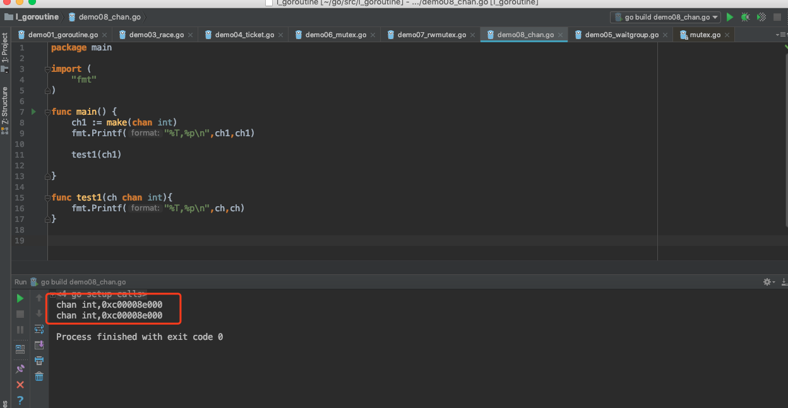
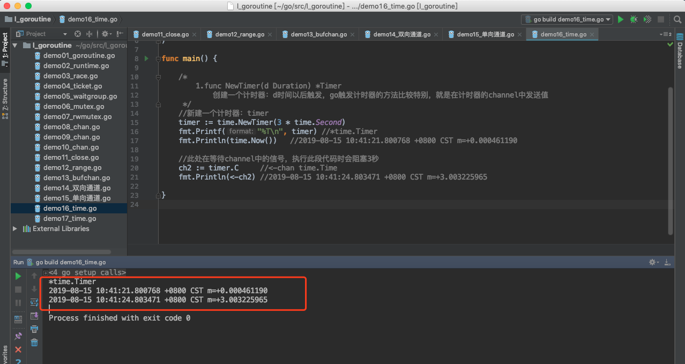

# channel channel

> @author：Han Ru
>
> Copyright: Beijing Qianfeng Internet Technology Co., Ltd.


Channels can be thought of as communication channels for Goroutines. Similar to the flow of water in a pipe from one end to the other, data can be sent from one end to the other and received through the channel.

When we talked about the concurrency of the Go language earlier, we said that when multiple Goroutines want to share data, although traditional synchronization mechanisms are also provided, the Go language strongly recommends the use of Channel channels to achieve inter-Goroutines. Communication.

```
"Don't communicate through shared memory, but share memory through communication" This is a classic phrase that has swept the golang community
```

In Go language, if you want to pass some data to another goroutine (coroutine), you can encapsulate the data into an object, and then pass the pointer of the object to a channel, and another goroutine reads this from the channel Pointers and deal with the memory objects they point to. From the language level, Go guarantees that only one goroutine can access the data in the channel at the same time, providing developers with an elegant and simple tool. So Go's approach is to use the channel to communicate, and pass the memory data through communication, so that the memory data Pass in different goroutines instead of using shared memory to communicate.


## One, what is a channel

### 1.1 The concept of channels

What is a channel? A channel is a channel between goroutines. It allows goroutines to communicate with each other.

Each channel has a type associated with it. This type is the type of data that the channel allows to transmit. (The zero value of the channel is nil. The nil channel is useless, so the channel must be defined using a method similar to map and slice.)

### 1.2 Channel declaration

Declaring a channel has the same syntax as defining a variable:

```go
//Declare the channel
var channel name chan data type
//Create a channel: If the channel is nil (that is, it does not exist), you need to create the channel first
Channel name = make (chan data type)
```


Sample code:

```go
package main

import "fmt"

func main() {
	var a chan int
	if a == nil {
		fmt.Println("channel is nil and cannot be used, you need to create a channel first...")
		a = make(chan int)
		fmt.Printf("The data type is: %T", a)
	}
}

```

operation result:

```

The channel is nil and cannot be used. You need to create the channel first. .
The data type is: chan int
```

You can also make a short statement:

```go
a := make(chan int) 
```

### 1.3 Channel data type

Channel is data of reference type. When passed as a parameter, the memory address is passed.

Sample code:

```go
package main

import (
	"fmt"
)

func main() {
	ch1 := make(chan int)
	fmt.Printf("%T,%p\n",ch1,ch1)

	test1(ch1)

}

func test1(ch chan int){
	fmt.Printf("%T,%p\n",ch,ch)
}


```

operation result:



We can see that the addresses of ch and ch1 are the same, indicating that they are the same channel.


### 1.4 Attention points of the channel

When using Channel channels, there are several points to note:

-1. Used for goroutine, to deliver messages.
-2. Channels, each has an associated data type,
  			nil chan, can’t be used, similar to nil map, can’t store key-value pairs directly
-3. Use the channel to transfer data: <-
  			   chan <- data, send data to the channel. Write data to the channel
       data <- chan, get data from the channel. Read data from the channel
-4. Blocking:
  			   Send data: chan <- data, blocked, until another goroutine, read data to unblock
       Read data: data <- chan, which is also blocking. Until another goroutine, write out the data to unblock.
  
-5. The channel itself is synchronous, which means that only one goroutine can operate at the same time.

Finally: the channel is the connection between goroutines, so the sending and receiving of the channel must be in different goroutines.


## Second, the use of channel syntax

### 2.1 Send and receive

Syntax for sending and receiving:

```go
data := <- a // read from channel a  
a <- data // write to channel a
```

The direction of the arrow on the channel specifies whether the data is sent or received.

in addition:

```go
v, ok := <- a //Read from a channel
```


### 2.2 Sending and receiving are blocked by default

A channel sending and receiving data is blocked by default. When a data is sent to the channel, it is blocked in the send statement until another Goroutine reads data from the channel. In contrast, when reading data from a channel, the reading is blocked until a Goroutine writes data to the channel.

The feature of these channels is to help Goroutines communicate effectively without using explicit locks or condition variables that are very common in other programming languages.

Sample code:

```go
package main

import "fmt"

func main() {
	var ch1 chan bool //Declaration, not created
	fmt.Println(ch1) //
   
    
	fmt.Printf("%T\n", ch1) //chan bool
	ch1 = make(chan bool) //0xc0000a4000, is data of reference type
	fmt.Println(ch1)

	go func() {
		for i := 0; i <10; i++ {
			fmt.Println("In the child goroutine, i:", i)
		}
		// After the loop is over, write data to the channel, indicating that it is about to end. .
		ch1 <- true

		fmt.Println("End...")

	}()

	data := <-ch1 // Read data from ch1 channel
	fmt.Println("data-->", data)
	fmt.Println("main...over...")
}

```

operation result:


In the above program, we first created a chan bool channel. Then start a sub Goroutine, and print 10 numbers in a loop. Then we write the input true to the channel ch1. Then in the main goroutine, we read data from ch1. This line of code is blocking, which means that the main goroutine will not execute to the next line of code before the child Goroutine writes data to the channel. Therefore, we can realize the communication between the child goroutine and the main goroutine through the channel. Before the execution of the child goroutine is completed, the main goroutine will be blocked by reading the data in ch1. This ensures that the child goroutine will be executed first. This eliminates the need for time. In the previous procedure, we either put the main goroutine to sleep to prevent the main goroutine from exiting. Either the WaitGroup is used to ensure that the child goroutine is executed first before the main goroutine ends.

Sample code: The following code adds sleep to better understand channel blocking

```go
package main

import (
	"fmt"
	"time"
)

func main() {
	ch1 := make(chan int)
	done := make(chan bool) // channel
	go func() {
		fmt.Println("The child goroutine executes...")
		time.Sleep(3 * time.Second)
		data := <-ch1 // Read data from the channel
		fmt.Println("data:", data)
		done <- true
	}()
	// Write data to the channel. .
	time.Sleep(5 * time.Second)
	ch1 <- 100

	<-done
	fmt.Println("main..over")

}

```

operation result:


As another example, this program will print the sum of the squares of the single digits of a number.

```go
package main

import (  
    "fmt"
)

func calcSquares(number int, squareop chan int) {  
    sum := 0
    for number != 0 {
        digit := number% 10
        sum += digit * digit
        number /= 10
    }
    squareop <- sum
}

func calcCubes(number int, cubeop chan int) {  
    sum := 0 
    for number != 0 {
        digit := number% 10
        sum += digit * digit * digit
        number /= 10
    }
    cubeop <- sum
} 
func main() {  
    number := 589
    sqrch := make(chan int)
    cubech := make(chan int)
    go calcSquares(number, sqrch)
    go calcCubes(number, cubech)
    squares, cubes := <-sqrch, <-cubech
    fmt.Println("Final output", squares + cubes)
}
```

operation result:

```
Final output 1536
```


### 2.3 Deadlock

An important factor to consider when using channels is deadlock. If Goroutine sends data on one channel, it is expected that other Goroutines should receive data. If this does not happen, then the program will deadlock at runtime.

Similarly, if Goroutine is waiting to receive data from the channel, then some other Goroutine will write data on the channel, otherwise the program will deadlock.

Sample code:

```go
package main

func main() {  
    ch := make(chan int)
    ch <- 5
}
```

Error:

```
fatal error: all goroutines are asleep-deadlock!

goroutine 1 [chan send]:
main.main()
	/Users/ruby/go/src/l_goroutine/demo08_chan.go:5 +0x50
```


> In order to ensure the security and consistency of shared data among multiple threads, mainstream programming languages ​​will provide a set of basic synchronization tools, such as locks, condition variables, atomic operations, and so on. Not surprisingly, the Go language standard library provides these synchronization mechanisms, and the usage is similar to other languages.
> In addition to these basic synchronization methods, the Go language also provides a new synchronization mechanism: Channel, which is a basic type like int, float32, etc. in the Go language. A channel can be considered as one that can be connected to multiple Goroutines. A pipe that transfers a certain type of data between. The channel in Go is very close to the BlockingQueue in Java in terms of implementation mechanism and usage scenarios.


## Three, close the channel

The sender can close the channel to inform the receiver that no more data will be sent to the channel.

```go
close(ch)
```

The receiver can use additional variables to check whether the channel has been closed when receiving data from the channel.

Grammatical structures:

```go
v, ok := <- ch  
```

> Similar to map operation, storing key and value key-value pairs
>
> v,ok := map[key] //Get the value from the map according to the key, if the key exists, v is the corresponding data, if the key does not exist, v is the default value


In the above statement, if the value of ok is true, it means that a data value is successfully read from the channel. If ok is false, it means that we are reading data from a closed channel. The value read from the closed channel will be the zero value of the channel type.

For example, if the channel is an int channel, then the value received from the closed channel will be 0.

Sample code:


```go
package main

import (
	"fmt"
	"time"
)

func main() {
	ch1 := make(chan int)
	go sendData(ch1)
	/*
	Child goroutine, write out 10 data
			Each time you write one, block once, and the main program reads once to unblock

	Main goroutine: loop reading
			Read one at a time, block once, subroutine, write out one, unblock

	Send, close the channel--->receiver, the received data is the zero value of this type, and false
	 */
	//Get channel data in the main program
	for{
		time.Sleep(1*time.Second)
		v, ok := <- ch1 //Other goroutines, call the close method shown to close the channel.
		if !ok{
			fmt.Println("All data has been read,", ok)
			break
		}
		fmt.Println("Retrieve data:", v, ok)
	}

	fmt.Println("main...over....")
}
func sendData(ch1 chan int) {
	// sender: 10 pieces of data
	for i:=0;i<10 ;i++ {
		ch1 <- i//write i to the channel
	}
	close(ch1) //Close the ch1 channel.
}
```

operation result


In the above program, send Goroutine writes 0 to 9 into the chl channel, and then closes the channel. There is an infinite loop in the main function. It checks whether the channel is closed after sending data using the variable ok. If ok is false, it means that the channel is closed and therefore the loop ends. You can also print the received value and the ok value.


## Fourth, the range loop on the channel

We can get data from the channel in a loop until the channel is closed. The for range form of the for loop can be used to receive values ​​from the channel until it is closed.

Using range loop, sample code:

```go
package main

import (
	"time"
	"fmt"
)

func main() {
	ch1 :=make(chan int)
	go sendData(ch1)
	// The for range form of the for loop can be used to receive values ​​from the channel until it is closed.
	for v := range ch1{
		fmt.Println("Read data:",v)
	}
	fmt.Println("main..over.....")
}
func sendData(ch1 chan int) {
	for i:=0;i<10; i++ {
		time.Sleep(1*time.Second)
		ch1 <- i
	}
	close(ch1)//Notify the other party, the channel is closed
}
```

operation result:


## Five, non-buffered channel

Basically, all the channels learned before have no buffer. Sending and receiving an unbuffered channel is blocked.

One sending operation corresponds to one receiving operation. For a goroutine, its one transmission is blocked until another goroutine receives it. Similarly, for receiving, it is also blocked before another goroutine sends it.


## Six, buffer channel

Buffer channel refers to a channel with a buffer. Sending to a buffer channel is blocked only when the buffer is full. Similarly, information received from the buffer channel will only be blocked when the buffer is empty.

The buffer channel can be created by passing additional capacity parameters to the make function, which specifies the size of the buffer.

grammar:

```go
ch := make(chan type, capacity)  
```

The capacity of the above syntax should be greater than 0 so that the channel has a buffer. By default, the capacity of an unbuffered channel is 0, so the capacity parameter was omitted when the channel was created previously.

Sample code:

In the following code, the chan channel has a buffer.

```go
package main

import (
	"fmt"
	"strconv"
	"time"
)

func main() {
	/*
	Non-cached channel: make(chan T)
	Cache channel: make(chan T ,size)
		Cache channel, understood as a queue:

	Non-buffering, sending or receiving, are all blocking
	The cache channel, the data in the cache area is full, the state will be blocked. .

	 */
	ch1 := make(chan int) //Non-cached channel
	fmt.Println(len(ch1), cap(ch1)) //0 0
	//ch1 <- 100//Blocked, other goroutines are needed to unblock, otherwise deadlock

	ch2 := make(chan int, 5) //Cached channel, the buffer size is 5
	fmt.Println(len(ch2), cap(ch2)) //0 5
	ch2 <- 100 //
	fmt.Println(len(ch2), cap(ch2)) //1 5

	//ch2 <- 200
	//ch2 <- 300
	//ch2 <- 400
	//ch2 <- 500
	//ch2 <- 600
	fmt.Println("--------------")
	ch3 := make(chan string, 4)
	go sendData3(ch3)
	for {
		time.Sleep(1*time.Second)
		v, ok := <-ch3
		if !ok {
			fmt.Println("Read it,,", ok)
			break
		}
		fmt.Println("\tThe data read is:", v)
	}

	fmt.Println("main...over...")
}

func sendData3(ch3 chan string) {
	for i := 0; i <10; i++ {
		ch3 <- "data" + strconv.Itoa(i)
		fmt.Println("Sub goroutine, write out the first", i, "number of data")
	}
	close(ch3)
}


```


operation result:


## Seven, two-way channel

Channel, channel, is used to implement communication between goroutines. One goroutine can send data to the channel, and another goroutine can get data from the channel. Up to now, the channels we have learned can both send and read data, and we call this kind of channel a two-way channel.

```go
data := <- a // read from channel a  
a <- data // write to channel a
```


## Eight, one-way channel

One-way channel, that is, directional channel.

The channels we learned before are all bidirectional channels, and we can receive or send data through these channels. We can also create unidirectional channels, which can only send or receive data.


Two-way channel, example code:

```go
package main

import "fmt"

func main() {
	/*
	Two-way:
		chan T -->
			chan <- data, write data, write
			data <- chan, get data, read
	One-way: Directional
		chan <- T,
			Only supports writing,
		<- chan T,
			Read only
	 */
	ch1 := make(chan string) // Bidirectional, readable and writable
	done := make(chan bool)
	go sendData(ch1, done)
	data :=<- ch1 //blocking
	fmt.Println("From the child goroutine:", data)
	ch1 <- "I am main..." // blocked

	<-done
	fmt.Println("main...over....")
}
//Sub goroutine-->write data to ch1 channel
//main goroutine-->take from ch1 channel
func sendData(ch1 chan string, done chan bool) {
	ch1 <- "I am Xiao Ming" // block
	data := <-ch1 // blocking
	fmt.Println("From main goroutine:",data)

	done <- true
}

```

operation result:


Create a channel that can only send data, sample code:

Sample code:

```go
package main

import "fmt"

func main() {
	/*
		One-way: Directional
		chan <- T,
			Only supports writing,
		<- chan T,
			Read only


		Used for parameter passing:
	 */
	ch1 := make(chan int)//Bidirectional, read, write
	//ch2 := make(chan <- int) // One-way, write only, not read
	//ch3 := make(<- chan int) //One-way, read-only, cannot write
	//ch1 <- 100
	//data :=<-ch1
	//ch2 <- 1000
	//data := <- ch2
	//fmt.Println(data)
	// <-ch2 //invalid operation: <-ch2 (receive from send-only type chan<- int)
	//ch3 <- 100
	// <-ch3
	// ch3 <- 100 //invalid operation: ch3 <- 100 (send to receive-only type <-chan int)

	//go fun1(ch2)
	go fun1(ch1)
	data:= <- ch1
	fmt.Println("The data written in fun1 is:",data)

	//fun2(ch3)
	go fun2(ch1)
	ch1 <- 200
	fmt.Println("main...over...")
}
//This function receives, write-only channel
func fun1(ch chan <- int){
	// Inside the function, only data can be written to ch, but data cannot be read
	ch <- 100
	fmt.Println("The fun1 function ends...")
}

func fun2(ch <-chan int){
	//In the function, only data can be read for ch, but data cannot be written
	data := <- ch
	fmt.Println("fun2 function, the data read from ch is:",data)
}

```

operation result:


## Nine, channel-related functions in the time package

The main thing is the timer. The Timer in the standard library allows users to define their own timeout logic, which is especially convenient when dealing with select processing of multiple channel timeouts and single channel read and write timeouts.

Timer is a one-time time trigger event, which is different from Ticker, which continuously triggers time events at a certain time interval.

Common ways to create Timer:

```go
t:= time.NewTimer(d)
t:= time.AfterFunc(d, f)
c:= time.After(d)
```

Although the creation methods are different, the principles are the same.

Timer has 3 elements:

```go
Timing time: it is that d
Trigger action: it is that f
Time channel: tC
```


### 9.1, time.NewTimer()

NewTimer() creates a new timer that will send the current time on its channel after at least d.


Its return value is a Timer.


Source code:

```go
// NewTimer creates a new Timer that will send
// the current time on its channel after at least duration d.
func NewTimer(d Duration) *Timer {
	c := make(chan Time, 1)
	t := &Timer{
		C: c,
		r: runtimeTimer{
			when: when(d),
			f: sendTime,
			arg: c,
		},
	}
	startTimer(&t.r)
	return t
}
```

From the source code, we can see that first a channel is created, the associated type is Time, and then a Timer is created and returned.

-Used to call a function or calculation expression after the specified Duration type time.
-If you just want to execute after a specified time, use time.Sleep()
-Use NewTimer(), the type of Timer that can be returned, cancel the timer before the timer expires
-The timer will not expire until a value is sent using <-timer.C


Sample code:

```go
package main

import (
	"time"
	"fmt"
)

func main() {

	/*
		1.func NewTimer(d Duration) *Timer
			Create a timer: trigger after d time. Go triggers the timer in a special way, which is to send the value in the timer channel
	 */
	//Create a timer: timer
	timer := time.NewTimer(3 * time.Second)
	fmt.Printf("%T\n", timer) //*time.Timer
	fmt.Println(time.Now()) //2019-08-15 10:41:21.800768 +0800 CST m=+0.000461190

	//Here we are waiting for the signal in the channel. When this code is executed, it will block for 3 seconds
	ch2 := timer.C //<-chan time.Time
	fmt.Println(<-ch2) //2019-08-15 10:41:24.803471 +0800 CST m=+3.003225965

}

```

operation result:




### 9.2, timer.Stop

The timer stops:


Sample code:

```go
package main

import (
	"time"
	"fmt"
)

func main() {

	/*
		1.func NewTimer(d Duration) *Timer
			Create a timer: trigger after d time. Go triggers the timer in a special way, which is to send the value in the timer channel
	 */
	//Create a timer: timer
	//timer := time.NewTimer(3 * time.Second)
	//fmt.Printf("%T\n", timer) //*time.Timer
	//fmt.Println(time.Now()) //2019-08-15 10:41:21.800768 +0800 CST m=+0.000461190
	//
	////Here is waiting for the signal in the channel, it will block for 3 seconds when this code is executed
	//ch2 := timer.C //<-chan time.Time
	//fmt.Println(<-ch2) //2019-08-15 10:41:24.803471 +0800 CST m=+3.003225965


	fmt.Println("-------------------------------")

	//Create a new timer, which will be triggered after one second

	timer2 := time.NewTimer(5 * time.Second)

	//Start a new thread to handle the event after triggering

	go func() {

		//Wait the signal when triggered

		<-timer2.C

		fmt.Println("Timer 2 ends...")

	}()

	//Because the above waiting signal is in a new thread, the code will continue to execute and stop the timer

	time.Sleep(3*time.Second)
	stop := timer2.Stop()

	if stop {

		fmt.Println("Timer 2 stop...")

	}

}

```

operation result:


### 9.3, time.After()

After waiting for the duration, the current time is then sent on the returning channel. It is equivalent to NewTimer(d).C. Before the timer is triggered, the garbage collector will not restore the underlying timer. If there is a problem with efficiency, use NewTimer instead, and call Timer. If the timer is no longer needed, stop.


Source code:

```go
// After waits for the duration to elapse and then sends the current time
// on the returned channel.
// It is equivalent to NewTimer(d).C.
// The underlying Timer is not recovered by the garbage collector
// until the timer fires. If efficiency is a concern, use NewTimer
// instead and call Timer.Stop if the timer is no longer needed.
func After(d Duration) <-chan Time {
	return NewTimer(d).C
}
```

Sample code:

```go
package main

import (
	"time"
	"fmt"
)

func main() {

	/*
		func After(d Duration) <-chan Time
			Return a channel: chan, which stores the current time after the interval of d.
	 */
	ch1 := time.After(3 * time.Second) //3s later
	fmt.Printf("%T\n", ch1) // <-chan time.Time
	fmt.Println(time.Now()) //2019-08-15 09:56:41.529883 +0800 CST m=+0.000465158
	time2 := <-ch1
	fmt.Println(time2) //2019-08-15 09:56:44.532047 +0800 CST m=+3.002662179


}

```

operation result:


## Ten, select statement

select is a control structure in Go. The select statement is similar to the switch statement, but the select will execute a runnable case randomly. If there is no case to run, it will block until there is a case to run.

The grammatical structure of the select statement is very similar to the switch statement. There are also case statements and default statements:

```go
select {
    case communication clause:
       statement(s);      
    case communication clause:
       statement(s); 
    /* You can define any number of cases */
    default: /* optional*/
       statement(s);
}
```

instruction:

-Each case must be a communication

-All channel expressions will be evaluated

-All sent expressions will be evaluated

-If multiple cases can be run, select will randomly and fairly select one to execute. Others will not be executed.

-Otherwise:

  If there is a default clause, the statement is executed.

  If there is no default clause, select will block until a certain communication can run; Go will not re-evaluate the channel or value.


Sample code:

```go
package main

import (
	"fmt"
	"time"
)

func main() {
	/*
	Branch statement: if, switch, select
	The select statement is similar to the switch statement,
		But select will randomly execute a runnable case.
		If there is no case to run, it will block until there is a case to run.
	 */

	ch1 := make(chan int)
	ch2 := make(chan int)

	go func() {
		time.Sleep(2 * time.Second)
		ch2 <- 200
	}()
	go func() {
		time.Sleep(2 * time.Second)
		ch1 <- 100
	}()

	select {
	case num1 := <-ch1:
		fmt.Println("Fetch data from ch1...", num1)
	case num2, ok := <-ch2:
		if ok {
			fmt.Println("Fetch data in ch2...", num2)
		}else{
			fmt.Println("ch2 channel has been closed...")
		}


	}
}

```

Operation result: It may execute the first case and print 100, or it may execute the second case and print 200. (Run a few more times, the result will be different)


The select statement is combined with the chan-related functions of the time package, sample code:

```go
package main

import (
	"fmt"
	"time"
)

func main() {
	ch1 := make(chan int)
	ch2 := make(chan int)

	//go func() {
	// ch1 <- 100
	//}()

	select {
	case <-ch1:
		fmt.Println("case1 can be executed...")
	case <-ch2:
		fmt.Println("case2 can be executed...")
	case <-time.After(3 * time.Second):
		fmt.Println("case3 execution...timeout...")

	//default:
	// fmt.Println("default...")
	}
}

```


operation result:


## Eleven, CSP model of Go language


The two biggest highlights of the go language are goroutine and chan. CSP, a typical application of the combination of the two, is basically a parallel development artifact recognized by everyone, which simplifies the difficulty of parallel program development. Let's take a look at CSP.


### 11.1、What is CSP

CSP is the abbreviation of Communicating Sequential Process. It can be called communication sequential process in Chinese. It is a concurrent programming model and a very powerful concurrent data model. It was proposed in the 1970s and used to describe two independent concurrent entities. A concurrency model of communication through a shared communication channel (pipe). Compared to the Actor model, the channel in CSP is the first type of object. It does not care about the entity sending the message, but the channel used when sending the message.

Strictly speaking, CSP is a formal language (similar to ℷ calculus), which is used to describe the interactive mode in concurrent systems. Therefore, it has become the theoretical source of concurrency-oriented programming languages ​​and derived Occam/Limbo/Golang …

Specific to programming languages, such as Golang, only a small part of CSP is actually used, namely Process/Channel in theory (corresponding to goroutine/channel in the language): There is no subordination between these two concurrency primitives, Process You can subscribe to any Channel, and Channel does not care which Process is using it to communicate; Process reads and writes around Channel, forming a set of orderly blocking and predictable concurrency models.


### 11.2, Golang CSP

Unlike mainstream languages ​​that use shared memory for concurrency control, Go language uses the CSP mode. This is a concurrency model used to describe two independent concurrent entities communicating through a shared communication Channel (pipe).

Golang borrows some concepts of the CSP model to implement concurrency for theoretical support. In fact, the go language does not fully implement all the theories of the CSP model, but only borrows the two concepts of process and channel. The performance of process in the go language is that goroutine is an entity that actually executes concurrently, and each entity communicates through channels to achieve data sharing.


The CSP model of Go language is implemented by Goroutine and Channel:

- 
  Goroutine goroutine: It is a kind of lightweight thread. It is not an operating system thread, but uses an operating system thread in segments, and realizes cooperative scheduling through a scheduler. It is a kind of green thread, micro thread, it is also different from Coroutine coroutine, it can start a new micro thread after blockage is found.
-Channel: Unix-like Pipe, used for communication and synchronization between coroutines. Although the coroutines are decoupled, they are coupled with the Channel.

 


### 11.3, Channel

Goroutine and channel are the two cornerstones of concurrent programming in the Go language. Goroutines are used to perform concurrent tasks, and channels are used to synchronize and communicate between goroutines.

Channel sets up a pipeline between gouroutines, transmits data in the pipeline, and realizes communication between gouroutines; because it is thread-safe, it is very convenient to use; channel also provides the "first in, first out" feature; it can also affect goroutines Blocking and awakening.

I believe you must have seen a sentence:

> Do not communicate by sharing memory; instead, share memory by communicating.

Do not communicate through shared memory, but through communication to achieve memory sharing.

This is Go's concurrency philosophy, which relies on the CSP model and is implemented based on channels.


**channel implements CSP**

Channel is a very important type in Go language and the first object in Go. Through channels, Go realizes memory sharing through communication. Channel is an important means of transferring data and synchronization between multiple goroutines.

The use of atomic functions and read-write locks can ensure the security of shared access to resources, but it is more elegant to use channels.

The literal meaning of channel is "channel", similar to the pipe in Linux. The syntax for declaring a channel is as follows:

```go
chan T // Declare a two-way channel
chan<- T // Declare a channel that can only be used for sending
<-chan T // Declare a channel that can only be used for receiving
```

The declaration of a one-way channel is represented by `<-`, which indicates the direction of the channel. As long as you understand that the order of writing the code is from left to right, you can immediately grasp the direction of the channel.

Because the channel is a reference type, before it is initialized, its value is nil, and the channel is initialized with the make function. You can pass an int value to it, which represents the size (capacity) of the channel buffer. A buffered channel is constructed; if it is not passed or 0 is passed, a non-buffered channel is constructed.

There are some differences between the two: unbuffered channels cannot buffer elements, and the order of operations on it is "send -> receive -> send -> receive -> ...". If you want to send 2 elements to a non-buffered chan in a row , And if it is not received, it will definitely be blocked for the first time; for buffered channel operations, it must be "relaxed", after all, it has a "buffer" halo.


The sending and receiving operations of chan will be converted into the underlying sending and receiving functions during compilation.

Channel is divided into two types: with buffer and without buffer. Operations performed on channels without buffering can actually be regarded as "synchronous mode", and those with buffering are called "asynchronous mode".

In synchronous mode, the sender and receiver must be synchronized and ready, and only when both are ready, data can be transferred between the two (see later, it is actually a memory copy). Otherwise, if either party performs a sending or receiving operation first, it will be suspended, waiting for the appearance of the other party to be awakened.

In asynchronous mode, when the buffer slot is available (with remaining capacity), both sending and receiving operations can proceed smoothly. Otherwise, the operating party (such as writing) will also be suspended, and will not be awakened until the opposite operation (such as receiving) occurs.

To summarize: In synchronous mode, the sender and receiver must be paired to make the operation successful, otherwise it will be blocked; in asynchronous mode, the buffer slot must have remaining capacity for the operation to succeed, otherwise it will be blocked.


Simply put, the CSP model consists of concurrently executing entities (threads or processes or coroutines), and the entities communicate by sending messages.
When sending messages here, the channel is used, or called channel.

The key to the CSP model is to focus on the channel, not the entity that sends the message. Go language implements part of the theory of CSP, goroutine corresponds to the entity that executes concurrently in CSP, and channel corresponds to the channel in CSP.


### 11.4、Goroutine

Goroutine is an entity that actually executes concurrently. Its bottom layer is to use coroutine to achieve concurrency. Coroutine is a user thread running in user mode, similar to greenthread. The starting point for choosing coroutine at the bottom layer of go is because it has the following characteristics :

-User space avoids the cost caused by switching between kernel mode and user mode
-Can be scheduled by language and framework layer
-Smaller stack space allows the creation of a large number of instances


It can be seen that the scheduling of the second user space thread is not completed by the operating system. For example, the greenthread used in java 1.3 is uniformly scheduled by the JVM (later java has been changed to a kernel thread), as well as in ruby Fiber (semi-coroutine) needs to be re-scheduled by itself, and goroutine provides a scheduler at the golang level, and encapsulates the network IO library, shields complex details, and provides unified syntax keyword support externally , Which simplifies the cost of writing concurrent programs.


### 11.5、Goroutine scheduler

Go concurrent scheduling: GPM model

On top of the kernel threads provided by the operating system, Go builds a unique two-level threading model. The goroutine mechanism implements the M:N threading model. The goroutine mechanism is an implementation of coroutine. The built-in scheduler in golang allows each CPU in the multi-core CPU to execute a coroutine.


### 11.6, finally

Golang's channel isolates goroutines, so you can focus on the channel during concurrent programming. To a certain extent, this is quite similar to the decoupling function of the message queue. If you are interested, let's take a look at the source code of the channel. It is very useful for a deeper understanding of the channel.

Go implements the CSP communication model through channel, which is mainly used for message passing and event notification between goroutines.

With channels and goroutines, concurrent programming in Go has become extremely easy and safe, allowing programmers to focus on business and improve development efficiency.

You know, technology is not the most important thing, it is just a tool to achieve business. An efficient development language allows you to save the time you save to do more meaningful things, such as writing articles.


> CSP was first proposed by Tony Hoare in 1977. It is said that the old man is still updating this theoretical model. Friends who are interested can check the electronic version by themselves: http://www.usingcsp.com/cspbook.pdf.
>
> 


Reference document: https://learnku.com/articles/32142


Qianfeng Go language learning group: 784190273

github knowledge base:

https://github.com/rubyhan1314

Golang URL:

https://www.qfgolang.com/

Author B station:

https://space.bilibili.com/353694001

Corresponding video address:

https://www.bilibili.com/video/av56018934

https://www.bilibili.com/video/av47467197

Source code:

https://github.com/rubyhan1314/go_goroutine


   

