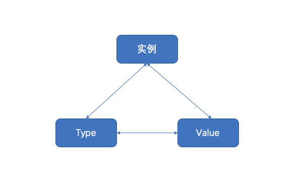

#Reflect reflect

## One, introduction

First look at the definition of reflection given by Rob Pike in the official Doc:

```
Reflection in computing is the ability of a program to examine its own structure, particularly through types; it's a form of metaprogramming. It's also a great source of confusion.
(In the computer field, reflection is an ability to make a program understand its own structure, mainly through types. It is one of the components of metaprogramming, and it is also a confusing problem.)

```

Definition in Wikipedia:

```
In computer science, reflection refers to the ability of a computer program to access, detect, and modify its own state or behavior at runtime. Metaphorically speaking, reflection is the ability to "observe" and modify its behavior while the program is running.
```


Different languages ​​have different reflection models, and some languages ​​do not yet support reflection. The "Go Language Bible" defines reflection as follows:

> Go language provides a mechanism to update variables and check their values ​​and call them at runtime, but the specific types of these variables are not known at compile time. This is called a reflection mechanism.


Why use reflection

2 common scenes that need reflection:

1. Sometimes you need to write a function, but you don't know what the type of the parameter passed to you is, it may not be agreed; it may also be that there are many types passed in, and these types cannot be represented uniformly. At this time reflection will be used.
2. Sometimes it is necessary to decide which function to call based on certain conditions, for example, based on user input. At this time, it is necessary to reflect on the function and the parameters of the function, and execute the function dynamically during operation.

But for reflection, there are still several reasons why it is not recommended to use reflection:

1. Code related to reflection is often difficult to read. In software engineering, code readability is also a very important indicator.
2. The Go language is a static language. During the coding process, the compiler can find some type errors in advance, but it is powerless to reflect the code. Therefore, including reflection-related code, it is likely to run for a long time before it fails. At this time, it is often directly panic, which may cause serious consequences.
3. Reflection has a relatively large impact on performance, one to two orders of magnitude slower than normal code. Therefore, for the code in a key position of operational efficiency in a project, try to avoid using reflection features.


## Second, related basics

How is reflection achieved? We have learned interface before, it is a very powerful tool for Go language to achieve abstraction. When assigning an entity type to an interface variable, the interface will store the type information of the entity, and reflection is achieved through the type information of the interface, and reflection is based on the type.

The Go language defines various types in the reflect package and implements various functions of reflection, through which you can detect type information and change the value of the type at runtime. Before going into a more detailed understanding, we need to review some of the features related to the Go language, the so-called review of the old and the new, and understand how the reflection mechanism is used from these features.

| Features | Description |
| ---------------------- | -------------------------- ---------------------------------- |
| Go language is a statically typed language. | The type has been determined at compile time. For example, for the redefined type of the basic data type, you need to confirm what type is returned during reflection. |
|The reflection mechanism of the empty interface interface{}|go is to be carried out through the interface, and the empty interface similar to Java's Object can interact with any type, so the reflection of basic data types etc. also directly uses this feature |
Types of Go language:

-Variables include (type, value) two parts

  ​ Understand this and you will know why nil != nil

-type includes static type and concrete type. Simply put, static type is the type you see in encoding (such as int, string), and concrete type is the type seen by the runtime system

-The success of the type assertion depends on the concrete type of the variable, not the static type. Therefore, if a reader variable also implements the write method for its concrete type, it can also be typed as a writer.


Go is a statically typed language. Each variable has a static type, which means that the type of each variable is determined at compile time: int, float32, *AutoType, []byte, chan []int and so on.

In the concept of reflection, the variable type is known at compile time as a static type; the variable type known at runtime is called a dynamic type.

-Static typing
  The static type is the type assigned when the variable is declared. for example:

 ```go
type MyInt int // int is static type

type A struct{
    Name string // string is static
}
var i *int // *int is static type

 ```


-Dynamic type
  Dynamic type: When assigning a value to this variable at runtime, the type of the value (if the value is nil, there is no dynamic type). The dynamic type of a variable may change at runtime, which mainly depends on its assignment (provided that the variable is an interface type).

```go
var A interface{} // static type interface{}
A = 10 // static type is interface{} dynamic is int
A = "String" // static type is interface{} dynamic is string
var M *int
A = M // The value of A can be changed

```


The reflection of the Go language is built on the type. The type of the variable of the specified type in Golang is static (that is, the variable of int, string is specified, and its type is static type), which is determined when the variable is created , Reflection is mainly related to Golang's interface type (its type is concrete type), and only the interface type has reflection.


In the implementation of Golang, each interface variable has a corresponding pair, and the value and type of the actual variable are recorded in the pair:

```go
(value, type)
```

Value is the actual variable value, and type is the type of the actual variable. An interface{} type variable contains 2 pointers, one pointer points to the value type [corresponding to concrete type], and the other pointer points to the actual value [corresponding to value].

For example, create a variable of type *os.File, and then assign it to an interface variable r:

```go
tty, err := os.OpenFile("/dev/tty", os.O_RDWR, 0)

var r io.Reader
r = tty
```

The following information will be recorded in the pair of the interface variable r: (tty, *os.File). This pair is unchanged during the continuous assignment of interface variables. Assign the interface variable r to another interface variable w:

```go
var w io.Writer
w = r.(io.Writer)
```

The pair of the interface variable w is the same as the pair of r, both are: (tty, *os.File), even if w is an empty interface type, the pair is unchanged.

The existence of interface and its pair is the prerequisite for implementing reflection in Golang. Understanding the pair makes it easier to understand reflection. Reflection is a mechanism used to detect (value; concrete type) pair pairs stored in interface variables.

So we have to understand two basic concepts, Type and Value, which are also the two most important types in the reflect space in the Go language pack.

## Three, Type and Value

The package we generally use is the reflect package.

Since reflection is a mechanism used to detect (value; concrete type) pair pairs stored in interface variables. So, in Golang's reflect reflection package, what way is there to let us directly obtain the information inside the variable? It provides two types (or two methods) so that we can easily access the content of interface variables, namely reflect.ValueOf() and reflect.TypeOf(), see the official explanation

```go
// ValueOf returns a new Value initialized to the concrete value
// stored in the interface i. ValueOf(nil) returns the zero 
func ValueOf(i interface{}) Value {...}

Translation: ValueOf is used to get the value of the data in the input parameter interface, if the interface is empty, it returns 0


// TypeOf returns the reflection Type that represents the dynamic type of i.
// If i is a nil interface value, TypeOf returns nil.
func TypeOf(i interface{}) Type {...}

Translation: TypeOf is used to dynamically get the type of the value in the input parameter interface, if the interface is empty, it returns nil

```


reflect.TypeOf() is to get the type in the pair, and reflect.ValueOf() to get the value in the pair.

First, you need to convert it into a reflect object (reflect.Type or reflect.Value, and call different functions according to different situations.

```go
t := reflect.TypeOf(i) //Get the metadata of the type, through t we can get all the elements in the type definition
v := reflect.ValueOf(i) //Get the actual value, through v we get the value stored in it, and we can also change the value
```


Sample code:

```go
package main

import (
	"fmt"
	"reflect"
)

func main() {
	//Reflection operation: Through reflection, the type and value of an interface type variable can be obtained
	var x float64 =3.4

	fmt.Println("type:",reflect.TypeOf(x)) //type: float64
	fmt.Println("value:",reflect.ValueOf(x)) //value: 3.4

	fmt.Println("-------------------")
	//According to the value of reflection, to obtain the corresponding type and value
	v := reflect.ValueOf(x)
	fmt.Println("kind is float64: ",v.Kind() == reflect.Float64)
	fmt.Println("type: ",v.Type())
	fmt.Println("value: ",v.Float())
}

```

operation result:

```
type: float64
value: 3.4
-------------------
kind is float64: true
type: float64
value: 3.4

```

instruction

1. reflect.TypeOf: directly gives us the type of type we want, such as float64, int, various pointers, structs, etc. real types
2. reflect.ValueOf: directly gives the specific value we want, such as the specific value of 1.2345, or the value of the structure struct like &{1 "Allen.Wu" 25}
3. In other words, reflection can convert "interface type variable" into "reflection type object", and reflection type refers to the two types of reflect.Type and reflect.Value

Both Type and Value contain a large number of methods. The first useful method should be Kind. This method returns the specific information of the type: Uint, Float64, etc. The Value type also contains a series of type methods, such as Int(), which are used to return the corresponding value. The following are the types of Kind:

```go

// A Kind represents the specific kind of type that a Type represents.
// The zero Kind is not a valid kind.
type Kind uint

const (
	Invalid Kind = iota
	Bool
	Int
	Int8
	Int16
	Int32
	Int64
	Uint
	Uint8
	Uint16
	Uint32
	Uint64
	Uintptr
	Float32
	Float64
	Complex64
	Complex128
	Array
	Chan
	Func
	Interface
	Map
	Ptr
	Slice
	String
	Struct
	UnsafePointer
)

```


## Fourth, the rules of reflection

In fact, the operation steps of reflection are very simple, which is to obtain the reflection object (Value, Type) through the entity object, and then operate the corresponding method.

The following figure describes the conversion relationship between instance, Value, and Type:



The classification of reflection API is summarized as follows:

**1) From instance to value**

Obtain the Value object through the instance, and use the reflect.ValueOf() function directly. E.g:

```go
func ValueOf(i interface {}) Value
```

**2) From instance to Type**

To obtain the Type of the reflection object through the instance, use the reflect.TypeOf() function directly. E.g:

```go
func TypeOf(i interface{}) Type
```

**3) From Type to Value**

There is only type information in Type, so the Value of an instance cannot be obtained directly from a Type interface variable, but the Value of a new instance can be constructed from the Type. The reflect package provides two methods, examples are as follows:

```go
//New returns a Value whose type is PtrTo(typ), that is, the Type of Value is the pointer type that specifies typ
func New(typ Type) Value
//Zero returns a typ type zero good, note that the returned Value cannot be addressed and the bit cannot be changed
func Zero(typ Type) Value
```

If you know the underlying storage address of a type value, there is another function that can restore Value based on the type and the address value. E.g:

```go
func NewAt(typ Type, p unsafe.Pointer) Value
```

**4) From Value to Type**

The method of Value can be called directly from the reflection object Value to Type, because Value stores the pointer to the Type type internally. E.g:

```go
func (v Value) Type() Type
```


**5) From Value to Instance**

Value itself contains type and value information, reflect provides a wealth of methods to realize the conversion from Value to instance. E.g:

```go
//This method is the most versatile, used to convert Value to an empty interface, which stores concrete type instances inside
//You can use the interface type query to restore to a specific type
func (v Value) Interface() (i interface{})

//Value itself also provides a wealth of methods to directly convert Value to a simple type instance. If the type does not match, it will directly cause panic
func (v Value) Bool () bool
func (v Value) Float() float64
func (v Value) Int() int64
func (v Value) Uint() uint64
```


**6) From the pointer of Value to the value**

There are two ways to obtain the value type Value from a pointer type Value. The examples are as follows.

```go
//If the v type is an interface, Elem() returns the Value of the instance bound to the interface. If the v type is a pointer, it returns the Value of the pointer value, otherwise it causes panic
func (v Value) Elem() Value
//If v is a pointer, return the Value of the pointer value, otherwise return v itself, this function will not cause panic
func Indirect(v Value) Value
```


**7) Mutual conversion between Type pointer and value**

Pointer type Type to value type Type. E.g:

```go
//t must be Array, Chan, Map, Ptr, Slice, otherwise it will cause panic
//Elem returns the Type of its internal elements
t.Elem() Type
```


Value type Type to pointer type Type. E.g:

```go
//PtrTo returns a pointer to t Type
func PtrTo(t Type) Type
```


**8) Modification of Value**

The modification of Value involves the following two methods:

```go
//Judging whether it can be modified through CanSet
func (v Value) CanSet() bool
//Modify through Set
func (v Value) Set(x Value)
```


Under what circumstances can Value be modified? We know that the instance object passed to the interface is a complete copy of the value. If the reflection method reflect.ValueOf() is called and passed in is a value type variable, the value obtained is actually a copy of the original object. This Value is It cannot be modified in any way.

**According to Go's official blog about reflection, there are three laws of reflection:**

> 1. Reflection goes from interface value to reflection object.
> 2. Reflection goes from reflection object to interface value.
> 3. To modify a reflection object, the value must be settable.

The first one is the most basic: reflection can get the reflection object from the interface value.

​ Reflection is a mechanism to detect the type and value stored in the interface. This can be obtained through the TypeOf function and the ValueOf function.

The second item is actually the opposite mechanism to the first item. Reflection can obtain the interface value from the reflection object.

​ It reverses the return value of ValueOf into an interface variable through the Interface() function.

The first two are that the interface variable and the reflection type object can be transformed into each other. The reflection type object actually refers to the reflect.Type and reflect.Value mentioned earlier.

The third is not easy to understand: If you need to manipulate a reflection variable, its value must be modifiable.

​ The nature of the reflection variable that can be set is that it stores the original variable itself, so that the operation of the reflection variable will be reflected to the original variable itself; on the contrary, if the reflection variable cannot represent the original variable, then the reflection variable will not be affected by the operation. Variables have any impact, which will cause confusion to users. So the second case is not allowed at the language level.


## Five, the use of reflection

### 5.1 Get interface information from relfect.Value

When reflect.ValueOf(interface) is executed, a variable of type "relfect.Value" is obtained. The real content of the interface variable can be obtained through its own Interface() method, and then it can be converted by type judgment to convert to the original There are real types. However, we may know the original type, or it may be the unknown original type. Therefore, the following two cases are explained.

#### Known original type

After a known type is converted to its corresponding type, the method is as follows, directly through the Interface method and then forced conversion, as follows:

```go
realValue := value.Interface(). (known type)
```

Sample code:

```go
package main

import (
	"fmt"
	"reflect"
)

func main() {
	var num float64 = 1.2345

	pointer := reflect.ValueOf(&num)
	value := reflect.ValueOf(num)

	// It can be understood as "forced conversion", but when you need to pay attention, when converting, if the type of conversion is not completely consistent, panic directly
	// Golang is very strict on the type, the type must be fully compliant
	// The following two, one is *float64, the other is float64, if confused, it will panic
	convertPointer := pointer.Interface().(*float64)
	convertValue := value.Interface().(float64)

	fmt.Println(convertPointer)
	fmt.Println(convertValue)
}
```

operation result:

```
0xc000098000
1.2345
```

instruction

1. When converting, if the converted type does not completely meet, panic directly, and the type requirements are very strict!
2. When converting, it is necessary to distinguish whether it is a pointer or a pointer
3. In other words, reflection can convert "reflection type object" to "interface type variable" again


#### Unknown original type

In many cases, we may not know the specific type, so what should we do at this time? We need to traverse to detect its Filed to find out, an example is as follows:

```go
package main

import (
	"fmt"
	"reflect"
)


type Person struct {
	Name string
	Age int
	Sex string
}

func (p Person)Say(msg string) {
	fmt.Println("hello,",msg)
}
func (p Person)PrintInfo() {
	fmt.Printf("Name: %s, age: %d, gender: %s\n",p.Name,p.Age,p.Sex)
}


func main() {
	p1 := Person{"Wang Ergou",30,"Male"}

	DoFiledAndMethod(p1)

}

// Get arbitrary parameters through the interface
func DoFiledAndMethod(input interface{}) {

	getType := reflect.TypeOf(input) //Get the type of input first
	fmt.Println("get Type is :", getType.Name()) // Person
	fmt.Println("get Kind is: ", getType.Kind()) // struct

	getValue := reflect.ValueOf(input)
	fmt.Println("get all Fields is:", getValue) //{Wang Ergou 30 male}

	// Get method field
	// 1. Get the reflect.Type of the interface first, and then traverse through NumField
	// 2. Get its Field through reflect.Type's Field
	// 3. Finally get the corresponding value through Field's Interface()
	for i := 0; i <getType.NumField(); i++ {
		field := getType.Field(i)
		value := getValue.Field(i).Interface() //Get the i-th value
		fmt.Printf("Field name: %s, field type: %s, field value: %v \n", field.Name, field.Type, value)
	}

	// Through reflection, operation method
	// 1. Get the reflect.Type of the interface first, and then traverse through .NumMethod
	// 2. The method of reflect.Type in the principality gets its Method
	for i := 0; i <getType.NumMethod(); i++ {
		method := getType.Method(i)
		fmt.Printf("Method name:%s, method type:%v \n", method.Name, method.Type)
	}
}

```


operation result:

```
get Type is: Person
get Kind is: struct
get all Fields is: {Wang Ergou 30 male}
Field name: Name, Field type: string, Field value: Wang Ergou 
Field name: Age, Field type: int, Field value: 30 
Field name: Sex, field type: string, field value: male 
Method name: PrintInfo, method type: func(main.Person) 
Method name: Say, method type: func(main.Person, string) 
```


instruction

From the running results, we can know that the steps to obtain the specific variables and types of the unknown type of interface are:

1. First get the reflect.Type of the interface, and then traverse through NumField
2. Get its Field through reflect.Type's Field
3. Finally get the corresponding value through Field's Interface()

From the running results, we can know that the steps to obtain the method (function) of the unknown type of interface are:

1. First get the reflect.Type of the interface, and then traverse through NumMethod
2. Respectively obtain the corresponding real method (function) through the Method of reflect.Type
3. Finally, take the Name and Type of the result to get the specific method name
4. In other words, reflection can convert "reflection type object" to "interface type variable" again
5. The nesting of struct or struct is the same judgment processing method


If it is a struct, you can use Elem()

```go
tag := t.Elem().Field(0).Tag //Get the Tag attribute defined in struct
name := v.Elem().Field(0).String() //Get the value stored in the first field
```


### 5.2 Set the value of the actual variable by reflect.Value

reflect.Value is obtained through reflect.ValueOf(X). Only when X is a pointer, can the value of the actual variable X be modified through reflec.Value, that is, if you want to modify an object of reflection type, you must ensure that its value is "Addressable".

A method is needed here:


The explanation is: Elem returns the value contained in the interface v or the value pointed to by the pointer v. If the type of v is not interface or ptr, it will panic. If v is zero, it returns a value of zero.


```go
package main

import (
	"fmt"
	"reflect"
)

func main() {

	var num float64 = 1.2345
	fmt.Println("old value of pointer:", num)

	// Get reflect.Value in num through reflect.ValueOf, note that the parameter must be a pointer to modify its value
	pointer := reflect.ValueOf(&num)
	newValue := pointer.Elem()

	fmt.Println("type of pointer:", newValue.Type())
	fmt.Println("settability of pointer:", newValue.CanSet())

	// Re-assign
	newValue.SetFloat(77)
	fmt.Println("new value of pointer:", num)

	////////////////////
	// What if the parameter of reflect.ValueOf is not a pointer?
	//pointer = reflect.ValueOf(num)
	//newValue = pointer.Elem() // If it is not a pointer, directly panic here, "panic: reflect: call of reflect.Value.Elem on float64 Value"
}

```

operation result:

```
old value of pointer: 1.2345
type of pointer: float64
settability of pointer: true
new value of pointer: 77
```

instruction

1. The parameter that needs to be passed in is the pointer *float64, and then the value pointed to can be obtained through pointer.Elem(), **note that it must be a pointer**.
2. If the parameter passed in is not a pointer, but a variable, then
   -Obtain the object corresponding to the original value through Elem, then directly panic
   -Query whether it can be set to return false through the CanSet method
3. newValue.CantSet() indicates whether the value can be reset. If the output is true, it can be modified, otherwise it cannot be modified. After the modification, print it and find that it has been modified.
4. reflect.Value.Elem() means to obtain the reflection object corresponding to the original value, only the original object can be modified, and the current reflection object cannot be modified
5. That is to say, if you want to modify the reflection type object, its value must be "addressable" [corresponding to the pointer to be passed in, and the reflection object corresponding to the original value must be obtained through the Elem method]
6. The nesting of struct or struct is the same judgment processing method


### 5.3 Calling methods through reflect.Value

This can be regarded as an advanced usage. Earlier we only talked about the usage of several reflections on types and variables, including how to get its value, its type, and how to reset a new value. But in project applications, another common and advanced usage is to call method [function] through reflect. For example, when we are doing a framework project, we need to be able to extend the method at will, or the user can customize the method, then what means do we use to expand so that the user can customize it? The key point is that the user's custom method is unknown, so we can get it through reflect.

Call() method:


** Through reflection, method is called. **

Get the structure object first, then

Sample code:

```go
package main

import (
	"fmt"
	"reflect"
)


type Person struct {
	Name string
	Age int
	Sex string
}

func (p Person)Say(msg string) {
	fmt.Println("hello,",msg)
}
func (p Person)PrintInfo() {
	fmt.Printf("Name: %s, age: %d, gender: %s\n",p.Name,p.Age,p.Sex)
}

func (p Person) Test(i,j int,s string){
	fmt.Println(i,j,s)
}


// How to call a method through reflection?
// It could be called directly with structure object. Method name(),
// But if you want to pass reflection,
// Then first register the method, which is MethodByName, and then mobilize mv.Call through reflection

func main() {
	p2 := Person{"Ruby",30,"男"}
	// 1. To call the corresponding method through reflection, you must first get reflect.Value through reflect.ValueOf(interface),
	// The next step can be done after getting the "reflection type object"
	getValue := reflect.ValueOf(p2)

	// 2. Be sure to specify the parameter as the correct method name
	// First look at the calling method without parameters

	methodValue1 := getValue.MethodByName("PrintInfo")
	fmt.Printf("Kind: %s, Type: %s\n",methodValue1.Kind(),methodValue1.Type())
	methodValue1.Call(nil) //No parameters, write nil directly

	args1 := make([]reflect.Value, 0) //Or create an empty slice
	methodValue1.Call(args1)

	// method call with parameters
	methodValue2 := getValue.MethodByName("Say")
	fmt.Printf("Kind: %s, Type: %s\n",methodValue2.Kind(),methodValue2.Type())
	args2 := []reflect.Value{reflect.ValueOf("Reflection Mechanism")}
	methodValue2.Call(args2)

	methodValue3 := getValue.MethodByName("Test")
	fmt.Printf("Kind: %s, Type: %s\n",methodValue3.Kind(),methodValue3.Type())
	args3 := []reflect.Value{reflect.ValueOf(100), reflect.ValueOf(200),reflect.ValueOf("Hello")}

	methodValue3.Call(args3)
}

```

operation result:

```
Kind: func, Type: func()
Name: Ruby, age: 30, gender: male
Name: Ruby, age: 30, gender: male
Kind: func, Type: func(string)
hello, reflection mechanism
Kind: func, Type: func(int, int, string)
100 200 Hello
```


**Call the function through reflection. **

First of all, we must first confirm that functions are like ordinary variables. When we talked about the essence of functions in the previous chapters, we can regard functions as a variable type, and it is a reference type. If Fun() is a function, then f1 := Fun is also possible, then f1 is also a function, if you call f1() directly, then the Fun() function is running.

Then we first get the reflection object of the function through ValueOf(), we can determine that its Kind is a func, then we can execute Call() to call the function.

Sample code:

```go
package main

import (
	"fmt"
	"reflect"
)

func main() {
	//Function reflection
	f1 := fun1
	value := reflect.ValueOf(f1)
	fmt.Printf("Kind: %s, Type: %s\n",value.Kind(),value.Type()) //Kind: func, Type: func()

	value2 := reflect.ValueOf(fun2)
	fmt.Printf("Kind: %s, Type: %s\n",value2.Kind(),value2.Type()) //Kind: func, Type: func(int, string)


	//Call function through reflection
	value.Call(nil)

	value2.Call([]reflect.Value{reflect.ValueOf(100),reflect.ValueOf("hello")})

}

func fun1(){
	fmt.Println("I am the function fun1(), no parameters...")
}

func fun2(i int, s string){
	fmt.Println("I am the function fun2(), with parameters...",i,s)
}

```


**instruction**

1. To call the corresponding method through reflection, you must first get reflect.Value through reflect.ValueOf(interface), and then do the next step after you get the "reflection type object"
2. The MethodByName of reflect.Value.MethodByName needs to specify an accurate and true method name. If an error occurs, it will panic directly. MethodByName returns the name of the reflect.Value method corresponding to a function value.
3. []reflect.Value, this is the parameter of the method that needs to be called eventually, there can be none or one or more, depending on the actual parameters.
4. Reflect.Value's Call method, this method will eventually call the real method, and the parameters must be consistent. If reflect.Value.Kind is not a method, then it will be panic directly.
5. It could be called directly with the object access method, but if you want to use reflection, you must first register the method, which is MethodByName, and then call methodValue.Call through reflection

## 


This article references:

http://www.sohu.com/a/313420275_657921

https://studygolang.com/articles/12348?fr=sidebar

http://c.biancheng.net/golang/


Qianfeng Go language learning group: 784190273

github knowledge base:

https://github.com/rubyhan1314

Golang URL:

https://www.qfgolang.com/

Author B station:

https://space.bilibili.com/353694001

Corresponding video address:

https://www.bilibili.com/video/av56018934

https://www.bilibili.com/video/av47467197

Source code:

https://github.com/rubyhan1314/go_reflect


