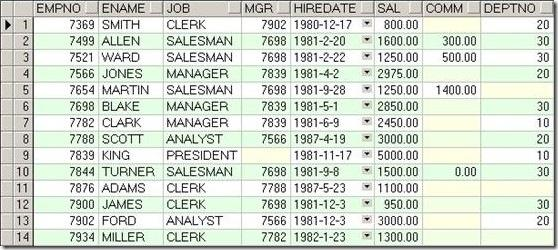

# Database basics

## 1. Introduction to the database

### 1.1 Why do you need a database

Human beings always have the need to record some information, the initial knotting note

With the development of mankind, characters, numbers and other symbols have been invented. These symbols can better record various events in life. But how to make records better preserved is a problem. 

From the initial turtle shell to the later paper, they are used to record this information. Slowly to more modern disks, etc., as the information grows, the requirements for data storage are getting higher and higher. How to be more effective and fast Processing this information becomes a
problem.


**The emergence of databases has solved the storage efficiency and read efficiency of data very well.**

------

### 1.2 What is a database

A database is a warehouse for storing data. In order to facilitate the storage and management of data, the data is stored on the disk in accordance with specific rules. Through the database management system, effectively organize and manage the data stored in the database.

**Database** is a warehouse (usually a file or a group of files) that organizes, stores and manages data according to the data structure.

One of the easiest ways to understand a database is to think of it as a file cabinet, which is a physical location where data is stored.

> Note: Some people usually use the term **database** to refer to the **database software** they use. This is incorrect. To be precise, the database software should be called **DBMS (Database Management System)**. **Database** is a container created and manipulated by **DBMS**. **Database** can be a file saved on a hardware device, but it doesn't have to be. It doesn't matter to us whether the **database** is a file or something else, because we don't directly access the **database**, we use a **DBMS**, which accesses the database for us.


### 1.3 What is a database system

Database system and database are not the same concept. Database system (DBS) is much larger than database and consists of database, database management system, and application development tools.

### 1.4、Current database classification

In today's Internet, the most common database models are mainly two types, namely **relational database** and **non-relational database. **


>Other databases:
>
>​ Hierarchical Model
>
>​ Mesh structure model
>
>​ Relational database (display data in the form of rows and columns, and store data in the form of two-dimensional tables)
>
>​ Object-oriented database

## Two, relational database

### 2.1. Introduction to relational database

The relational database model summarizes the complex data structure into simple binary relations (that is, two-dimensional table form).

In relational databases, almost all operations on data are based on one or more relational tables, and the management of the database is realized by sorting, merging, connecting or selecting these related tables.

Relational databases have been born for more than 40 years. From theory generation to actual products, such as Oracle and MySQL, Oracle has risen to the dominant position in the database field, forming a huge industrial market of tens of billions of dollars each year. MySql database has an absolute position in SMEs and free markets.

#### 2.1.1 Table

>> **Table (table)** is the basic unit of data storage in the database.
>
> 
>


#### 2.1.2 Column

> **Column** a field in the table. All tables are composed of one or more columns.

#### 2.1.3 Data Type

> **Datatype (datatype)** Each column has a corresponding data type, which is used to limit the data stored in the column.

#### 2.1.4 line

> A (row) record in the row table.

 The data in the table is stored in rows, and each saved record is stored in its own row. If you think of the table as a grid, the vertical columns in the grid are table columns, and the horizontal rows are table rows.

#### 2.1.5 Primary key

> Primary key (primary key) a column (or a group of columns), its value can uniquely distinguish each row in the table.

 Each row in the table should have a column (or set of columns) that can uniquely identify itself. The customer code column can be used in a customer table, and the order ID can be used in the order table. If there is no primary key in a table, it is difficult to update or delete specific rows in the table because there is no safe way to ensure that only related rows are involved.

**Primary Key Rules** Any column in the table can be used as a primary key, as long as it meets the following conditions:

-No two rows have the same primary key value (the primary key value of each row is unique).

-Each row must have a primary key value (primary keys do not allow null values)

  **Good habits for primary keys** In addition to mandatory rules, there are several generally recognized good habits that should be adhered to:

-Do not update the value in the primary key column

-Do not reuse the value of the primary key column

-Do not use values ​​that may change in the primary key column


## Three, install and uninstall MySQL

### 3.1 Installation

See the installation document for details

### 3.2 Uninstall

See the uninstall document for details

​ Close service:

### 3.3 Configure environment variables


### 3.4 Login

A: Because environment variables are configured, you can directly use the command line terminal and enter the following:

mysql -u root -p

enter password


>-u: followed by the user name
>
>-p: followed by a password
>
>-h: followed by IP


B: You can also use the mysql command line directly:


### 3.5 Start and stop mysql service

Dos command line: (You need to run cmd.exe as an administrator)

​ Input: net stop mysql

​ Input: net start mysql


Or through the operation interface: My Computer-Management-Service-start and stop the mysql service.

## Fourth, install Navicat

### 4.1 Installation and registration


### 4.2 Create connection


[Extension] A few terms of the database

```
DB: refers to datebase (database)
	A database is a collection of stored data. The database is usually composed of data tables, etc., and the data table is composed of information such as data fields and data values.
DBMS: refers to datebase mangement systerm (database management system)
	It is a system for operating and managing databases. For example, mysql, sqlserver, etc. belong to database management software. People use these systems or tools to manage the data in the database.
DBS: refers to datebase systerm (database system)
	The database system is composed of databases and database management software. The database is a logical concept of storing data, and the corresponding entity is the database stored on the hard disk by the database management software, so the database system includes the database and the database management software.
```
Understand the database:

The database we are talking about now generally refers to the relational database management system (RDBMS-Relatitonal database management system), that is, the database server.

After we install the database server, we can create a database in the database server, and each database can also contain multiple tables.

A database table is a table with multiple rows and multiple columns. When creating a table, you need to specify the number of columns in the table, as well as column names, strength and other information. Instead of specifying the number of rows in the table, there is no upper limit on the number of rows.


# Database operation

## One, SQL language

### 1.1 What is SQL

SQL is Structured Query Language (Structured Query Language)

### 1.2 The role of SQL

The client uses SQL to operate the server

​ Start mysql, after connecting to the server, you can use sql to operate the server

​ In the future, I will use python programs (or other programs, such as java) to link to the server, and then use sql to operate the server

### 1.3 SQL Standard

A unified operation method for DBMS formulated by the International Standards Organization (ISO) (for example, the same statement can be operated: mysql, oracle, etc.).

For example, SQL99, the standard developed in 1999

> SQL99
>
> (1) is the rule for operating all relational databases 
> (2) is the fourth generation language 
> (3) is a structured query language 
> (4) Just issue a legal and reasonable command, and the corresponding result will be displayed

Note that a certain DBMS not only supports the SQL standard, but also has its own unique syntax. For example, the limit statement can only be used in MySQL.

### 1.4 SQL syntax

1. The SQL statement can be written in a single line or multiple lines, ending with a semicolon

   ​ Sometimes it is not necessary to end with a semicolon, such as in the code

2. Spaces and indentation can be used to enhance the readability of statements

3. MySQL is not case sensitive, uppercase is recommended

### 1.5 Four categories of SQL99 standard: 

1. DDL data definition language (data definition language)

   ​ create table, alter table, drop table, truncate table. .

2. DML data manipulation language (Data Manipulation Language)

   ​ insert,update,delete 

3. DQL data query language (data query language)

   select

   In fact, DQL is also separated from DML.

4. DCL Data Control Language (Data Control Language)

   ​ Grant permission to scott, revoke permission from scott. . .

5. DCL (Transaction Control Language): commit, rollback, rollback to savepoint. . .

   


## Second, the basic operation of the database

### 2.1 Connect to the `mysql` database in the terminal

Enter the following command in the terminal:

```shell
mysql -u root -p
```

Enter the password after pressing Enter.

### 2.2 View database version

```mysql
select version();
```

Note: Don't forget the semicolon when entering the command

### 2.3 View current time

```mysql
select now();
```

### 2.4 Exit the connection to the `mysql` database

`exit` or `quit`


------


**The following operations can only be done after connecting to the database**

Note that you must include a semicolon at the end of the command.

### 2.5 Show all databases

```sql
show databases;
```

Note: There is an `s` after `databases`

### 2.6 Create a database

```mysql
create database [if not exists] database name [default charset utf8 collate utf8_general_ci];
```

Can be abbreviated:

```mysql
create database database name character set utf-8;
```


instruction: 

1. Do not use Chinese for the database name
2. Since some `non-ascii` characters will be stored in the database in the future, be sure to specify the character encoding, usually `utf-8` encoding
3. CHARSET select utf8 
   COLLATION select utf8_general_ci 
4. The character set in mysql is utf8, not utf-8.

### 2.7 Switch to the database to be operated

To manipulate the contents of the database, you need to switch to the database to be operated

```mysql
use database name;
```

### 2.8 View the currently selected database

```mysql
select database();
```

### 2.9 Delete database

```mysql
drop database [if exists] database name;
```

------

### 2.10 [Extension] MySQL add user, delete user and authorization

DCL Data Control Language (Understand)

Usually one user is created for a project. There is only one database corresponding to a project, and this user can only have permissions on this database and cannot operate on other databases.


Add users in MySql, create new databases, user authorization, delete users, and modify passwords (note that each line is followed by one; it means the end of a command statement):

#### 1. Create a user

A: Log in with root account first

Login MYSQL:

@>mysql -u root -p

@>Password: hanru1314

B: Create user:

```mysql
CREATE USER'username'@'IP Address' [IDENTIFIED BY'PASSWORD'] where password is optional;
	Users can only log in on the specified IP address
CREATE USER'username'@'%' [IDENTIFIED BY'PASSWORD'] where password is optional;
	Users can log in on any IP address
```


E.g:

create user "test"@"localhost" identified by "1234";

CREATE USER'john'@'192.168.189.71' IDENTIFIED BY "123";

C: Then log in:

mysql>exit;

@>mysql -u ruby ​​-p

@>Enter password

mysql> Successful login

#### 2. Authorize users

```mysql
Authorization format: grant permission on database.* to username@login host identified by "password";
```

2.1 Log in to MYSQL (with ROOT permission), log in as ROOT here:

@>mysql -u root -p

@>Password

2.2 First create a database (testDB) for the user:

mysql>CREATE DATABASE`testDB`DEFAULT CHARACTER SET utf8 COLLATE utf8_general_ci;

2.3 Authorize the test user to have all permissions of the testDB database (all permissions of a database):

```sql
Format: grant permission on database.* to username@login host identified by "password";
```

grant all privileges on *.* to'root'@'%' identified by '123456';

mysql>grant all privileges on testDB.* to test@localhost identified by '1234';

mysql>flush privileges;//Refresh the system privilege table


2.4 If you want to assign partial permissions to a user, you can write it like this:

mysql>grant select,update on testDB.* to test@localhost identified by '1234';

mysql>flush privileges; //Refresh the system privilege table

2.5 Authorize the test user to have certain permissions for all databases:

mysql>grant select,delete,update,create,drop on_._to test@"%" identified by "1234";

```mysql
 //The test user has select, delete, update, create, and drop permissions for all databases.

```

//@"%" means to authorize all non-local hosts, excluding localhost. (The localhost address is set to 127.0.0.1. If it is set to a real local address, I don’t know if it can be done. There is no verification.)

//Authorize localhost: add a sentence of grant all privileges on testDB.* to test@localhost identified by '1234';

**3. Revocation of permission**

```mysql
revoke permission 1, permission 2. . . on database.* from username@IP address;
```

Revoke the execution authority of the specified user on the specified database.

**4. View permissions**

```mysql
show grants for username@IP address;
```

**5. Delete user**

@>mysql -u root -p

@>Password

Delete account and permissions: >drop user username@'%';

\>drop user username@ localhost;


## Three, MySQL data type

The type of data fields defined in MySQL is very important for the optimization of your database. MySQL supports a variety of types, which can be roughly divided into three categories: numeric, date/time, and string (character) types.

### 3.1 Numerical Type

MySQL supports all standard SQL numeric data types. These types include strict numeric data types (INTEGER, SMALLINT, DECIMAL, and NUMERIC), and approximate numeric data types (FLOAT, REAL, and DOUBLE PRECISION). The keyword INT is a synonym for INTEGER, and the keyword DEC is a synonym for DECIMAL. The BIT data type saves bit field values ​​and supports MyISAM, MEMORY, InnoDB and BDB tables. As an extension of the SQL standard, MySQL also supports the integer types TINYINT, MEDIUMINT, and BIGINT. The following table shows the storage and range required for each integer type.


** Among the types in the above table, the most commonly used are 2 types: int (integer) and decimal (floating point).**


### 3.2 Date and time types

The date and time types that represent time values ​​are DATETIME, DATE, TIMESTAMP, TIME, and YEAR. Each time type has a valid value range and a "zero" value, and the "zero" value is used when specifying an illegal value that MySQL cannot represent. The TIMESTAMP type has a proprietary automatic update feature, which will be described later.


**Most commonly used: datatime type.**


### 3.3 String type

String types refer to CHAR, VARCHAR, BINARY, VARBINARY, BLOB, TEXT, ENUM, and SET. This section describes how these types work and how to use them in queries. CHAR and VARCHAR types are similar, but they are stored and retrieved in different ways. Their maximum length and whether trailing spaces are preserved are also different. No case conversion is performed during storage or retrieval. The BINARY and VARBINARY classes are similar to CHAR and VARCHAR, except that they contain binary strings rather than non-binary strings. That is, they contain byte strings instead of character strings. This means that they do not have a character set, and sorting and comparison are based on the numeric value of the column value byte. BLOB is a binary large object that can hold a variable amount of data. There are 4 BLOB types: TINYBLOB, BLOB, MEDIUMBLOB and LONGBLOB. They differ only in the maximum length of the value that can be accommodated. There are 4 TEXT types: TINYTEXT, TEXT, MEDIUMTEXT and LONGTEXT. These correspond to 4 BLOB types, with the same maximum length and storage requirements.


**The most commonly used: char, varchar and text types.**

> Summarize the commonly used types:
>
> int: integer
>
> double: floating point type, for example double(5,2) means up to 5 digits, of which there must be 2 decimal places, that is, the maximum value: 999.99
>
> decimal: floating-point type, there will be no lack of precision, such as money.
>
> char: fixed-length character string type: maximum length: char(255)
>
> varchar: variable-length character string type: maximum length: varchar(65535)
>
> text(clob): string type, storing large text.
>
> blob: byte type, maximum 4G
>
> date: date type, format: yyyy-MM-dd
>
> time: Time type: the format is: hh:mm:ss
>
> timestamp: timestamp
>
> datatime


## Fourth, the basic operation of the table

MySQL is not only used for table data manipulation, but also can be used to perform all operations on the database and table, including the creation and processing of the table itself.

**The database is stored in a table, and the table is stored in rows of data.**

### 4.1 View all tables in the current database

```mysql
show tables;
```

Note: There is an `s` after `tables`

### 4.2 Create Table

General syntax: **CREATE TABLE table_****name (column_name column_type);**

```mysql

CREATE TABLE [IF NOT EXISTS] table name (
	Column name column type (length) constraint default value,
  	Column name column type (length) constraint default value,
  	...
); 

E.g:
create table student(id int auto_increament primary key, name varchar(16) not null, age int, sex char(1));
```

Here, some data items need to be explained:

-The field uses NOT NULL because we don't want the value of this field to be NULL. Therefore, if the user will try to create a record with a NULL value, then MySQL will generate an error.
-The AUTO_INCREMENT attribute of the field tells MySQL to automatically increase the next available number in the id field.
-DEFAULT Set the default value.
-The keyword PRIMARY KEY is used to define this column as the primary key. You can use commas to separate multiple columns to define the primary key.


Exercise:

```mysql
create table test_table( test_id INT NOT NULL AUTO_INCREMENT, test_title VARCHAR(100) NOT NULL, test_author VARCHAR(40) NOT NULL DEFAULT'larry', test_date DATE, PRIMARY KEY (test_id) );
```


### 4.3 View table structure

General syntax: **desc table name;**

>describe tableName

```mysql
desc table name;
```


### 4.4 View table creation statement

```mysql
show create table table name;
```


### 4.5 Modify the table

General syntax: **ALTER TALBE table name....**

**1. Add a field** :add

```mysql
alter table table name add(
	Column name column type,
  	Column name column type,
  	...
);
```

**Modify table** 

**2. Modify column type**: modify

```mysql
alter table table name modify 
	Column name column type;
```

Note: If the modified column already has data, the new type may affect the existing data

**3. Modify column name**: change

```mysql
alter table table name change 
	Original column name and new column name column type;
```

**4.Delete column**: drop

```mysql
alter table table name drop 
	Column name;
```

**5. Change the name of the table**: rename to

```mysql
rename table original table name to new table name;
alter table original table name rename to new table name;
```

### 4.6 Delete table

```mysql
drop table [if exists] table name;
```

### 4.7 [Extension] Copy the data in the table (only copy the data without copying the structure of the table)

```mysql
create table table name 2 as select * from table name 1;
```


## Five, manipulate the data in the table

For the data sheet to improve the damage inspection (also called CRUD).

DML language: addition, deletion and modification

DQL language: check

> crud refers to the abbreviation of the initials of the words "Create", "Retrieve", "Update" and "Delete" when doing calculation processing. crud is mainly used to describe the basic operating functions of the database or persistence layer in a software system.

### 5.1 Query data

The operation of querying data is the most complicated, which will be discussed in detail later.
Only use the simplest one today.

```mysql
select * from table name;
```

------

### 5.2 Add data

There are many ways to increase data:

> Note: All string types in the database must use single quotes, not double quotes. Use single citations for date types.

#### 5.2.1 Full column insert

```mysql
insert into table name values(value 1, value 2,...);
```

instruction:

1. When inserting a full column, the data in each column needs to be added.
2. For automatically growing data, it needs to be occupied when inserting the whole column. Generally, 0 is used to occupy the position. However, the final value is subject to the actual situation.


#### 5.2.2 Default Insert

```mysql
insert into table name (column 1, column 2, ...) values ​​(value 1, value 2, ...);
```

instruction:

1. When inserting, the columns of `not null` and `primary key` must be assigned, and other columns are assigned according to the situation. If there is no assignment, the default value will be used.


#### 5.2.3 Insert multiple data at the same time

```mysql
insert into table name values ​​(value 1, value 2,...), (value 1, value 2,...),...;
```

or

```mysql
insert into table name (column 1, column 2, ...) values ​​(value 1, value 2, ...), (value 1, value 2, ...), ...;
```


------

### 5.3 Modify data (update data)

```mysql
update table name set column 1=value 1, column 2=value 2,... [where condition]
E.g: 
update stus set sex='male',age=100 where sex is null;
```

>conditions (conditions are optional)
>
>1. The condition must be a boolean type value or expression
>2. Operator: =,!=,<>,>,<,>=,<=,between..and, in(...),or ,and ,not, is null, is not null
>3. is null is not = null (always false)


### 5.4 Delete data

```mysql
delete from table name [where condition]
```


------

## Six, constraints (constraint)

When creating a data table, set a constraint for a certain field, which means to limit the numerical content of the column. You can also add constraints by modifying the table structure

### 6.1 Default value: default

### 6.2 Non-empty constraint: not null

  If a non-null constraint is added to a field, the value of the field cannot be null. For mysql, it means there is nothing and unknown. It is not 0, nor is it empty "", and it is not "NULL".

NUll

​ 0,"","NULL"

```mysql
create table stu (
	sid int,  
	sname varchar(20) not null, # Define the sname field value cannot be empty
	age int,
	gender varchar(10)
);
```

Remove non-empty constraints:

```mysql
alter table stu modify sname varchar(20);
```

Add non-empty constraints:

```mysql
alter table stu modify sname varchar(20) not null;
```

> The existing data in this column cannot have null values.


### 6.3 Uniqueness constraint: unique

  The uniqueness constraint emphasizes that all values ​​in the field are unique. No duplication is allowed. Null values ​​(multiple) are allowed.

```mysql
create table stu (
	sid int primary key auto_increment,  
	sname varchar(20) unique, # Define the sname field value must be unique
	age int,
	gender varchar(10)
);
Or, use constraint to restrict the name unique field.
create table stu (
	sid int auto_increment,
	sname varchar(20),
	age int,
	gender varchar(10),
  	[constraint] unique (sname) # indicates that the name field is unique
);
```

Delete the unique constraint:

```mysql
alter table stu modify sname varchar(20);
```

Add a unique constraint:

```mysql
alter table stu modify sname varchar(20) not null;
```

> The existing data in this column cannot have null values.

  Set constraints for existing fields
  alter table table name modify field constraints

  Add new fields, with constraints
```mysql
alter table table name add field data type constraints
```

  First delete the existing fields and re-add the constrained ones.
  alter table table name drop column column name
  alter table table name add column name data type constraints

### 6.4 Primary key constraint: primary key.

Primary key constraint: The value of this field must not be empty and the value must be unique. (not null+unique)

The primary key constraint is used to uniquely identify each row in the table. There can be at most one primary key constraint in a table.

  ```mysql
create table stu (
	sid int primary key auto_increment, # Define sid as the primary key of the stu table
	sname varchar(20),
	age int,
	gender varchar(10)
);
Or, use the constraint to restrict the name of the primary key field.
create table stu (
	sid int auto_increment,
	sname varchar(20),
	age int,
	gender varchar(10),
  	[constraint [sid_pk]] primary key (sid) # Specify sid as the primary key of the stu table
);
  ```

Delete the primary key:

```mysql
alter table stu drop primary key;
```

Add primary key:

```mysql
alter table teachers add primary key(id);
```


**Primary key auto-increment: ** auto_increment

It is required that the field value is not allowed to be empty and the value is unique. Therefore, we usually specify the primary key type as an integer, and then set it to grow automatically, so that the unique and non-null characteristics of the primary key column when inserting data can be guaranteed.

Set the primary key to automatically grow when modifying the table:

```mysql
alter table stu modify sid int auto_increment;
```

Delete the primary key automatically grow when the table is modified:

```mysql
alter table stu modify sid int;
```


### 6.5 Foreign key constraints: foreign key,

#### 6.5.1 Foreign keys

-Thinking: How to ensure the validity of relational column data? Is any integer okay? For example, there are class numbers, class names, and class positions in a class table. There is also a student table with student number, student name, student gender, and class number, etc.

A: It must be the data that exists in the class number column in the student table, and the validity of the data can be verified through foreign key constraints

**Foreign keys function for data integrity. **

The class table can be called the parent table (primary table): class, the field classno, the primary key of the table

The student table can be called a child table (from the table): student, the field sid is the primary key of the table, and classno is the foreign key of the table

  Parent table: department, field deptno, primary key of the table
  Child table: employee, field empno, primary key of the table, deptno, foreign key of the table

**The foreign key of the child table is the primary key of the parent table. **

1. When inserting data into a child table, the value of the foreign key field cannot be inserted casually, but depends on the value of the primary key of the parent table.
2. For the delete operation of the parent table, it depends on whether there is a record in the child table that references the value.


#### 6.5.2 Setting of foreign keys 

Method 1: When creating a child table, directly indicate the foreign key.

```mysql
Set the foreign key syntax:
  references the parent table (primary key);
  constraint classno_FK foreign key (classno) references class(classno);

Create data table
create table scores(
	sid int(4) primary key auto_increment,
	sname varchar(20),
	sage int(3),
	classno int(4),
	constraint stu_classno foreign key(classno) references class(classno) on delete cascade,
);
```

Method 2: Use the alter statement to add foreign keys today


```mymysql
alter table student add constraint stu_classno foreign key(classno) references class(classno);
```

```mysql
alter table student add constraint stu_classno foreign key(classno) references class(classno) on delete cascade;
```

-When inserting or modifying data at this time, if the value of classno does not exist in the student table, an error will be reported

Delete foreign key:

```mysql
alter table student drop foreign key stu_classno;
```


#### 6.5.3 Cascade operation of foreign keys

-When deleting data in the class table, if the classno value already exists in the student, an exception will be thrown

-Tombstone is recommended, it can also solve this problem

-The cascade operation can be specified when the table is created, or the cascade operation of the foreign key can be modified after the table is created

```mysql
  grammar:

  on delete cascade, when deleting the parent table, the data of the child table is directly deleted, cascade delete

  on delete set null, when deleting the parent table, the data of the child table is set to null.
```


-The types of cascading operations include:
  -restrict: default value, throw exception
  -cascade (cascade): If the record of the main table is deleted, the associated records from the table will be deleted
  -set null: Set the foreign key to null
  -no action: do nothing


