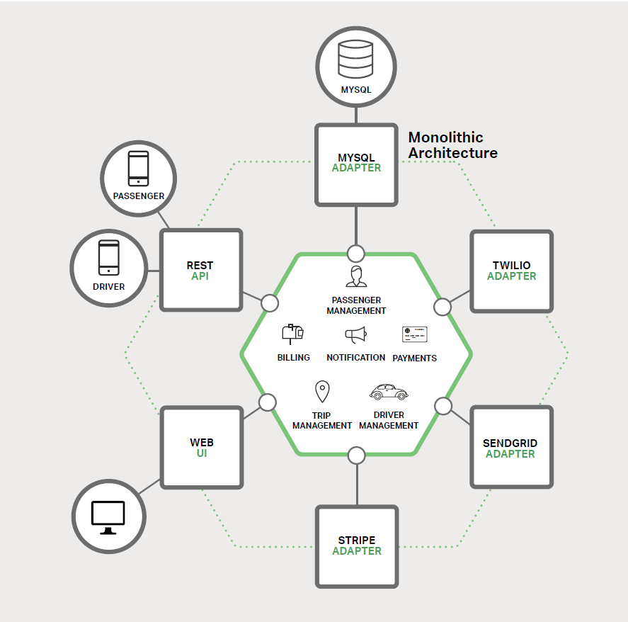
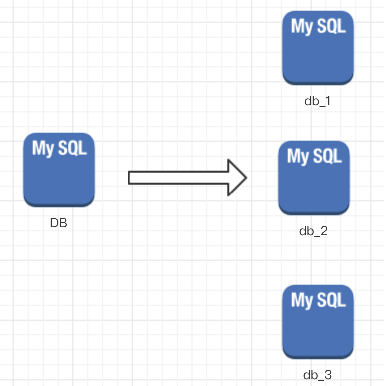
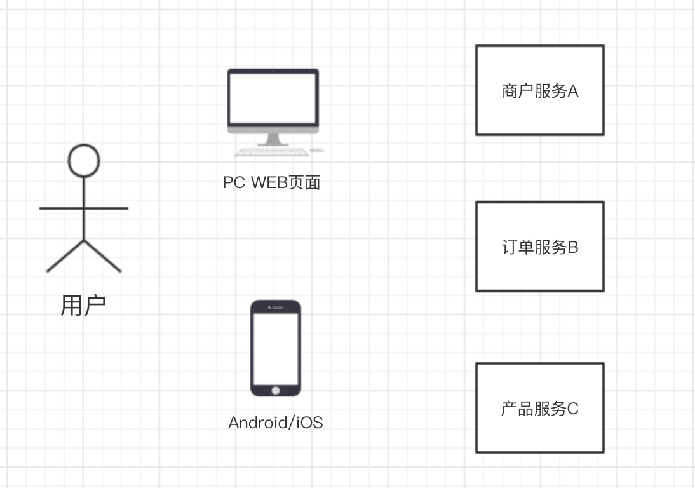

# Microservice features
**@author: Davie**
**Copyright: Beijing Qianfeng Internet Technology Co., Ltd.**

## 1. Introduction to Microservices-Building Monolithic Applications

Today, with the rapid development of Internet technology, microservices have attracted much attention: articles, blogs, social media discussions and conference speeches are all talking. At the same time, there are skeptical software community members who think that microservices are nothing new. Opponents claim that its thinking is just a reinvention of service-oriented architecture. However, whether it is hype or suspicion, it is undeniable that the microservice architecture model has very obvious advantages-especially in the implementation of agile development and iterative development of complex enterprise applications.

Starting from this article, let's start school to understand the relevant knowledge of learning microservices.

### 1.1, single application

Let's not ask what is a microservice? How to implement microservices? Let's start with creating an application and an ordinary project that we are most familiar with.

#### 1.1.1, taxi system

We assume that we want to start developing a taxi-hailing application, the goal is to compete with Uber and DiDi. After discussion and technical selection, we started to manually develop and generate a new project. The new application has a modular hexagonal architecture, as shown in the following figure:

The core of the application is the business logic implemented by **module**. It defines **services, domain objects, and events**. Surrounding the core is an adapter that interfaces with the outside world. Examples of adapters include database access components, message components that produce and consume messages, and web components that expose APIs or implement a UI.

* **Single application: **The so-called single application means that a war package contains all the functions of the project. For example, in the taxi-hailing application in the above example, although there is a logical modular architecture, the application is packaged and deployed as a single unit. For example, many well-known Java applications are packaged into WAR files and deployed on application servers such as Tomcat or Jetty. Other Java applications are packaged into executable JAR packages.

* **Features of single application:**
    * **Easy to develop: **Developers only need to use dedicated development tools such as (Eclipse, myEclipse) to manage the entire project code and complete code development.
    
    * **Easy to run and test: **Since we can complete the functional development and debugging of the entire project on the local development tool, it is naturally easy to test and debug on our local environment.
    
    * **Easy to deploy: **As we said in the example of a single application building project, when the application is developed, debugged, and tested, we only need to package the code, and then copy the packaged application to the server It can be deployed on.
    
#### 1.1.2, Internet company structure

For another example, let's take the static logic architecture of a common Internet company as an example. We divide the system into five layers through the following architecture diagram, as shown in the following figure:

* **Application layer: **The final customer-oriented software product, directly exposed to various apps, Web sites and Wap sites on the Internet.

* **Pre-service layer: **All kinds of business-heavy aggregation entrances, do a lot of work on the specific reference layer, realize the encapsulation of the business call chain, and achieve the strong realization of business logic.

* **Business service layer: **Contains various basic business service units, such as loan system, repayment system, credit investigation system, activity system, crawler system, drainage system, file system, etc.

* **Basic service layer: **Basic business services that do not include status, including but not limited to SMS gateway, file gateway, service monitoring, etc.

* **Data layer: **Includes various forms of data storage layer, but not limited to various databases, caches, message queues, etc.

As above, we explained to you what a single application is, the characteristics of the single application, and the architecture design of traditional applications from the perspective of traditional construction project applications and project architecture disassembly. Similar monolithic applications are very common in our past Internet development and enterprise applications, and many companies still have similar monolithic applications.

However, as demand grows and business changes, monolithic applications will also encounter some problems after slow development and iteration, and the bottleneck of monolithic applications will gradually appear.

[Note:] The above documents, part of the content is excerpted from "Docker Microservice Architecture Practice", author Jiang Biao

## 2. Introduction to Microservices-Towards Monolithic Hell

In the last lesson, we said that when we are developing a new application, we can build an overall application system, which we call a monolithic application. When our application has just started, there are few business functions, and the amount of code is controllable, we can still develop normally.

### 2.1. Limitations
However, as the system business continues to grow and the amount of code continues to increase, the performance and maintenance costs of the single application system we maintain and create will be restricted, limiting our ability to continue to add new businesses.

### 2.2, the development trend of single application
There is a trend for successful applications, and the entire project will become more and more bloated over time. The development team has to implement more user requirements in each iterative development cycle, which means that many lines of code need to be added. After several years of operation and maintenance of the original single reference, a small and simple application will gradually grow into a huge application.

### 2.3、Problems and Dilemmas
Once the application becomes a large and complex monolithic application, the entire development team may fall into a painful situation and may encounter many, many problems, such as:

* **Agile development frustrated**

    **The main problem is: the application is really complex, which is too large for any developer**. In the end, it becomes very difficult and time-consuming to fix bugs and implement new features correctly.
    
    Take the application startup time as an indicator. The larger the application, the longer the startup time. I have heard of strange things that take more than 40 minutes to start an application. If developers often have to restart the application server, then a large part of the time is spent in waiting, which will greatly affect our work efficiency.
    
* **Continuous deployment frustrated**
    
    Another big problem is that the complex monolithic application itself is an obstacle to continuous deployment. Today, SaaS (Software-as-a-Service) applications have developed to the point where changes can be pushed to the production environment multiple times a day. This is very difficult for complex monoliths, because it requires redeploying the entire application to update any part of it. Considering the long startup time mentioned earlier, this would not be a good thing.

    In addition, the impact of changes is usually not clear, and developers are likely to need to do a lot of manual testing. For example, we only modify a certain part of the code, but because it is all deployed, we must re-test the entire system on the entire link, which will consume a lot of extra time.
    
    Therefore, continuous deployment is impossible.
    
* **App is difficult to expand**

    When resource requirements conflict between different modules, a single application may be difficult to expand. For example, one module may perform intensive image processing logic and is ideally deployed in the cloud server A instance; another module may be an in-memory database, which is most suitable for deployment in the cloud server B instance. However, because these modules belong to the same application, they can only be deployed together. At this time, the operation and maintenance personnel must make compromises and concessions in hardware selection. Therefore, the ability of the originally designed system to handle business will be affected. Limitations of the hardware environment.

* **Low reliability**

    Another problem of monolithic applications is low reliability. Because all modules are running in the same process. A bug in any module, such as a memory leak, may bring down the entire process.
    
    In addition, since all instances of the application are the same, the error will affect the availability of the entire application and affect the entire application.

* **Difficult to upgrade technology**

    Monolithic applications are very difficult to adopt new frameworks and languages ​​because of their huge size. Suppose there are 500,000 lines of code written using a certain framework. If you use a newer framework to rewrite the entire application, it will be very expensive (in terms of time and cost). Therefore, this is a very big obstacle for the team to adopt new technologies and upgrade the system.

Finally, after reviewing the above issues, let’s summarize: When we develop a project application with a small business volume and appropriate functions, through the development of a single application, we can meet our development needs and achieve business Function. When the business volume grows rapidly and the system continues to be developed and iterated, our application volume and business complexity will become higher and higher, which will affect the development efficiency of developers and increase the maintenance cost of the project. Our projects will encounter various The bottleneck problem, the continuous expansion ability of the application is limited, and the performance is also affected.

Now that such problems are encountered in the actual production environment, as project managers and project developers, we must find ways to solve these problems.

How can we solve the problem of limited scalability and various bottlenecks encountered after continuous iteration of the project? The answer is **microservices**.

[Note:] Part of the above documents in this article are excerpted from "Docker Microservice Architecture Practice", author Jiang Biao.

### Three. Introduction to Microservices-Solving Complex Problems
Many large companies, such as Alibaba, Tencent, Weibo, Didi, etc., have adopted the so-called microservice architecture model to solve the various problems encountered by the single application we mentioned earlier. The main idea: ** Decompose the application into a set of smaller interconnected services. **

#### 3, 1 microservice solution 

**A service usually implements a set of different features or functions, such as order management, customer management, etc. Each microservice is a small mini application, where it needs to be relied upon, it connects with other required servicestar business logic through REST API. **

* **Microservice Architecture**

    Some microservices expose a set of APIs for other modules to access and use. Other microservices implement their own business logic, and when necessary, they can be accessed through the API. For example, the aforementioned single application can be disassembled into the following architecture:

    

    The specific performance is: **Each functional area of ​​the application is now implemented by its own microservices. **For example, taking our taxi system as an example, one is for passengers and the other is for drivers. This makes it easier to deploy different scenarios for specific users, drivers, devices, or specialized use cases. Each backend service exposes a REST API, and most of the APIs consumed by services are provided by other services. For example, Driver Management uses a Notification server to notify available drivers of an optional route. The UI service calls other services to render the page.

* **Relationship between microservices and databases**

    Since we have obviously affected the relationship between the application and the database by the microservice architecture model, it is different from other shared single database model services, each of which has its own database model. On the one hand, this approach is contrary to the idea of ​​an enterprise-level database data model. In addition, it often leads to partial data redundancy. For the microservice architecture, each service should have its own database schema, because it can achieve loose coupling. As shown below:

    

    The characteristic of the design architecture in this mode is that each service has its own database. Moreover, the service can use a database that best suits its needs and is known as a multilingual persistent architecture. For example, to find drivers close to potential passengers, Driver Management must use a database that supports efficient geographic queries.

**【Supplement: Telescopic Cube】**

Whether it is a monolithic application or a microservice architecture application, when the actual production environment and the amount of data increase, they will face the need for application expansion and improve processing capabilities. There are different ways to explore the scalability of the system. Generally, we have the following common methods to improve the scalability of the system:

* It is composed of multiple copies running after the load balancer. If there are N copies, no copy is responsible for handling 1/N of the load. For example, when our system traffic is too large, we often deploy to multiple Tomcats. These Tomcats are all mounted on the same load balancer, so that the business volume handled by each Tomcat is reduced to the original part. . As shown below:
    

* Decompose the database. It turns out that all services and functions are stored in a unified database, such as db1. In order to improve the performance of the system and the ability to process data, the business modules that are originally coupled and depend on the same system can be split into multiple small-scale business modules, which is what we call the implementation architecture of microservices. Microservices only implement core functions. For example, the order module is split into one microservice, and the payment module is split into one microservice. In the process of splitting, because each microservice is deployed independently, the order table corresponding to the order module exists in one database db1, and the payment table corresponding to the payment module exists in another database db2. This completes the split from one database to multiple databases. As shown below:

    

* Split the data table. In the database, when the amount of data in the same table is too large, our query and other businesses will become less efficient when operating the database. We need to improve the efficiency of database operations by other means. To solve the problem of excessive data volume of the same table data, it is solved by dismantling the table. For example, we store the data of 0-10000000 in the first table, store the data of 10000001-20000000 in the second table, and so on. When we operate the database, we can query the corresponding database. As shown below:

##### **Retractable Cube**
Scaling cube is a concept proposed in a technical book, the title of this book is "The Art of Scalability".

After the system scalability solution we introduced to you above, let's explain the scalability cube. In the above-mentioned telescopic cube table, there are X-axis, Y-axis, and Z-axis. The specific axis plan is as follows:

* **X axis:** Multiple instances after running multiple load balancers.

* **Y-axis: **The application is further broken down into microservices (sub-library)

* **Z axis: ** When the amount of data is large, the data is partitioned (sub-table)

#### 3, 2 Advantages and disadvantages of microservices
* **Benefits of Microservices**
    * ** Solve complex problems. **The microservice architecture decomposes a monolithic application that may become huge into a set of services. Although the number of functions remains the same, the application has been broken down into manageable blocks or services. Each service has a way to clearly define its boundaries, such as remote procedure call (RPC) drivers or APIs. The microservice architecture pattern enforces a certain degree of modularity. In fact, it is extremely difficult to implement using monolithic code. Therefore, using the microservice architecture pattern, individual services can be developed faster, and easier to understand and maintain.

    * ** Team division of labor and collaboration is easier. **The microservice architecture allows each service to be independently developed by a team. Developers are free to choose any technology that conforms to the service API. Of course, more organizations hope to avoid complete chaos by restricting technology selection. However, this freedom means that it is no longer possible for developers to use outdated technologies at the beginning of such free new projects. When writing a new service, they can choose the current technology. In addition, due to the small size of microservices, it will become more feasible to rewrite old services using current technology.

    * ** Independent deployment. **The microservice architecture pattern can realize the independent deployment of each microservice. Developers do not need to coordinate the deployment of local changes to the service at all. These changes can be deployed as soon as they are tested. For example, the UI team can go through its own development and testing, and quickly iterate UI changes. The microservice architecture model gives each team that focuses on its core business more autonomy.
    
    * **Strong program expansion capability. **The microservice architecture pattern enables each service to be independently extended. Developers can only deploy the number of instances that meet the capacity and availability constraints of each service, and each development team can also use the hardware that best matches the resource requirements of the service. For example, we can deploy an image processing service on the cloud server A instance, and deploy an in-memory database service on the cloud server B instance. The microservice architecture makes it a reality for us to deploy instances separately.
    
The above points are that we have described the advantages of microservices. Compared with monolithic applications, microservices have their advantages, but of course there are also disadvantages.

* **Disadvantages of microservices**
    
    * **The scale is difficult to define. **Like the name of microservices, the design pattern based on microservice architecture focuses too much on split and micro, so that a large project will be split into many microservice instances. In the process of splitting, there are often different standards on how to define the scale of microservice mini-applications. Some people use core functions as the standard, while others advocate the amount of code as the standard. In short, the measurement standards are different. What we need to emphasize is: **Microservices are only a technical means, not the main goal. **The goal of microservices is to fully decompose applications to facilitate agile application development and deployment.

    * **Increase system complexity. **Because microservices are deployed independently and split into individual functional service instances. Therefore, the original single application becomes a distributed system. How to manage this distributed system increases the complexity of the original application invisibly. In a distributed system, to realize the communication and business invocation between various microservice instances, developers need to select and implement an inter-process communication mechanism based on message or RPC framework to realize inter-microservice communication. In addition, issues such as requests, debugging, and coordination between multiple microservice calls will also increase the communication cost between teams. Compared with a single application, the microservice architecture is also more complicated at this point.
    
    * **Difficulties in partitioned database architecture. **When we are doing normal business development, we often need to involve data calls and data updates between multiple modules. Under the original monolithic application, it is relatively easy to implement, we only need to operate different entity tables to achieve, but in the microservice architecture, because the data storage is independent storage and deployment, which leads us to update more in a certain business When the data of each module, we need to call different microservice interface APIs to update in turn. In the actual development and practice process, this problem will also become one of the main problems for developers.

    * **The difficulty of project testing has increased. **In the original single application, developers can write test cases and test methods in a unified test directory, and then start the application service to test system functions. This is a common practice and comparison for developers. Familiar approach. In comparison, if we want to perform functional testing of microservices, we need to start all the microservices that we depend on before they can be executed. Although this task is not difficult, it should be known that once our microservice instance depends on a large number of other instances, the workload for developers to debug will rise linearly.
    
    * **Multi-service modification is more difficult. **For example, there are three modules in the original single application: Module A, Module B and Module C. When we have business logic that needs to be modified, we only need to coordinate the modification of three modules in the same application, complete the adjustment of business functions, and then test and go online. But in microservices, when we need to make business adjustments across multiple microservice instances, we need to plan and coordinate carefully to complete the adjustment of the entire business. In this way, the cost of iterative maintenance will increase for developers.

    * **Microservices need to be deployed multiple times. **When the original single application is deployed, all the project modules can be packaged into an overall deployment package, and then deployed to a server or a group of servers. In comparison, after the program is changed to a microservice architecture, the number of applications will increase, so that it needs to be deployed multiple times during the overall operation, which is a lot of work.
    
The above points are the shortcomings of the microservice architecture. We must treat and use microservices dialectically, which is essentially a technology, and we must use microservices technology to solve problems in real projects.

## Fourth, the concept of microservices and the problems of microservice architecture practice
In the previous few courses, we talked about the transformation of project architecture from monolithic application to microservice architecture, and the advantages and disadvantages of monolithic application and microservice architecture. In this lesson, let's take a look at the definition and standards of microservices, as well as the problems solved in practice.

### 4, 1 Definition of microservices
Combine the articles and relevant knowledge we have learned before, and combine relevant information. We refer to the definition of microservices given by Mr. Martin, the father of microservices: **Split a single application into a set of tiny service components, each tiny service component runs in its own process, and the components pass such as RESTful API Such a lightweight mechanism interacts. These services are centered on business capabilities and are independently deployed with an automated deployment mechanism. In addition, these services can be developed in different languages ​​and use different technologies to store data. **Through the above definition and description, we can basically determine the section characteristics of the given microservice, as shown below:

* In a distributed environment, a single application is split into a series of services to form the entire system together.

* Each service is lightweight, deployed separately, and runs in its own process.

* Each microservice focuses on the development of its own core capabilities, and uses lightweight communication methods for communication between microservice components, including but not limited to RESTful APIs.

* Divided according to business boundaries.

* Microservice is a programming architecture thought, which can be implemented in different languages.

### 4, 2 Problems to be solved in the practice of microservices
To use microservices to practice in production projects, we must first solve some problems. For example, the microservice business architecture shown in the figure below:

In the architecture diagram shown in the diagram above, we assume that business merchant service A, order service B, and product service C are split into a microservice application and deployed separately. At this time, we are faced with many possible problems to be solved, such as:

* **1. How does the client access these services? **

* **2. How to communicate between each service? **

* **3. How to implement multiple microservices? **

* **4. What should I do if the service fails abnormally? **

These are all problems and need to be solved one by one.

#### 4.2.1. How does the client access the service

In the development of a single application, all services are local, and the front-end UI interface and the mobile APP program can directly access the back-end server program.

Now it is split into independent services by function and runs in independent processes. As shown below:

At this time, there are N services in the background, and the front desk needs to remember to manage N services. If a service is **offline**, **update**, **upgrade**, the foreground and mobile apps must be redeployed or Re-issue of the contract, this obviously does not serve our split concept. Especially with the rapid development of current business requirements, business changes are very frequent.

In addition to difficulties in access management, the invocation of N small services is also a significant network overhead. In addition, general microservices are usually stateless inside the system, and our users often operate across business modules when they perform business operations, and they need to be stateful. In this system architecture at this time, it is also Can't solve this problem. Traditionally used to solve user login information and authority management usually has a unified place to maintain and manage (OAuth), which we call authorization management.

Based on the problems listed above, we adopt a technical solution called a gateway (API Gateway in English) to solve these problems. The main functions of the gateway include:

* **Provide a unified service entrance, make microservices transparent to the front desk**

* **Aggregate back-end services to save traffic and improve performance**

* ** Provide API management functions such as security, filtering, flow control, etc.**

The gateway (API Gateway) can be implemented in many generalized ways. It can be a box of software and hardware, a simple MVC framework, or even a Node.js server. Their most important role is to provide aggregation of back-end services for the front desk (usually mobile applications), provide a unified service exit, and release the coupling between them, but API Gateway may also become a **single point of failure** point or performance Bottleneck.

Finally, the business architecture diagram with the added gateway (API Gateway) is changed to the following:

#### 4.2.2 How to communicate between services
All microservices are deployed independently and run in their own process container, so the communication between microservices and microservices is IPC (Inter Process Communication), which translates to inter-process communication. The scheme of inter-process communication has been relatively mature, and now there are two most common categories: **synchronous call and asynchronous message call**.

##### **Synchronous call**
Synchronous call is relatively simple and consistent, but it is prone to call problems and poor performance experience, especially when there are multiple call levels. There are two ways to implement synchronous calls: **REST** and **RPC**
* **REST: **REST is based on HTTP, which is easier to implement and supports various languages. At the same time, it can be cross-client. There is no special requirement for the client. It can be used as long as it has the HTTP network request library function.
* **RPC: **rpc is characterized by high transmission efficiency, controllable security, and is used more when calling and implementing within the system.

Based on the characteristics of REST and RPC, the principles we usually adopt are: **Use REST for external exposure to the system, and use RPC for internal exposure of the system. **

##### **Asynchronous message call**
The asynchronous message method is particularly widely used in distributed systems. It can not only reduce the coupling between calling services, but also become a buffer between calls, ensuring that the message backlog will not overwhelm the callee, and at the same time, it can ensure that the caller The service experience, continue to do what you should do, and will not be slowed down by the background performance. The price to be paid is the weakening of consistency and the need to accept the data **final consistency**. The so-called final consistency is that the synchronization may not be completed immediately, there will be a delay, but the data synchronization will be completed in the end; Background services generally need to achieve **idempotence**, because messages are generally repeated due to performance considerations (ensure that the message is received and received only once is a big test for performance). Finally, an independent Broker must be introduced as an intermediate agent pool.

Common frameworks for asynchronous message calling are: Kafaka, Notify, and MessageQueue.

In the end, most of the call architecture between services is implemented as follows:

#### 4.2.3, how to implement many microservices
In the microservice architecture, generally each service has multiple copies for load balancing. A service may go offline at any time, or it may add new service nodes in response to temporary access pressure. This brings up a new problem:

* **How ​​do services perceive each other? **For example, when a new service instance is online, how does the online instance know and communicate with it?

* **How ​​to manage the service? **The number of service instances is large, and it is also facing the problem of how to manage it.

This is the problem of service discovery, identification and management. To solve the identification between multiple services, the problems found are generally carried out through registration.

Specifically: When the service goes online, the service provider registers its service registration information in a special framework, maintains a long link through the heartbeat, and updates the link information in real time. The service caller uses the service management framework to address, find the corresponding service according to a specific algorithm, or cache the registration information of the service locally to improve performance. When a service goes offline, the service management framework will send a notification that the service goes offline to other services.

Common service management frameworks are: Zookeeper and other frameworks.

There are two specific implementations of the above problem solution: **client-based service registration and discovery**, **server-based service registration and discovery**.

##### Client-based service registration and discovery
The advantage is that the structure is simple, the extension is flexible, and it only depends on the service registrar. The disadvantage is that the client has to maintain all the addresses for invoking the service, which is technically difficult, and generally large companies have mature internal framework support.

##### Server-based service registration and discovery

The advantage is simplicity. All services are transparent to the front-end caller. Generally, small companies deploy more applications on cloud services.

#### 4.2.4. Handling of abnormal situations such as service downtime
As mentioned earlier, a big risk in monolithic application development is to put all the eggs in one basket, and all the eggs will be prosperous. The biggest feature of distributed is that the network is unreliable. Splitting through microservices can reduce this risk, but if there is no special guarantee, the outcome is definitely a nightmare.

Therefore, when our system is composed of a series of service call chains, we must ensure that any problems in any link will not affect the overall link. There are many corresponding methods, such as:

* Retry mechanism

* Limiting

* Fuse mechanism

* Load balancing

* Downgrade (local cache)

