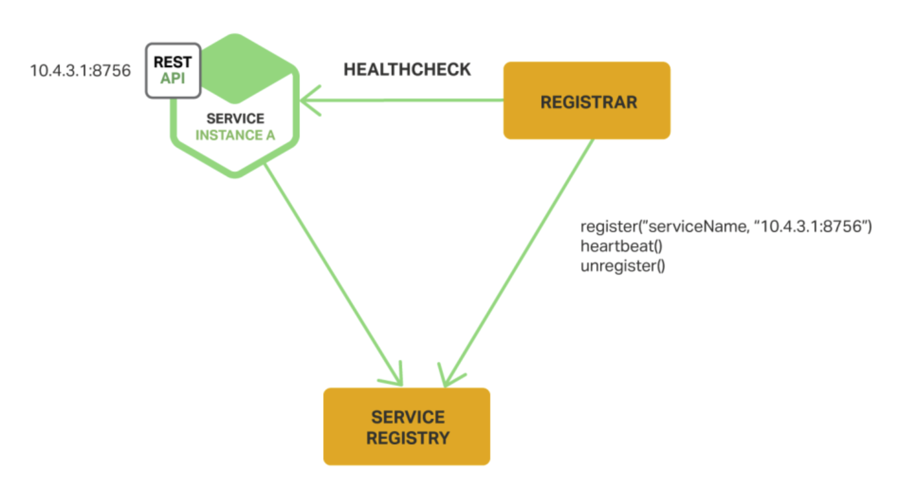
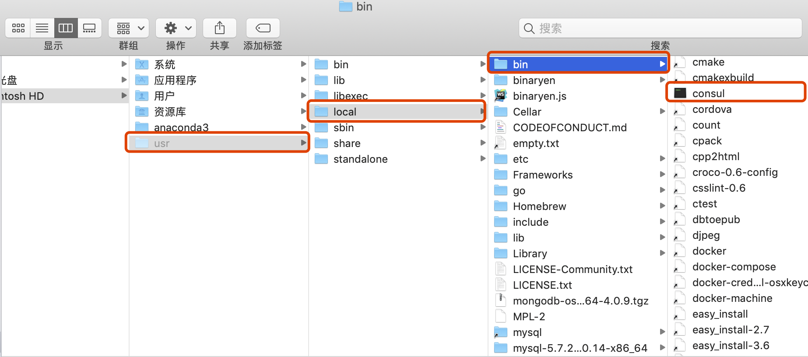
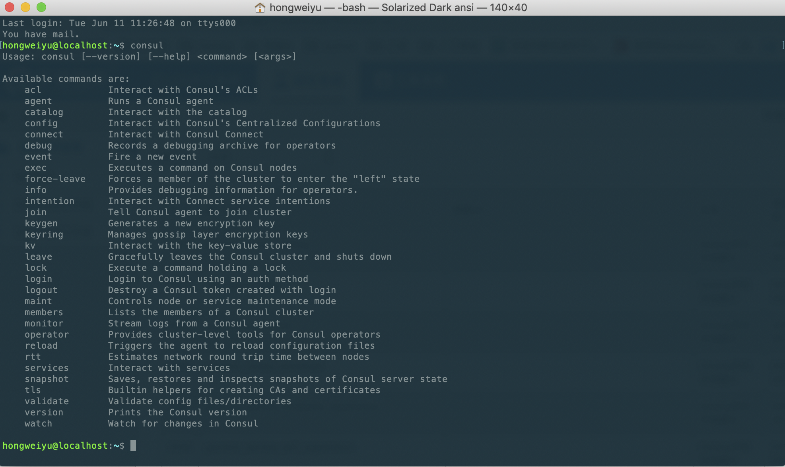
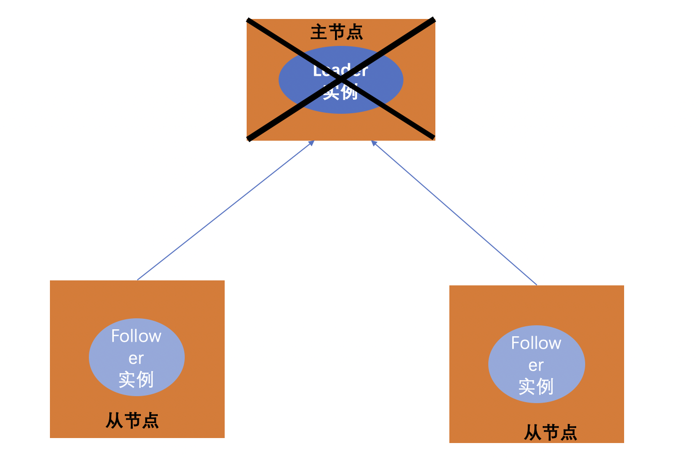
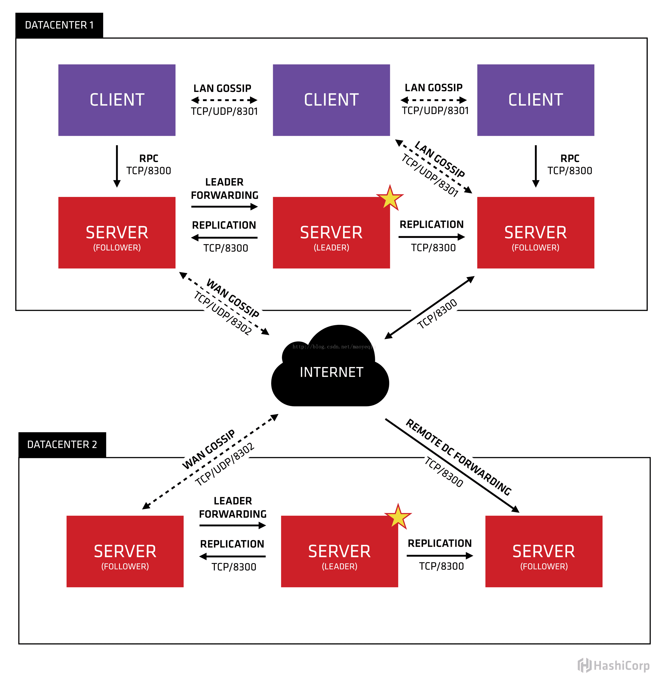
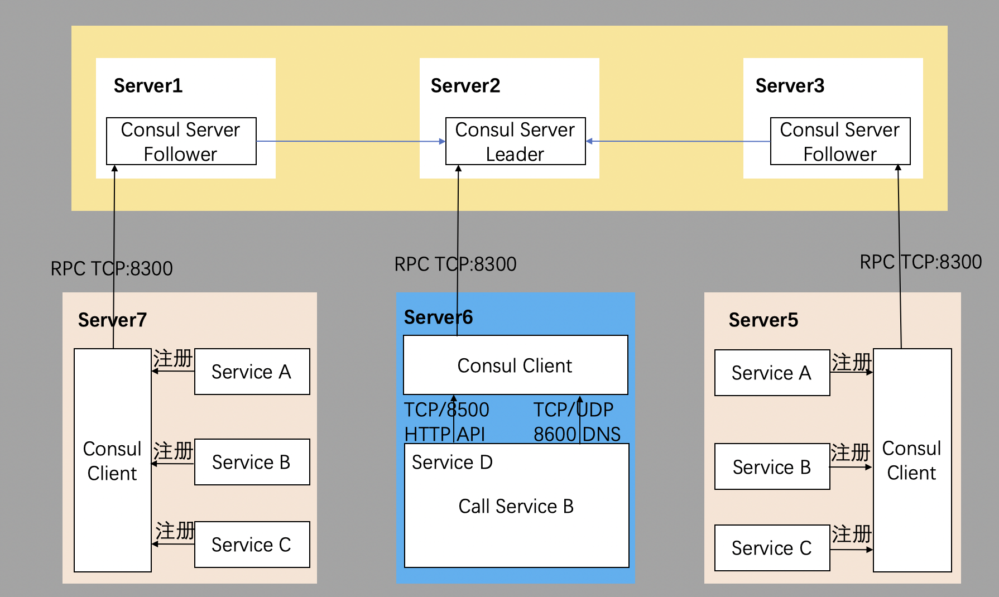
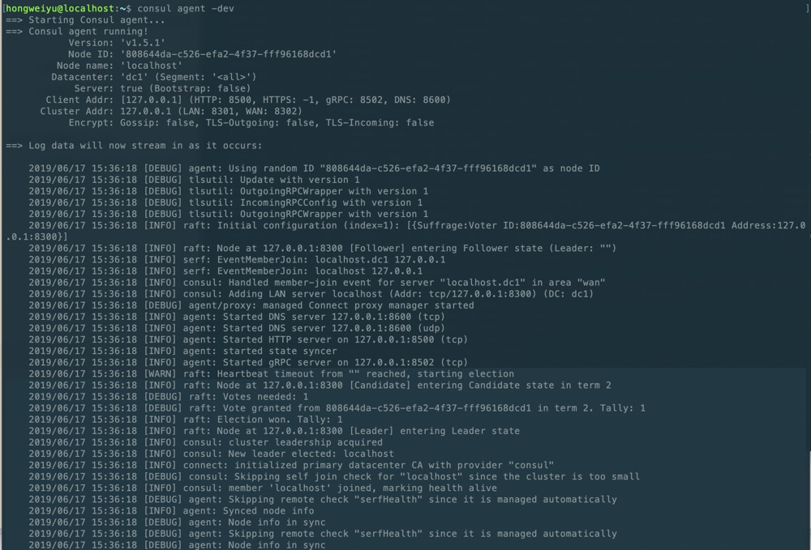
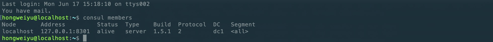
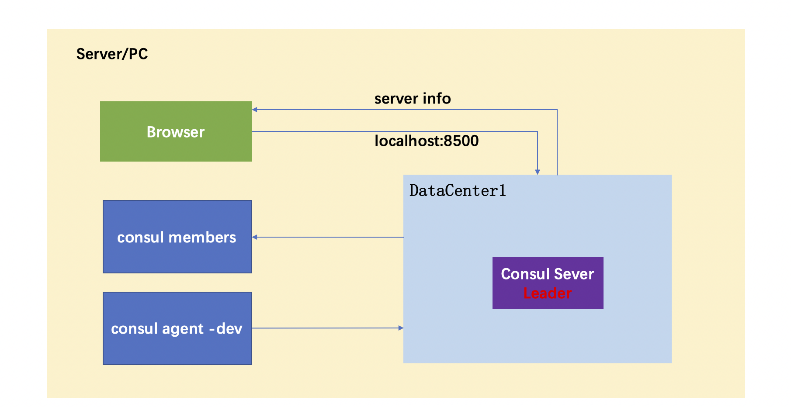

# Microservice management (on)
**@author: Davie**
**Copyright: Beijing Qianfeng Internet Technology Co., Ltd.**

## One, microservice management--service discovery

In the introduction to microservices, we have introduced four basic problems to be solved in the microservice architecture. From this lesson, we will learn how to implement service management.

### 1.1. Why use service discovery

Imagine that we write some code to call a service through REST API or Thrift API. In order to initiate this request, the code needs to know the network address (IP address and port number) of the service instance. In traditional applications running on physical machines, the network address of a service instance is generally static. For example, the code can read the network address from a configuration file that is only updated occasionally.

However, in the current popular cloud platform-based microservice applications, there are more difficult problems that need to be solved as shown in the figure below:


Service instances need to dynamically allocate network addresses, and a group of service instances may dynamically change due to automatic expansion, failure or upgrade, so the client code should use a more refined service discovery mechanism.

In production practice, there are mainly two service discovery mechanisms: **client-side discovery** and **server-side discovery**. Let's introduce these two mechanisms separately:

### 1.2, client discovery mode
When we use the client to discover, the client is responsible for determining the network address of available service instances and load balancing the requests in the cluster. The client accesses the **service registration table**, which is a database of available services, and then the client Use a load balancing algorithm to select an available service instance and initiate a request. The mode is shown in the figure below:


This mode is the same as the client mechanism in the service discovery mechanism that we introduced in the introduction to microservices, as shown in the figure:


The network address of the service instance is registered in the service registry when the service is started, and removed from the service registry when the instance terminates the service. The registration of service instances is generally refreshed periodically through the **heartbeat mechanism**.

* **The advantages of the client discovery mechanism:**
    * In this mode, only the service registry is added, and the overall structure is relatively simple;
    * The client can use more intelligent, application-specific load balancing mechanisms, such as consistent hashing.
* **Disadvantages of the client discovery mechanism: ** In the client discovery mechanism, the client is closely coupled with the service registry, and the developer must specify the programming language and framework version corresponding to each consumer service client Implement service discovery logic.

* **Application of client-side discovery mode: **Often large companies will use the client-side discovery mechanism to realize the mode of service discovery and registration.

### 1.3, server discovery mode
Corresponding to the client discovery mode, another service discovery mode is called the server discovery mode. The overall architecture is as follows:


In this mode, the client sends a request to the service through a load balancer, and the load balancer queries the service registry and routes the request to an available service instance. Like client discovery, service instances register and deregister services through the service registry.

Similarly, there are advantages and disadvantages of the server-side issuing mode:

* **The advantages of server discovery mode:**
    * The details of service discovery are abstract to the client, and the client only needs to send a request to the load balancer.
    * This approach reduces the trouble of implementing service discovery logic for different programming languages ​​and frameworks for consumer services. Many deployment environments already provide this feature.
* **Disadvantages of the server-side discovery model: ** Unless the deployment environment already provides a load balancer, this is another highly available system component that requires additional settings and management.

### 1.4, service registration form
The service registry is a key part of service discovery. It is a database containing the network addresses of service instances. A service registry needs to be highly available and updated in real time, and the client can cache the network address obtained from the service registry. However, in this case, the cached information will eventually expire, and the client can no longer find service instances based on this information. Therefore, the service registry uses a replication protocol for service instances in the cluster to maintain consistency.

For example: Netflix Eureka is a typical case implementation of a service registry. It provides a REST API for the registration and query of service instances: **A service instance can use POST to register its own network address, and it must pass every 30 seconds PUT to refresh, the service instance can directly or use DELETE to delete the information in the registry when the service instance registration expires, and the client can use HTTP GET to obtain the information of the registered instance. **

Of course, in addition to Netflix Eureka, there are:
* **etcd: ** A highly available, distributed, consistent, key-value storage, used in shared configuration and service discovery. Two famous projects used it: Kubernetes and Cloud Foundry.
* **consul:** A tool for discovering and configuring services. It provides APIs for client registration and service discovery. Consul can also determine the availability of services by performing health checks.

* **Apache Zookeeper: **Zookeeper is a widely used, high-performance coordination service for distributed applications. Apache Zookeeper was originally a sub-project of Hadoop, and is now a top-level project.

### 1.5, service registration method
The service instance must use the service registry to register and deregister the service. In practice, there are different ways to realize the registration and deregistration of the service:

* **self-registration mode: ** In this mode, the service instance itself is responsible for registering and deregistering itself through the service registry. In addition, if necessary, the service instance can send a heartbeat packet request to prevent the registration from expiring. The architecture of this mode is implemented as follows:
* 
    
    
    The **self-registration** mode has some advantages and disadvantages: One of the advantages is that it is relatively simple and does not force the use of other system components. However, a big disadvantage is that it makes the service instance and the service registry strongly coupled. You must implement the registration logic in each client programming language and architecture code that uses the service.
    
* **third-party registration mode: **When using the third-party registration mode, the service instance itself is not responsible for registering itself through the service registry, on the contrary, the registration is handled through another system component called service registrar . The service registrar detects the changes of some running instances by polling or subscribing to events. When it detects a new available service instance, it registers the instance in the service registry. The service registrar is also responsible for canceling the service instance that has been terminated. , The following figure shows the architecture of this mode:
    
    
    
    The third-party registration model also has some advantages and disadvantages: the main advantage is that the service is decoupled from the service registry. You do not need to implement the logic of service registration for each development language and framework used by the developer. On the contrary, the registration of service instances It is handled in a centralized manner by a proprietary service. The disadvantage of this model is that unless it is built into the deployment environment, it is another highly available system component that needs to be set up and managed.
    
### 1.6、Summary
In a microservice application, a group of running service instances are dynamically changing, and the instances have dynamically assigned network addresses. Therefore, in order for the client to initiate requests to the service, a service discovery mechanism is required.

The key to service discovery is the service registry. The service registry is a database of available service instances. It provides APIs for management and query. Service instances use these management APIs for service registration and cancellation, and system components use query APIs to discover available service instances.

* Cases discovered by the client: Eureka, ZooKeeper
* Cases found on the server: consul+nigix

We choose Consul to learn.

### 1.7, Consul
* **Consul Overview**
Consul is a service discovery and configuration management center service developed by Google open source using the go language. Consul is a tool for discovering and configuring services in the basic settings of the microservice architecture. Consul provides the following core functions:
    
    * **Service discovery: **Some clients of Consul can provide a service, and other clients can use Consul to discover the provider of this service.
    
    * **Health check: **Consul client can provide some health checks, which can be associated with a specified service, such as the detection of heartbeat packets.
    
    * **Key-value storage: **Application instances can use the hierarchical key-value storage provided by Consul, such as dynamic configuration, feature tagging, collaboration, etc. Obtain through HTTP API.

    * **Multi-data center: **Consul has very good support for multiple data centers.

* **Official website:**
You can visit [https://www.consul.io/](https://www.consul.io/) to view the relevant introduction of Consul and obtain relevant information.

* **Install:**
In the official document, click the Download button to enter the download software interface [https://www.consul.io/downloads.html](https://www.consul.io/downloads.html), select your own system Type, as shown in the figure below:


The latest version of Consul is v1.5.1.

## Two, microservice management-distributed and single point of failure
In the last lesson, we mentioned the service registration and discovery mechanism. A service registration discovery component can be introduced to realize service management, complete service registration, information query, storage configuration and other functions. Although the introduction of the service registration discovery component solves the problem, it will introduce new problems.

### 2.1, Consul environment configuration

* 1. Decompress the downloaded consul_1.5.1_darwin_amd64.zip, and get the executable file consul after decompression.

* 2. Copy the consul executable file to the local environment variable of the computer.
    * In Unix systems: you can copy to the **~/bin** or **/usr/local/bin** directory, these two directories are common installation directories.
    * Windows system: You can install consul to the directory path corresponding to **%PATH%**.
    Take the macOS system as an example, which belongs to the unix system. Copy consul to the /usr/local/bin directory, as shown in the figure:
    
    
* 3. The test configuration is successful
After completing the consul environment configuration, it means that the consul has been installed. You can verify whether the installation is successful by running the consul command on the command line. Open the command line tool and enter the following command:
    
    ```
    consul
    ```
    
    Enter the **consul** command in the terminal, and the above command usage and parameter prompts appear, which means that the consul installation is successful.
    If you get the error of **-bash: consul: command not found**, it means that **path** is not set correctly, and you need to recheck whether the path of the consul executable file is added to the environment variable PATH.

### 2.2、Master-slave mode distributed system
In a distributed system, the master-slave mode is used for deployment, as shown in the following figure:


### 2.3, single point of failure
Usually the distributed system adopts the master-slave mode, that is, a master computer is connected to multiple processing nodes. The master node is responsible for distributing tasks, and the slave node is responsible for processing tasks. When our master node fails, the entire system is paralyzed. This is a single point of failure.

Single point of failure (single point of failure), literally in English, can be seen as a single point of failure, usually used in computer systems and networks. What actually means is that when a single point fails, it will affect the entire system or network, causing the entire system or network to be paralyzed. This should be avoided when designing IT infrastructure.

Corresponding to the service registration and discovery component we mentioned above, if there is a problem with the service registration and discovery component we introduce, it will cause the system and the entire link to be paralyzed, which is intolerable. A new solution is needed to solve this problem.



### 2.4, traditional solutions
The traditional solution is to use a backup node. This backup node periodically sends ping packets to the current master node. After receiving the ping packet, the master node sends a reply ACK to the backup node. When the backup node receives the reply, it will think that the current master node is still Live, let him continue to provide services.


When the master node stops serving, the backup node cannot receive a reply at this time, and the backup master node thinks that the master node is down, and the backup node will replace the master node to become the master node, as shown in the following figure:


However, this scheme has a problem. If it is only the ACK return delay caused by a network failure, this scheme will face the problem of two master nodes at the same time.

### 2.5, Raft in Consul
Raft is a consensus algorithm based on Paxos. Compared with Paxos, Raft has fewer states and the algorithm is simpler and easier to understand.

A node in Raft is always in one of the following three states: follower, candidate or leader. All nodes are initially followers. In this state, nodes can accept log entries from the leader and vote. If no entry is received within a period of time, the node will automatically be promoted to candidate status. In the candidate state, the node requests votes of the same level. If a candidate gets a quorum of votes, then he is promoted to leader. The leader must accept the new log entry and replicate it to all other followers. In addition, if obsolete reads cannot be accepted, all queries must be executed against the leader.

### 2.6, Consul internal principle

We can understand the principle of Consul through the following schematic diagram:

 
First of all, Consul supports multiple data centers. In the above figure, there are two DataCenters. They are interconnected through the Internet. At the same time, please note that in order to improve communication efficiency, only Server nodes can participate in cross-data center communication.

In a single data center, Consul is divided into two nodes: Client and Server (all nodes are also called Agent). The Server node stores data, and the Client is responsible for health checks and forwarding data requests to the Server.

The server node has a leader and multiple followers. The leader node will synchronize data to the followers. The recommended number of servers is 3 or 5. When the leader hangs up, the election mechanism will be activated to generate a new leader.

Consul nodes in the cluster maintain membership through the gossip protocol (gossip protocol), which means that a certain node knows which nodes are still in the cluster, and whether these nodes are Client or Server.

The rumor protocol of a single data center uses both TCP and UDP communication, and both use port 8301. The gossip protocol across data centers also uses TCP and UDP for communication, and the port uses 8302.

Data read and write requests in the cluster can be sent directly to the Server, or forwarded to the Server through the Client using RPC, and the request will eventually reach the Leader node.

When the data is allowed to be slightly stale, the read request can also be completed on the ordinary Server node, and the reading, writing and copying of data in the cluster are all done through TCP port 8300.

## Three, microservice management--Consul service discovery principle

### 3.1, Consul service discovery principle
Use the following case to explain the principle of Consul service discovery, as shown in the figure:



1. **Deploy the cluster. **First, a normal Consul cluster is required, with Server and Leader. Here, Consul Server is deployed on the servers Server1, Server2, and Server3 respectively.

2. **Elect the Leader node. **Suppose they elected the Consul Server node on Server2 as Leader. It is best to deploy only the Consul program on these servers in order to maintain the stability of Consul Server as much as possible.

3. **Registration service. **Then register Service A, B, and C on the servers Server4 and Server5 through Consul Client respectively. Here, each Service is deployed on two servers separately, which can avoid the single point problem of Service. Services can be registered to Consul through HTTP API (port 8500) or through Consul configuration files.

4. **Consul client forwards the registration message. **Consul Client can be considered stateless. It forwards the registration information to Consul Server through RPC, and the service information is stored in each node of the Server, and strong consistency is achieved through Raft.

5. The ** service initiates a communication request. **Finally, Program D needs to access Service B in the server Server6. At this time, Program D first accesses the HTTP API provided by the local Consul Client, and the local Client will forward the request to the Consul Server.

6. Consul Server queries the current information of Service B and returns, and finally Program D gets all the deployed IPs and ports of Service B, and then can select one of the deployments of Service B and initiate a request to it.

## Four, microservice management-Consul start
### 4.1, start Consul
After installing and configuring Consul, we can start consul with a simple command. First look at the simplest way to start:

```
consul agent -dev
```
In the new terminal, perform the above operations.



```
hongweiyu@localhost:~$ consul agent -dev
==> Starting Consul agent...
==> Consul agent running!
           Version:'v1.5.1'
           Node ID: '808644da-c526-efa2-4f37-fff96168dcd1'
         Node name:'localhost'
        Datacenter:'dc1' (Segment: '
   
    ')
            Server: true (Bootstrap: false)
       Client Addr: [127.0.0.1] (HTTP: 8500, HTTPS: -1, gRPC: 8502, DNS: 8600)
      Cluster Addr: 127.0.0.1 (LAN: 8301, WAN: 8302)
           Encrypt: Gossip: false, TLS-Outgoing: false, TLS-Incoming: false

==> Log data will now stream in as it occurs:

    2019/06/17 15:36:18 [DEBUG] agent: Using random ID "808644da-c526-efa2-4f37-fff96168dcd1" as node ID
    2019/06/17 15:36:18 [DEBUG] tlsutil: Update with version 1
    2019/06/17 15:36:18 [DEBUG] tlsutil: OutgoingRPCWrapper with version 1
    2019/06/17 15:36:18 [DEBUG] tlsutil: IncomingRPCConfig with version 1
    2019/06/17 15:36:18 [DEBUG] tlsutil: OutgoingRPCWrapper with version 1
    2019/06/17 15:36:18 [INFO] raft: Initial configuration (index=1): [{Suffrage:Voter ID:808644da-c526-efa2-4f37-fff96168dcd1 Address:127.0.0.1:8300}]
    2019/06/17 15:36:18 [INFO] raft: Node at 127.0.0.1:8300 [Follower] entering Follower state (Leader: "")
    2019/06/17 15:36:18 [INFO] serf: EventMemberJoin: localhost.dc1 127.0.0.1
    2019/06/17 15:36:18 [INFO] serf: EventMemberJoin: localhost 127.0.0.1
    2019/06/17 15:36:18 [INFO] consul: Handled member-join event for server "localhost.dc1" in area "wan"
    2019/06/17 15:36:18 [INFO] consul: Adding LAN server localhost (Addr: tcp/127.0.0.1:8300) (DC: dc1)
    2019/06/17 15:36:18 [DEBUG] agent/proxy: managed Connect proxy manager started
    2019/06/17 15:36:18 [INFO] agent: Started DNS server 127.0.0.1:8600 (tcp)
    2019/06/17 15:36:18 [INFO] agent: Started DNS server 127.0.0.1:8600 (udp)
    2019/06/17 15:36:18 [INFO] agent: Started HTTP server on 127.0.0.1:8500 (tcp)
    2019/06/17 15:36:18 [INFO] agent: started state syncer
    2019/06/17 15:36:18 [INFO] agent: Started gRPC server on 127.0.0.1:8502 (tcp)
    2019/06/17 15:36:18 [WARN] raft: Heartbeat timeout from "" reached, starting election
    2019/06/17 15:36:18 [INFO] raft: Node at 127.0.0.1:8300 [Candidate] entering Candidate state in term 2
    2019/06/17 15:36:18 [DEBUG] raft: Votes needed: 1
    2019/06/17 15:36:18 [DEBUG] raft: Vote granted from 808644da-c526-efa2-4f37-fff96168dcd1 in term 2. Tally: 1
    2019/06/17 15:36:18 [INFO] raft: Election won. Tally: 1
    2019/06/17 15:36:18 [INFO] raft: Node at 127.0.0.1:8300 [Leader] entering Leader state
    2019/06/17 15:36:18 [INFO] consul: cluster leadership acquired
    2019/06/17 15:36:18 [INFO] consul: New leader elected: localhost
    2019/06/17 15:36:18 [INFO] connect: initialized primary datacenter CA with provider "consul"
    2019/06/17 15:36:18 [DEBUG] consul: Skipping self join check for "localhost" since the cluster is too small
    2019/06/17 15:36:18 [INFO] consul: member'localhost' joined, marking health alive
    2019/06/17 15:36:18 [DEBUG] agent: Skipping remote check "serfHealth" since it is managed automatically
    2019/06/17 15:36:18 [INFO] agent: Synced node info
    2019/06/17 15:36:18 [DEBUG] agent: Node info in sync
    2019/06/17 15:36:18 [DEBUG] agent: Skipping remote check "serfHealth" since it is managed automatically
    2019/06/17 15:36:18 [DEBUG] agent: Node info in sync
    2019/06/17 15:37:18 [DEBUG] consul: Skipping self join check for "localhost" since the cluster is too small
    2019/06/17 15:37:49 [DEBUG] agent: Skipping remote check "serfHealth" since it is managed automatically
    2019/06/17 15:37:49 [DEBUG] agent: Node info in sync
    2019/06/17 15:38:18 [DEBUG] manager: Rebalanced 1 servers, next active server is localhost.dc1 (Addr: tcp/127.0.0.1:8300) (DC: dc1)
    2019/06/17 15:38:18 [DEBUG] consul: Skipping self join check for "localhost" since the cluster is too small
    
```

The output log of Consul startup is posted above, and the log is analyzed and explained as follows:

* -dev: dev is one of the multiple startup modes of consul. dev is the abbreviation of development, which stands for development mode. This startup mode is only for quick and convenient startup of single-node consul, such as the current environment.
* Consul agent running!: Indicates that the consul node is running normally.
* Datacenter:'dc1' means that the name of the data center to which the current node belongs is dc1.
* Server: true (bootstrap: false) means that the node belongs to the Server role. Consul nodes are collectively called agents, and there are two types: Client and Server.
* raft: Heartbeat timeout from "" reached, starting election Raft algorithm starts leader node election.
* consul: cluster leadership acquired, consul: New leader elected: localhost Leader node election is over, and the only local node is elected as the leader node.
* consul: member'localhost' joined, marking health alive The current localhost node is a healthy and normal node

### 4.2, view consul node information
After consul is started, you can view node information through commands. In addition to the original terminal window where consul has been started, reopen a new terminal window and execute the following command:

```
consul members
```



```
Node Address Status Type Build Protocol DC Segment
localhost 127.0.0.1:8301 alive server 1.5.1 2 dc1  
    
      ``` Output log description: * Address: node address * Status: alive means the node is healthy * Type: node type, there are two types: server, client * DC: the abbreviation of Datacenter, dc1 indicates that the node belongs to Datacenter1 ### 4.3. UI interface access terminal After starting the dev mode of consul under the command line, you can view the node information through the members command. In addition, you can also use the Http browser access mode to view the node information. Consul starts, after normal operation, open the browser and type: http://localhost:8500 in the address bar. You can view the node information, as shown below:   ### 4.4. To stop the service, execute it in the node running terminal: ctrl + c, which means to exit the node running.  ``` 2019/06/17 16:21:43 [INFO] agent: Caught signal: interrupt 2019/06/17 16:21 :43 [INFO] agent: Graceful shutdown disabled. Exiting 2019/06/17 16:21:43 [INFO] agent: Requesting shutdown 2019/06/17 16:21:43 [WARN] agent: dev mode disabled persistence, killing all proxies since we can't recover them 2019/06/17 16:21:43 [DEBUG] agent/proxy:Stopping managed Connect proxy manager 2019/06/17 16:21:43 [INFO] consul: shutting down server 2019/06/17 16:21:43 [WARN] serf: Shutdown without a Leave 2019/06/17 16:21 :43 [WARN] serf: Shutdown without a Leave 2019/06/17 16:21:43 [INFO] manager: shutting down 2019/06/17 16:21:43 [INFO] agent: consul server down 2019/06/ 17 16:21:43 [INFO] agent: shutdown complete 2019/06/17 16:21:43 [INFO] agent: Stopping DNS server 127.0.0.1:8600 (tcp) 2019/06/17 16:21:43 [ INFO] agent: Stopping DNS server 127.0.0.1:8600 (udp) 2019/06/17 16:21:43 [INFO] agent: Stopping HTTP server 127.0.0.1:8500 (tcp) 2019/06/17 16:21: 43 [INFO] agent: Waiting for endpoints to shut down 2019/06/17 16:21:43 [INFO] agent: Endpoints down 2019/06/17 16:21:43 [INFO] agent: Exit code: 1 `` `Exit the node operation. ### 4.5. Schematic diagram of consul dev mode Appeal to start and run consul nodes in consul agent -dev mode. The cluster contains only one node, and the only node is elected as the leader node. 
    
   

