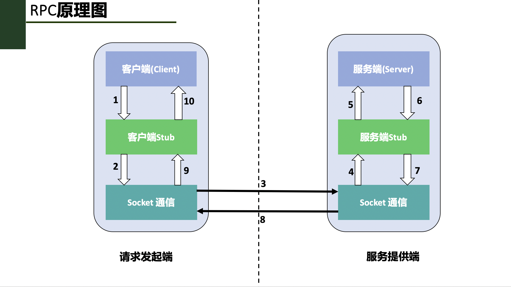

# RPC remote procedure call
**@author: Davie**
**Copyright: Beijing Qianfeng Internet Technology Co., Ltd.**

## 1. Introduction and principle of RPC

### 1.1、Background
In the previous course "Go Language Microservice Theory and Practice Course", we have learned the theoretical knowledge of microservices and understood what problems need to be solved in the practice of microservices.
Starting from this technical document, we enter the learning of new microservice content. In this series of courses, we will focus on the content of the framework, which mainly includes two: gRPC framework and go-micro framework.

First, let's learn about the content of the gRPC framework.

### 1.2, local procedure call
Let us first take a look at the execution and calling of the program under normal circumstances. For example, the following Go language code:
```go
func main() {
	var a, b int
	a = 1
	b = 2
	c := Add(a, b)
	fmt.Println("Calculation result:", c)
}
func Add(a int, b int) int {
	return a + b
}
```
In the above Go language code, we define an Add method to realize the function of adding two numbers. In the main method, the operation of calculating the sum of two variables is realized by calling the Add method. The whole process involves operations such as pushing variable values ​​into the stack, popping the stack, and assigning values. Finally, the calculation result of the popping stack is returned and assigned to the c variable.

In summary, the process of local program call can be roughly divided into several steps and stages:
* The program developed by the developer, compiled, and compiled into an executable file recognized by the machine.
* Run the executable file and call the corresponding function method. During this period, the machine instructions of the executable file will be read, and operations such as stacking, popping and assignment will be performed. At this time, the computer is controlled by the process where the executable program is located.
* The call ends, all the memory data is popped out of the stack, and the program execution ends. The computer continues to be controlled by the operating system.

### 1.3, problems and solutions
As we have said above, remote procedure calls are calls implemented on two or more different physical machines, during which calls must be made across the network. Therefore, if we want to complete the function call through the form of the former text method call, it cannot be realized, because the compiler cannot call the program method on the remote machine through the compiled executable file. Therefore, it is necessary to use the RPC method to implement the invocation of the program method on the remote server.

The internal principle of RPC technology is realized through a combination of two technologies: **local method invocation and network communication technology. **

### 1.4 Introduction to RPC
In the above example of local procedure call, we executed the program on the computer on a computer to complete the call. With the development of computer technology and the change of demand scenarios, sometimes it is necessary to execute the program on another computer from one computer, so RPC technology was developed later. Especially with the rapid iteration and development of Internet technology, users and demands are almost exponentially increasing at a high speed. At this time, in most cases, the program is deployed on multiple machines, and you need to call other The situation of the program on the physical machine.

RPC is an acronym for Remote Procedure Call Protocol. It is referred to as: RPC, which is translated into Chinese and is called Remote Procedure Call Protocol. The so-called remote procedure call, the popular understanding is that the function method of the program running on another server can be called in the local program. This kind of calling process crosses the limitation of the physical server and is completed in the network. In the process of calling the program on the remote server, the local program waits for the calling result to be returned until the remote program is executed, and the result is returned to the local , And finally complete a complete call.

What needs to be emphasized is: **Remote procedure call refers to the whole process of calling the program on the remote server. **

### 1.5, RPC design composition
RPC technology is composed of four parts in architecture design, namely: ** client, client stub, server, and server stub. **

The concepts of **client** and **server** are mentioned here, which belong to a way of programming architecture. In the design of modern computer software program architecture, the general direction is divided into two directions, namely : **B/S Architecture**, **C/S Architecture**. The B/S architecture refers to the browser-to-server interaction architecture. The other is to install a separate application on the computer, called the client, to interact with the server.

Because in the process of invoking the service, one party is the initiating party, and the other party is the party providing the service. Therefore, we call the service initiator the client, and the service provider the server. The following is an explanation and description of the four roles of RPC:

* **Client: **The initiator of the service call, also known as the service consumer.

* **Client Stub: **This program runs on the computer where the client is located, and is mainly used to store the address of the server to be called. In addition, the program is also responsible for requesting the client to the remote server program The data information is packaged into data packets and sent to the server Stub program through the network; secondly, the call result data packet sent by the server Stub program must be received and parsed and returned to the client.

* **Server: **The program running on the remote computer machine, in which there are methods to be called by the client.

* **Server Stub: **Receive the request message packet sent by the client Stub program through the network, and call the real program function method in the server to complete the function call; secondly, the server executes the result of the call Data processing is packaged and sent to the client Stub program.

### 1.6, RPC principle and calling steps
After understanding the structure of the RPC technology, let's take a look at how to implement the call from the client to the server. In fact, if we want to implement a remote call process on any two computers in the network, we have to solve many problems, such as:

* Two physical machines must establish a stable and reliable communication connection in the network.
* The problem of the definition of the communication protocol between two servers, that is, how the programs on the two servers recognize each other's request and return the result. That is to say, the two computers must be able to recognize the information sent by the other party, and be able to recognize the meaning of the request and the meaning of the return, and then they can process it. This is actually the work to be done by the communication protocol.

Let's take a look at how RPC solves these problems. The specific call steps of RPC are as follows:



In the above figure, the invocation process of each step of RPC is illustrated in the form of steps 1-10. The specific description is:

* 1. If the client wants to initiate a remote procedure call, first call the function method name that it wants to use by calling the local client Stub program;

* 2. The client stub program receives the client's function call request, ** serializes the method name and the parameters carried by the client request to call, and packs it into a data packet. **

* 3. The client Stub finds the IP address of the remote server program, calls the Socket communication protocol, and sends it to the server through the network.

* 4. The server Stub program receives the data packet information sent by the client, and ** deserializes the data through the agreed protocol to obtain the requested method name and request parameters and other information. **

* 5. The server stub program prepares relevant data, ** calls the function method corresponding to the local Server, and passes in the corresponding parameters for business processing. **

* 6. The server program executes the calling process according to the existing business logic, and after the business execution ends, the execution result is returned to the server Stub program.

* 7. The server Stub program ** serializes the program call result according to the agreed protocol, ** and sends it back to the client Stub program through the network.

* 8. The client Stub program receives the return data sent by the server Stub, **deserializes the data,** and passes the data returned by the call to the client request initiator.

* 9. The client requests the initiator to get the call result, and the entire RPC call process ends.

### 1.7, RPC related technologies
Through the above series of text descriptions and explanations, we have understood the origin of RPC and the entire invocation process of RPC. We can see that RPC is a collection of a series of operations, which involves many operations on data, as well as network communication. Therefore, we make a summary and analysis of the technologies involved in RPC:

* **1. Dynamic proxy technology: ** The Client Stub and Sever Stub programs we mentioned above are all automatically generated using dynamic proxy technology in the specific coding and development practice.

* **2. Serialization and deserialization:** During the RPC call, we can see that the data needs to be transferred from one machine to another. On the Internet, all data is transmitted in the form of bytes. In the process of programming, we often use data objects. Therefore, if we want to transmit data objects and related variables on the network, we need to serialize and deserialize data objects.
    
    * **Serialization:** The process of converting an object into a byte sequence is called the serialization of the object, which is the process of encoding.
    
    * **Deserialization:** The process of restoring the byte sequence to an object is called the deserialization of the object, which is the process of decoding.
    
Our common Json, XML and other related frameworks can all perform serialization and deserialization encoding and decoding operations on data. At the same time, in the previous "Go Language Microservice Theory and Practice" course, we have learned the Protobuf protocol, which is also a protocol for data encoding and decoding, and is more widely used in the RPC framework.

## Two, Go language to achieve RPC programming

In the last lesson, we introduced the knowledge of RPC, explained the principle of RPC, and explained the internal execution process of RPC through diagrams. In this lesson, we will continue to learn RPC related content.

### 2.1, RPC official library
In the pkg description on the official Go language website, the officially supported rpc package is provided. The specific link is as follows: [https://golang.org/pkg/net/rpc/](https://golang.org/pkg/net /rpc/). The complete package name of the official rpc package is: **net/rpc**. According to the official explanation, the rpc package mainly provides the function of accessing an object method through the network.

In this lesson, we will learn how to use the official RPC package provided by the go language to implement RPC call coding.

### 2.2, net/rpc library realizes RPC call programming
We have already mentioned that there are two participants in the rpc call: **client and server**.

The first is to provide the party exposed by the method-the server.

#### 2.2.1, service definition and exposure
In the process of programming implementation, the server side needs to register the structure object, and then expose it to the caller through the method that the object belongs to, thereby providing services. This method is called the **output method**, and this output method can be called remotely. Of course, when defining output methods, methods that can be called remotely need to follow certain rules. We explain through code:

```go
func (t *T) MethodName(request T1,response *T2) error
```

The above code is the official definition standard of the externally exposed service method given by the go language, which contains the main rules, namely:
* 1. The externally exposed method has and can only have two parameters. These two parameters can only be the output type or the built-in type, one of the two types.
* 2. The second parameter of the method must be a pointer type.
* 3. The return type of the method is error.
* 4. The type of method is exportable.
* 5. The method itself is also exportable.

Let's take an example: Suppose we have a requirement at present, and give a float type variable as the radius of the circle, and it is required to call the RPC to return the corresponding circle area. The specific programming ideas are as follows:

```go
type MathUtil struct{
}
//This method is exposed to the outside: provide services for calculating the area of ​​a circle
func (mu *MathUtil) CalculateCircleArea(req float32, resp *float32) error {
	*resp = math.Pi * req * req //The area of ​​the circle s = π * r * r
	return nil //return type
}
```

In the above case, we can see:
* 1. The Calculate method is a service method provided by the service object MathUtil. This method is used to receive the incoming circle radius data, calculate the circle area and return.
* 2. The first parameter req represents the parameters provided by the caller (client).
* 3. The second parameter resp represents the calculation result to be returned to the caller and must be a pointer type.
* 4. Under normal circumstances, the return value of the method is error, which is nil. If an exception or special situation is encountered, error will be returned to the caller as a string, at this time, the resp parameter will not be returned to the caller.

So far, the function definition of the server has been implemented. The next step is to make the service code take effect. You need to register the service and start the request processing.

#### 2.2.2, registration service and monitoring request
**net/rpc package** provides us with a series of methods for registering services and processing requests, combined with this case to implement registration and processing logic, as shown below:

```go
//1, initialize the pointer data type
mathUtil := new(MathUtil) //Initialize pointer data type

//2, call the function of the net/rpc package to register the service object
err := rpc.Register(mathUtil)
if err != nil {
	panic(err.Error())
}

//3. Register the service provided in mathUtil to the HTTP protocol through this function, so that the caller can use http for data transfer
rpc.HandleHTTP()

//4, listen on a specific port
listen, err := net.Listen("tcp", ":8081")
if err != nil {
	panic(err.Error())
}
go http.Serve(listen, nil)
```

After service registration and monitoring processing, the server implementation in the RPC call process has been completed. The next thing that needs to be realized is the realization of the client request code.

#### 2.2.3, client call
On the server side, it waits for the connection through the Http port monitoring method, so the client side needs to connect through http, and first realize the connection with the server side.

* The client connects to the server
    
    ```go
    client, err := rpc.DialHTTP("tcp", "localhost:8081")
    	if err != nil {
    		panic(err.Error())
    	}
    ```

* Remote method call
After the client successfully connects to the server, you can call the method of the server through method calls. The specific calling methods are as follows:

    ```go
    var req float32 //request value
	req = 3
    
	var resp *float32 //Return value
	err = client.Call("MathUtil.CalculateCircleArea", req, &resp)
	if err != nil {
		panic(err.Error())
	}
	fmt.Println(*resp)
    ```
    
    The core of the above calling method lies in the invocation of the client.Call method. The method has three parameters. The first parameter indicates the method name of the remote service to be called, the second parameter is the parameter to be passed in when calling, and the third The parameter is the return value to be received by the call.
    The above-mentioned Call method call is implemented synchronously. In addition, there is an asynchronous way to implement the call. The asynchronous call code is implemented as follows:
    
    ```go
    var respSync *float32
	//Asynchronous call method
	syncCall := client.Go("MathUtil.CalculateCircleArea", req, &respSync, nil)
	replayDone := <-syncCall.Done
	fmt.Println(replayDone)
	fmt.Println(*respSync)
    ```
    
#### 2.2.4, multi-parameter request call parameter transfer
The above content demonstrates how to implement RPC calls under a single parameter for requests under multiple parameters. We demonstrate through another case.

Suppose that another requirement needs to be fulfilled: the function of calculating the addition of two numbers through RPC calls and returning the result of the calculation. At this point, you need to pass two parameters, the specific implementation is as follows:

Define the parameter in a new structure and store it in the param package:
```go
type AddParma struct {
	Args1 float32 //The first parameter
	Args2 float32 //The second parameter
}
```
In the server.go file, the function of adding two numbers is realized, and the logic of service registration is realized:

```go
func (mu *MathUtil) Add(param param.AddParma, resp *float32) error {
	*resp = param.Args1 + param.Args2 //Realize the function of adding two numbers
	return nil
}
mathUtil := new(MathUtil)

	err := rpc.RegisterName("MathUtil", mathUtil)
	if err != nil {
		panic(err.Error())
	}

	rpc.HandleHTTP()

	listen, err := net.Listen("tcp", ":8082")
	http.Serve(listen, nil)
```

In this case, we realized the registration and invocation of the service through the new registration method rpc.RegisterName.

So far, we have completed the most basic use of the net/rpc package.

## Three, RPC combined with Protobuf
In the last lesson, we used the core net/rpc library provided by Golang to implement RPC call programming. This lesson will continue to look at the combination of RPC and Protobuf learned before in programming.

Requirements: Suppose there is an order module in a system, and other modules want to implement RPC remote engineering calls, and order information can be obtained according to the order ID and timestamp. If the acquisition is successful, the corresponding order information will be returned; if the query cannot be found, the failure information will be returned. Now, let's carry out the programming realization of the requirement.

### 3.1, transmission data format definition
In the "Go Language Microservice Theory and Practice Course", I learned about Protobuf. You can use Protobuf related rules to define the corresponding data format, and the file extension is .proto.

* **Data Definition**
According to the requirements, define the message.proto file, the detailed definition is as follows:

    ```
    syntax = "proto3";
    package message;
    
    //Order request parameters
    message OrderRequest {
        string orderId = 1;
        int64 timeStamp = 2;
    }
    
    //order information
    message OrderInfo {
        string OrderId = 1;
        string OrderName = 2;
        string OrderStatus = 3;
    }
    ```

    In the above file, the request data structure OrderRequest when the client initiates an RPC call and the data structure OrderInfo returned after the server query is defined. The data definition is implemented using proto3 syntax, and the entire data definition is defined in the message package.
    
* **Compile proto file**
The .proto file is compiled through the proto compilation command, and the Go language file corresponding to the structure is automatically generated. The compilation command is as follows:

    ```go
    protoc ./message.proto --go_out=./
    ```
The execution of the above command is under the message package. After the compilation command is over, the message.pb.go file will be generated under the message package, which automatically generates the definition of the structure of the OrderRequest and OrderInfo in the Go language and related methods.

### 3.2, Protobuf format data combined with RPC

* **Definition of Service**
To make RPC remote procedure calls and realize the method of invoking remote servers, first of all, there must be a service. In this case, define the service that provides order query function, named OrderService, and provide order information query method for remote call. The detailed services and methods are defined as follows:

    ```go
    //Order service
    type OrderService struct {
    }
    func (os *OrderService) GetOrderInfo(request message.OrderRequest, response *message.OrderInfo) error {
    	//201907310003
    	orderMap := map[string]message.OrderInfo{
    		"201907300001": message.OrderInfo{OrderId: "201907300001", OrderName: "Clothes", OrderStatus: "paid"},
    		"201907310001": message.OrderInfo{OrderId: "201907310001", OrderName: "Snacks", OrderStatus: "paid"},
    		"201907310002": message.OrderInfo{OrderId: "201907310002", OrderName: "Food", OrderStatus: "Unpaid"},
    	}

	   current := time.Now().Unix()
	   if (request.TimeStamp> current) {
		  *response = message.OrderInfo{OrderId: "0", OrderName: "", OrderStatus: "Order Information Abnormal"}
	   } else {
		  result := orderMap[request.OrderId]//201907310003
		  if result.OrderId != "" {
			 *response = orderMap[request.OrderId]
		  } else {
			 return errors.New("server error")
		  }
	   }
	   return nil
    }
    ```
In the method definition of the service, orderMap is used to simulate the initial order database, which is convenient for case query and display. The GetOrderInfo method has two parameters. The first is message.OrderRequest, as the parameter passed by the caller, and the second is message.OrderInfo, as the parameter returned by the call. Through the two parameters here, the above will pass the .proto The Go language structure data that is defined and automatically generated is combined.

* **Service Registration and Processing**
After the service is defined, you need to register the service to the RPC framework and start the http request monitoring process. This part of the code is consistent with the previous RPC server implementation logic, and the specific implementation is as follows:

    ```go
    func main() {
    
    	orderService := new(OrderService)
    
    	rpc.Register(orderService)
    
    	rpc.HandleHTTP()
    
    	listen, err := net.Listen("tcp", ":8081")
    	if err != nil {
    		panic(err.Error())
    	}
    	http.Serve(listen, nil)
    }
    ```

* **RPC client call implementation**
On the client side, in addition to the logic of the client's normal access to the remote server, it is also necessary to prepare the request data message.OrderInfo that the client needs to pass. The specific implementation is as follows:

    ```go
    client, err := rpc.DialHTTP("tcp", "localhost:8081")
    	if err != nil {
    		panic(err.Error())
    	}
    
    	timeStamp := time.Now().Unix()
    	request := message.OrderRequest{OrderId: "201907310001", TimeStamp: timeStamp}
    
    	var response *message.OrderInfo
    	err = client.Call("OrderService.GetOrderInfo", request, &response)
    	if err != nil {
    		panic(err.Error())
    	}
    
    	fmt.Println(*response)
    ```
    
### 3.3, running results
Run the server.go and client.go programs in sequence. The results of the operation are as follows:


