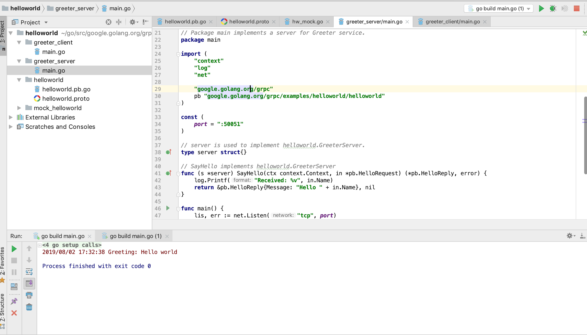

# gRPC remote procedure call mechanism
**@author: Davie**
**Copyright: Beijing Qianfeng Internet Technology Co., Ltd.**

## One, gRPC introduction and installation
### 1.1、What is gRPC
#### 1.1.1, gRPC introduction
gRPC is a high-performance remote procedure call (RPC) framework open sourced by Google, which can run in any environment. The framework provides load balancing, tracking, intelligent monitoring, identity verification and other functions, which can realize efficient connections between systems. In addition, in distributed systems, the gRPC framework is also widely used to realize the connection between mobile society, browsers, etc. and servers.

#### 1.1.2, gRPC official website
gRPC official website: [https://grpc.io/](https://grpc.io/).

#### 1.1.3, gRPC source code
The official source code repository of gRPC is on the github website and can be accessed publicly. The link to the homepage of the gRPC source code library is as follows: [https://github.com/grpc/grpc](https://github.com/grpc/grpc)

The gRPC open source library supports multiple languages ​​such as: C++, C#, Dart, Go, Java, Node, Objective-C, PHP, Python, Ruby, WebJS, etc. Developers can choose to view the implementation of the corresponding language in the gRPC github homepage library. .

#### 1.1.4, gRPC call execution process
Because gRPC supports the implementation of multiple languages, gRPC supports the deployment and operation of client and server in multiple language environments and calls to each other. An example of multilingual environment interaction is shown in the figure below:


The default data formatting method used in gRPC is protocol buffers. The knowledge and connections related to protocol buffers have been covered in the previous course content, so I won’t repeat them here.

### 1.2, grpc-go introduction
#### 1.2.1 What is grpc-go
The grpc-go library is the Golang language implementation version of the gRPC library. The source code of grpc-go library can be accessed and downloaded from the github homepage. The Github address of grpc-go homepage is as follows: [https://github.com/grpc/grpc-go](https://github.com/grpc/grpc-go)

#### 1.2.2 grpc-go installation

##### 1.2.2.1 go get command installation
In the case of a smooth network environment, you can use the go get command to install the grpc-go library:

```go
go get -u google.golang.org/grpc
```

It should be noted that when many developers use the above commands to install the grpc-go library, they often encounter network environment problems that cause download failures and link timeout errors. Frequently encountered errors are:
```go
package google.golang.org/grpc: unrecognized import path "google.golang.org/grpc" (https fetch: Get https://google.golang.org/grpc?go-get=1: dial tcp 216.239.37.1: 443: i/o timeout)
```
If you encounter a link server timeout error similar to the timeout mentioned above, it indicates a network environment problem. At this time, you can install it through the second solution.

##### 1.2.2.2 Install by download
You can use the git clone command in the git tool to download the code from github to the local. clone command:
```go
git clone https://github.com/grpc/grpc-go.git $GOPATH/src/google.golang.org/grpc
```

The second half of the above command, $GOPATH/src/google.golang.org/grpc, is to download the grpc-go code library to a specific directory.

##### 1.2.2.3 Dependency configuration
If you use the clone method in 2.2.2 to download and install, because other external library content is called in the grpc-go library, you need to additionally prepare the relevant code library environment. The libraries that need to be prepared are mainly libraries under the golang.org package. The libraries under the golang.org package can also be downloaded from github, and then placed in the corresponding golang.org directory.

##### 1.2.3.4 grpc-go case
After setting up the grpc-go library environment just now, I will not write grpc programs for the time being. You can learn grpc through official cases. In the root directory of the downloaded grpc-go library, there is an examples directory that stores official demonstration cases. Developers can learn and run debugging through development tools.

##### 1.2.3.5 Case demonstration
View the helloworld project in the examples directory, and execute the main.go program in greeter_server and the main.go program in greeter_client respectively. You can view the results of the operation. The project directory and running effects are as follows:


## Two, gRPC framework use
In the last class, I have learned the basic knowledge of gRPC and have a preliminary understanding of gRPC. This lesson implements gRPC programming through programming.

### 2.1, define service
What we want to achieve is to make remote service calls through the gRPC framework. The first step is to have services. Using the content previously mastered, the gRPC framework supports the definition and generation of services.
The gRPC framework uses protocol buffers as an interface definition language by default to describe the structure of network transmission messages. In addition, you can also use protobuf to define service interfaces.

```proto
syntax = "proto3";
package message;

//Order request parameters
message OrderRequest {
    string orderId = 1;
    int64 timeStamp = 2;
}

//order information
message OrderInfo {
    string OrderId = 1;
    string OrderName = 2;
    string OrderStatus = 3;
}

//Order service service definition
service OrderService{
    rpc GetOrderInfo(OrderRequest) returns (OrderInfo);
}
```
While we define the data structure through the proto file, we also define the service interface to be implemented. GetOrderInfo is the definition of the specific service interface. In the definition of the GetOrderInfo interface, OrderRequest represents the parameter passed by the request, and OrderInfo represents the data parameter returned by the processing result. .

### 2.2, compile .proto file
#### 2.2.1, environmental preparation
The defined proto file needs to be compiled to generate go language code files for use by client programs and server programs. You can install the proto plugin in the go language environment.
```go
go get -a github.com/golang/protobuf/protoc-gen-go
```
The -a parameter indicates go install directly after downloading

#### 2.2.2, compile .proto file
##### 2.2.2.1, basic usage
You can complete the compilation of the .proto file through the basic compilation command. The basic compilation command is as follows:
```proto
protoc --go_out=. *.proto
```
##### 2.2.2.2, gRPC compilation support
If the defined .proto file, as shown in this case, the definition contains the definition of the service interface, and we want to use the gRPC framework to implement RPC calls. Developers can use the plug-in compilation function provided by the protocol-gen-go library to generate golang language code compatible with the gRPC framework. You only need to specify the parameters of the plug-in based on the basic compilation commands and inform the protoc compiler. The specific commands for compiling and generating service code compatible with the gRPC framework are as follows:
```protoc
protoc --go_out=plugins=grpc:. *.proto
```

### 2.3, gRPC realizes RPC programming
#### 2.3.1, service interface implementation
After the service interface is defined in .proto and the corresponding go language file is generated, the specific implementation of the service interface is required. The definition of the service interface is specifically implemented by OrderServiceImpl, and the detailed content of GetOrderInfo is implemented. The service implementation logic is the same as the content described above. The difference is the change of service interface parameters. The detailed code implementation is as follows:
```go
type OrderServiceImpl struct {
}

//Specific method implementation
func (os *OrderServiceImpl) GetOrderInfo(ctx context.Context, request *message.OrderRequest) (*message.OrderInfo, error) {
	orderMap := map[string]message.OrderInfo{
		"201907300001": message.OrderInfo{OrderId: "201907300001", OrderName: "Clothes", OrderStatus: "paid"},
		"201907310001": message.OrderInfo{OrderId: "201907310001", OrderName: "Snacks", OrderStatus: "paid"},
		"201907310002": message.OrderInfo{OrderId: "201907310002", OrderName: "Food", OrderStatus: "Unpaid"},
	}

	var response *message.OrderInfo
	current := time.Now().Unix()
	if (request.TimeStamp> current) {
		*response = message.OrderInfo{OrderId: "0", OrderName: "", OrderStatus: "Order Information Abnormal"}
	} else {
		result := orderMap[request.OrderId]
		if result.OrderId != "" {
			fmt.Println(result)
			return &result, nil
		} else {
			return nil, errors.New("server error")
		}
	}
	return response, nil
}
```
#### 2.3.2, gRPC implementation server
Using the gRPC framework, first implement the server program. Since it is implemented using the gRPC framework, it is necessary to call gRPC for service method registration and monitoring processing. The service registration and monitoring processing are implemented as follows:
```go
func main() {

	server := grpc.NewServer()

	message.RegisterOrderServiceServer(server, new(OrderServiceImpl))

	lis, err := net.Listen("tcp", ":8090")
	if err != nil {
		panic(err.Error())
	}
	server.Serve(lis)
}
```
#### 2.3.3, gRPC realizes the client
After the server is implemented, the client program is implemented. Corresponding to the server program relationship, call the method of the gRPC framework to obtain the corresponding client program and implement the service call. The specific programming implementation is as follows:
```go
func main() {

	//1, Dail connection
	conn, err := grpc.Dial("localhost:8090", grpc.WithInsecure())
	if err != nil {
		panic(err.Error())
	}
	defer conn.Close()

	orderServiceClient := message.NewOrderServiceClient(conn)

	orderRequest := &message.OrderRequest{OrderId: "201907300001", TimeStamp: time.Now().Unix()}
	orderInfo, err := orderServiceClient.GetOrderInfo(context.Background(), orderRequest)
	if orderInfo != nil {
		fmt.Println(orderInfo.GetOrderId())
		fmt.Println(orderInfo.GetOrderName())
		fmt.Println(orderInfo.GetOrderStatus())
	}
}
```

### 2.4、Run the program
After the above steps, the program and logic are all developed. The program runs and prints the following results:
```go
201907300001
clothing
Paid
```

