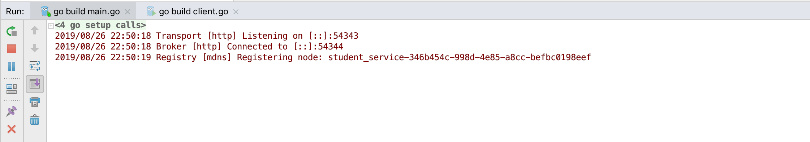
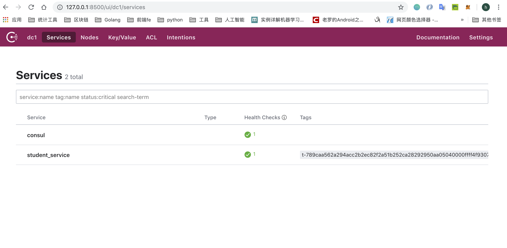

# go-micro Introduction and environment construction
**@author: Davie**
**Copyright: Beijing Qianfeng Internet Technology Co., Ltd.**

## 1. Introduction to micro framework
### 1.1、Background
In the previous content of this course, you have learned the communication protocol used for communication between microservices, how to realize service registration and discovery, build a service management cluster, and the RPC communication method between services. The specific content includes: protobuf protocol, consul and docker deployment consul cluster, the use of gRPC framework and other specific implementation schemes.

The above specific solutions are all proposed to solve a specific problem in the practice of microservices and realize the project development of the microservice architecture. However, in the specific project development process, developers focus on the development of business logic and the realization of functions. A large amount of environment configuration, debugging and construction and other basic work will consume a considerable amount of energy, so it is necessary to integrate the microservice architecture Involved, related solutions are managed and maintained centrally. This is the Micro we want to learn.

### 1.2、Overview
Micro is a microservice ecosystem that simplifies distributed development. The system provides efficient and convenient module construction for the development of distributed applications. The main purpose is to simplify the development of distributed systems.

After learning the framework, it is convenient for developers to develop micro-service architecture projects very simply, and with the increase of business modules and functions, Micro can also provide tools and functions to manage the micro-service environment.

### 1.3, micro composition
Micro is a microservice toolkit, which is composed of a series of toolkits, as shown in the following figure:


* **Go Micro: **Plug-in RPC framework for writing microservices in Go. It provides libraries for service discovery, client load balancing, coding, synchronous and asynchronous communication.

* **API:** API is mainly responsible for providing an API gateway that routes HTTP requests to corresponding microservices. It acts as a single entry point and can be used as a reverse proxy or convert HTTP requests to RPC.

* **Sidecar: **A language-transparent RPC proxy, with all the functions of go-micro as an HTTP endpoint. Although Go is a great language for building microservices, you may also want to use other languages, so Sidecar provides a way to integrate other applications into the Micro world.

* **Web:** Dashboard and reverse proxy for Micro Web applications. We believe that web applications should be built based on microservices, so we are regarded as first-class citizens in the microservices field. It behaves very much like an API reverse proxy, but also includes support for web sockets.

* **CLI:** A direct command line interface to interact with your microservices. It also allows you to use Sidecar as a proxy, and you may not want to connect directly to the service registry.

* **Bot: **Hubot style bot, located in your microservice platform, can interact through Slack, HipChat, XMPP, etc. It provides CLI functionality through messaging. You can add other commands to automate common operational tasks.

### 1.4. Toolkit introduction

#### 1.4.1, API
Enable the API as a gateway or proxy to serve as a single entry point for microservice access. It should run on the edge of your infrastructure. It converts HTTP requests to RPC and forwards them to the corresponding service.


#### 1.4.2, Web
UI is the web version of go-micro, allowing interactive access to the environment through the UI. In the future, it will also be a way to aggregate Micro Web services. It contains a proxy method for web applications. Route /[name] to the corresponding service through the registry. The Web UI adds the prefix "go.micro.web." (configurable) to the name, looks for it in the registry, and then reverse proxy will be performed.


#### 1.4.3, Sidecar
The Sidecar is the HTTP interface version of go-micro. This is a way to integrate non-Go applications into the Micro environment.


#### 1.4.4, Bot
Bot is a Hubot-style tool located in your microservice platform and can interact through Slack, HipChat, XMPP, etc. It provides CLI functionality through messaging. You can add other commands to automate common operation tasks.


#### 1.4.5, CLI
Micro CLI is the command line version of go-micro, which provides a way to observe and interact with the operating environment.

#### 1.4.6, Go-Micro
Go-micro is an independent RPC framework for microservices. It is the core of the toolkit and is affected by all the components mentioned above. Here, we will look at each feature of go-micro.


### 1.5, Go-Micro features
* Registry: Mainly responsible for service registration and discovery functions. The consul we have learned before can be combined with the Registry here to realize the service discovery function.

* Selector: The main function of the selector is to realize the load balancing function of the service. When a client initiates a request, it will first query the service registry and return the list of services available in the current system, and then select one of the nodes to query to ensure that the node is available.

* Broker: Broker is the interface for event publishing and subscription in the go-micro framework. It mainly uses message queues to achieve information receiving and publishing, and is used to process asynchronous functions between systems.

* Codec: The encoding and decoding interface during data transmission in go-micro. There are multiple encoding methods in go-micro. The default implementation method is protobuf. In addition, there are formats such as json.

* Transport: The communication interface in the go-micro framework. There are many implementation schemes to choose from. The HTTP communication method is used by default. In addition, there are communication methods such as grpc.

* Client and Server: respectively are the client interface and server interface in go-micro. The client is responsible for the call, and the server is responsible for waiting for the request to be processed.

### 1.6、Environmental installation
#### 1.6.1, install consul
The consul environment is the service discovery method used by go-micro by default. It has been installed in the previous course.

#### 1.6.2, install protobuf and dependencies
About protobuf related knowledge, we have also installed and learned before, so I won't repeat it here.

#### 1.6.3, micro toolkit installation (optional)
As mentioned earlier, micro is a micro-service system that provides many toolkits to help us develop and debug.


You can use the following command to install a series of micro toolkits:
```go
go get -u github.com/micro/micro
```

#### 1.6.4, 1Go-micro installation
Before using the go-micro framework, you first need to install the go-micro framework. Use the following command:

```go
go get github.com/micro/go-micro
```

After the installation is complete, you can find the source code of go-micro under the $GOPATH directory, as shown in the following figure:


The source code of go-micro can be found on github, the link is as follows: [https://github.com/micro/go-micro](https://github.com/micro/go-micro)

## Second, create a microservice
### 2.1, the definition of service
In the micro framework, a service is defined by an interface, and the service is defined as a Service. The complete interface definition is as follows:
```go
type Service interface {
	Init(...Option)
	Options() Options
	Client() client.Client
	Server() server.Server
	Run() error
	String() string
}
```

In this interface, the specific methods to be included in a service instance are defined, which are: Init, Options, Client, Server, Run, String and other six methods.

### 2.2、Initialize service instance
In addition to the definition of Service, the micro framework provides methods for creating service instances for developers to call:

```go
service := micro.NewService()
```

The above is the easiest way to create a service instance. NewService can accept an optional parameter of type Options. The definition of NewService is as follows:

```go
func NewService(opts ...Option) Service {
	return newService(opts...)
}
```

#### 2.2.1, Options optional configuration
Regarding Options configurable options, there are many settings that can be selected. The micro framework package contains the options.go file, which defines the content of detailed optional configuration. The most basic and common configuration items are: service name, service version, service address, service:

```go
//service name
func Name(n string) Option {
	return func(o *Options) {
		o.Server.Init(server.Name(n))
	}
}

//Service version
func Version(v string) Option {
	return func(o *Options) {
		o.Server.Init(server.Version(v))
	}
}

//Service deployment address
func Address(addr string) Option {
	return func(o *Options) {
		o.Server.Init(server.Address(addr))
	}
}

//Metadata item settings
func Metadata(md map[string]string) Option {
	return func(o *Options) {
		o.Server.Init(server.Metadata(md))
	}
}
```

The complete instantiated object code is as follows:
```go
func main() {
	//Create a new service object instance
	service := micro.NewService(
		micro.Name("helloservice"),
		micro.Version("v1.0.0"),
	)
}
```

Developers can directly call micro.Name to set the name of the service, set the version number and other information. In the corresponding function, the server.Server.Init function is called to initialize the configuration items.

### 2.3. Define the service interface and implement the service business logic
In the previous courses, you have learned to use protobuf to define service interfaces and implement specific services. Using protobuf to define the service interface and automatically generate the go language file, you need to go through the following steps, we will illustrate with examples:

> We still use cases to explain related knowledge points: in the school's educational administration system, there is a need for student information management. Student information includes the student's name, student class, and academic performance composition; you can query the student's related information based on the student's name. We use rpc calls and student services to implement this case.

#### 2.3.1, define .proto file
Use proto3 syntax to define data structures and service methods. The specific definition is as follows:
```go
syntax ='proto3';
package message;

//Student data body
message Student {
    string name = 1; //Name
    string classes = 2; //class
    int32 grade = 3; //Score
}

//Request data body definition
message StudentRequest {
    string name = 1;
}

//Student Service
service StudentService {
    //Query student information service
    rpc GetStudent (StudentRequest) returns (Student);
}
```
#### 2.3.2, compile .proto file
When we originally studied the gRPC framework, we compiled the .proto file according to the grpc plug-in standard. And now, we are learning go-micro, so we can compile according to the micro plugin. We need to install the protobuf plugin in the micro framework separately.
* Install the protobuf plugin of the micro framework

    ```go
    go get github.com/micro/protobuf/{proto,protoc-gen-go}
    ```
    The proto plugin can be successfully installed through the above command. After the installation is successful, you can see the newly installed plugin in src/github.com/micro/protobuf in the $GOPATH directory in the local environment. The source code directory is shown below:
    

* Specify the micro plugin to compile

    ```go
    protoc --go_out=plugins=micro:. message.proto
    ```
    The above compilation command is successfully executed, and the message.pb.go file can be generated in the message directory under the project directory. This file is automatically compiled and generated by the protoc compiler and cannot be modified by the developer. message.pb.go is shown in the figure:
    
    
#### 2.3.3, coding to achieve service functions
In the project directory, implement the rpc GetStudent function defined by StudentService. Create a new studentManager.go file, the specific implementation is as follows:
```go
//Student Service Management Realization
type StudentManager struct {
}

//Implementation of the service interface for obtaining student information
func GetStudent(ctx context.Context, request *message.StudentRequest, response *message.Student) error {

	studentMap := map[string]message.Student{
		"davie": message.Student{Name: "davie", Classes: "Software Engineering Major", Grade: 80},
		"steven": message.Student{Name: "steven", Classes: "Computer Science and Technology", Grade: 90},
		"tony": message.Student{Name: "tony", Classes: "Computer Network Engineering", Grade: 85},
		"jack": message.Student{Name: "jack", Classes: "Business Administration", Grade: 96},
	}

	if request.Name == "" {
		return errors.New("Request parameter error, please request again.")
	}

	student := studentMap[request.Name]
	
	if student.Name != "" {
		response = &student
	}
	return errors.New("Relevant student information was not queried")
}
```

### 2.4、Run service
In the previous learning process, we wrote the server.go program by ourselves, registered the service, and realized request monitoring. Now, we use the micro framework to implement the operation of the service. The complete code for running the service is as follows:
```go
func main() {

	//Create a new service object instance
	service := micro.NewService(
		micro.Name("student_service"),
		micro.Version("v1.0.0"),
	)

	//Service initialization
	service.Init()

	//register
message.RegisterStudentServiceHandler(service.Server(), new(StudentManager))
	
	//run
	err := service.Run()
	if err != nil {
		log.Fatal(err)
	}
}
```

### 2.5, client call
The client can construct the request object and access the corresponding service method. The specific method is as follows:
```go
func main() {

	service := micro.NewService(
		micro.Name("student.client"),
	)
	service.Init()

	studentService := message.NewStudentServiceClient("student_service", service.Client())

	res, err := studentService.GetStudent(context.TODO(), &message.StudentRequest{Name: "davie"})
	if err != nil {
		fmt.Println(err)
	}
	fmt.Println(res.Name)
	fmt.Println(res.Classes)
	fmt.Println(res.Grade)
}
```

### 2.6, running results
#### 2.6.1, run the server
Run the main function in the main.go file, the service registration is successful, and the following log is output:


```go
2019/08/26 22:50:18 Transport [http] Listening on [::]:54343
2019/08/26 22:50:18 Broker [http] Connected to [::]:54344
2019/08/26 22:50:19 Registry [mdns] Registering node: student_service-346b454c-998d-4e85-a8cc-befbc0198eef
```

#### 2.6.2、Run the client
The client is responsible for initiating requests and function calls, running the client.go program, and the program outputs normally.


### 2.7, register service to consul
#### 2.7.1, register to mdns by default
When we run the server program, we can see the Registry [mdns] Registering node:xxx log, which shows that the go-micro framework has registered our service with the default configuration in mdns. mdns can be simply translated as mdns, which is the default configuration option of go-micro.

#### 2.7.2, register to consul
In the previous microservice theory course, we have learned consul. Consul is the component of service registration and discovery. Therefore, if our local system has already installed the consul environment, we can choose to register our service in consul. When registering to consul, you need to start consul first.

* Start consul
    The startup command is as follows:

    ```go
    consul agent -dev
    ```
Through the above command, we can start consul in the terminal.

* Register the designated service to consul
Run the service program through the command and specify the registration to consul. The detailed commands are as follows:
```go
go run main.go --registry=consul
```
Through the --registry option, specify the service discovery component to be registered to.

* View service
Because consul provides us with a ui interface, we can access the consul node page through the browser interface. To access the local port 8500, the browser address is:

    ```go
    http://localhost:8500
    ```

    

