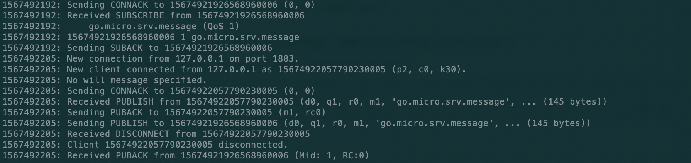

# go-micro use (1)
**@author: Davie**
**Copyright: Beijing Qianfeng Internet Technology Co., Ltd.**

## 1. Heartbeat mechanism and optional configuration

### 1.1、Background
In the previous lesson, we specified consul as the registered component of the microservice and saw the new service registered in consul. This also contains other content, we will continue to look at this lesson.

### 1.2, code implementation consul configuration
In the last lesson, we used the form of the --registry option configuration to specify the registration to the consul component. In fact, this configuration can also be implemented in the code. The last lesson said that go-micro provides many optional configurations when creating services, including the specification of service components. The programming code specified to register to consul is implemented as follows:
```go
...
   //Create a new service object instance
	service := micro.NewService(
		micro.Name("student_service"),
		micro.Version("v1.0.0"),
		micro.Registry(consul.NewRegistry()),
	)
...
```
You can specify the discovery component to be registered through micro.Registry. Here we register to consul, so we call consul.NewRegistry.

### 1.3, plug-in
In the previous go-micro introduction class, we mentioned that go-micro is a basic microservice framework that supports plug-inization. Not only go-micro, but the entire micro is designed as a "pluggable" mechanism.

In the case of the previous lesson, we used the --registry option to specify the service to be registered to the corresponding service discovery component, and we chose to register to consul. The --registry here is the embodiment of the "pluggable" plug-in mechanism. Because in the latest code in 2019, go-micro registers services in mdns by default, and supports developers to manually specify specific service discovery components.

We can see that in this process, our service program has not undergone any changes, but the replacement of service registration discovery components has been easily realized. This is the advantage of plug-inization, and the use of plug-inization can maximize decoupling.

In the go-micro framework, components such as consul, etcd, zookeeper, and dns are supported to realize the functions of service registration and discovery. If necessary, developers can replace service discovery components according to their needs.

### 1.4, the principle of service registration discovery
Let us review the principle of service registration and discovery: service registration discovery is to register all services to the registration component center. When each service calls each other, it first obtains the status information and address of the service to be called through the query method. , And then initiate a call to the corresponding microservice module. We have learned the working principle and environment of consul. The working principle diagram of congsul is as follows:


### 1.5, no service error found
After reviewing the principle of service registration discovery, we can know that if the request initiator cannot find the corresponding service in the service component, an error will occur. Next, we use the program to demonstrate the error.

First, start the consul node service through a terminal command to facilitate service registration:
```go
consul agent -dev
```

#### 1.5.1, register the designated service program to consul
We use the service registration options we have learned to specify the registration to the consul component. The detailed commands are as follows:
```go
go run main.go --registry=consul
```
With this command, you can successfully register the service to the consul component, and start the service to start running.

#### 1.5.2, run the client service
Since the server program has been registered with consul, the client program also needs to query in consul to execute correctly. The command to run the client and register to the consul component is:
```go
go run client.go --registry=consul
```
Through the above command, the program can be executed correctly and output the correct result.

#### 1.5.3, No service error found
We can take the initiative to make errors occur in the program to verify the undiscovered errors, so as to verify the principles of service registration and discovery that we have learned. When executing the client program, we do not specify the --registry option, and mdns is used by default. The command is:
```go
go run client.go
```
We execute the above command to run the client program. Since our client program will connect to the corresponding service method, but the corresponding service is not registered in mdns, the program will have an error. In this case, the execution error of the client program is as follows:
```
{"id":"go.micro.client","code":500,"detail":"error selecting student_service node: not found","status":"Internal Server Error"}
```
We can see that the program returned an error message, prompting us that the service was not found.

Through this demonstration of proactive errors, we can have a deeper understanding of the plug-in collaboration between go-micro and consul and the internal principles of microservices.

### 1.6, drawbacks and solutions
The working mechanism of the service instance and the discovery component is: when the service is started, its related information is registered in the discovery component, and when the service is closed, an uninstall or removal request is sent. In the actual production environment, there may be many abnormal situations in the service, such as downtime or other situations. Often the service process will be destroyed, or the network failure will also cause problems in the communication link. In these cases, the service instance will Removed in the service discovery component.

#### 1.6.1, TTL and interval time
To solve this problem, the go-micro framework provides a TTL mechanism and an interval registration mechanism. TTL is the abbreviation of Time-To-Live. It specifies the validity period of a registration in the registration component, and it will be deleted after expiration. The interval registration means to re-register to the registration component regularly to ensure that the service is online.

* Instruction method
    Both of these two registration methods can be configured through optional instructions. The specific commands are as follows:

    ```go
    go run main.go --registry=consul --register_ttl=10 --register_interval=5
    ```

    This command means that we register with the service registration component every 5 seconds, and the validity period is 10 seconds each time.
    
* Encoding
  In addition to the way of using instructions, the settings of these two parameters can also be implemented in the code, which is completed through configuration when the microservice is created. The specific code is as follows:
  ```go
  ...
  service := micro.NewService(
		micro.Name("student_service"),
		micro.Version("v1.0.0"),
		micro.RegisterTTL(10*time.Second),
		micro.RegisterInterval(5*time.Second),
	)
  ...
  ```
  The two options are set through micro.RegisterTTL and micro.RegisterInterval respectively.
  
  
## Two, decoupling weapon-event-driven mechanism
Earlier we have learned about the optional configuration of creating and starting microservices. Today we will learn about event-driven mechanisms.

### 2.1、Background
In the previous course, we have learned to use go-micro to create microservices and implement service calls. Our specific implementation is to instantiate the client object and call the relevant methods of the corresponding service. This way can realize the system function, but has the relatively big shortcoming.

Let us illustrate with examples: there are user services, product services, and message services in a certain system. If the user service wants to call the function method in the message service, the specific implementation can be represented by the method shown in the following figure:


According to the normal implementation, a client of the message service is instantiated in the program of the user service module, and then an RPC call is made, and sendMessage is called to send the message.

#### 2.1.1, disadvantages
This implementation mode has a high degree of code coupling, and the message service module code appears in the user service module, which is not conducive to the expansion of the system and the iterative development of functions.

### 2.2, publish/subscribe mechanism
#### 2.2.1, event-driven
Still in the above case, the user service needs to call a certain method of the message service during the user operation, suppose it is a method of sending a verification code message. In order to achieve decoupling of the system code, the user service does not directly call the specific method of the message service, but sends related data such as user information to an intermediate component, which is responsible for storing messages, and the message service will follow a specific frequency Visit the message storage component in the middle, take out the message in it, and then perform operations such as sending a verification code. The specific schematic diagram is as follows:


In the above architecture diagram, we can see that compared to the previous implementation, there is one more intermediate message component system.

#### 2.2.2, event release
Only when a certain function in the user service is executed, the corresponding event will be triggered, and the corresponding user data and other messages will be sent to the message queue component. This process is called event publishing.

#### 2.2.3, event subscription
Corresponding to event publishing is event subscription. The purpose of adding the message queue component is to realize the decoupling of the module program. Originally, the program caller took the initiative to call the program. Now the program of the other party module needs to actively obtain the required data and make the related function call from the message queue component. This active acquisition process is called subscription.

The message system based on message publish/subscribe has many framework implementations, the common ones are: Kafka, RabbitMQ, ActiveMQ, Kestrel, NSQ, etc.

### 2.3、Broker
As mentioned when we introduced go-micro, the entire framework of go-micro is a plug-in design. Yes, the publish/subscribe here is also implemented through interface design.

#### 2.3.1, definition
```go
type Broker interface {
	Init(...Option) error
	Options() Options
	Address() string
	Connect() error
	Disconnect() error
	Publish(topic string, m *Message, opts ...PublishOption) error
	Subscribe(topic string, h Handler, opts ...SubscribeOption) (Subscriber, error)
	String() string
}
```

If we want to implement event publishing and subscription functions, we only need to install the corresponding support go-plugins. The message queue modes supported in go-plugins are: kafka, nsq, rabbitmq, redis, etc. At the same time, go-micro itself supports three brokers, namely http, nats, and memory. The default broker is http. In actual use, third-party plug-ins are often used to implement message publishing/subscription.

In this course, we demonstrate the event subscription and publishing mechanism implemented by the RabbitMQ plug-in.

### 2.4, install go-plugins
In the learning process of the go-micro framework, related plug-ins need to be frequently used. Therefore, first install the go-plugins plug-in library. In the go-plugins plug-in library, the package provides the implementation scheme of the plug-in mechanism in the go-micro framework.

#### 2.4.1, source code library
The source code of the corresponding go-plugins plugin library can be found on the github website. The source code address is: [https://github.com/micro/go-plugins](https://github.com/micro/go-plugins)

#### 2.4.2, installation
```go
go get github.com/micro/go-plugins
```

You can install the micro plug-in library through the above command. After installation, you can find the corresponding plug-in library source code in the $GOPATH/src/github.com/micro directory of the current system.

#### 2.4.3, Broker implementation
In the installed and downloaded go-plugins plug-in library, we can see that there is a broker directory, which encapsulates the solutions supported by the broker mechanism of the go-micro framework.

In this case, we use mqtt to explain.

### 2.5, MQTT introduction and environment construction
#### 2.5.1 Introduction to MQTT
The full name of MQTT is Message Queuing Telemetry Transport, translated as Message Queuing Telemetry Transport Protocol. It is a "lightweight" communication protocol based on the publish/subscribe model. The protocol is based on the TCP/IP protocol and was released by IBM in 1999. The biggest advantage of MQTT is that it can use very few codes and limited bandwidth to provide real-time and reliable messaging services for connecting remote devices.

#### 2.5.2, MQTT installation
In the MacOS system, install the MQTT server Mosquitto. You can use the command in the MacOS terminal to install:
```go
brew install mosquitto
```
#### 2.5.3, run mosquitto
After successful installation in the MacOS system, you can start mosquitto through commands. The specific operation commands are as follows:
```
$cd /usr/local/
$./sbin/mosquitto -c etc/mosquitto/mosquitto.conf -d -v
```
After the startup is successful, there will be a log output as shown below in the terminal:

The output content shown in the above figure appears, which means that mqtt has started successfully.

To install and start mqtt on windows system, you can go to [https://activemq.apache.org/](https://activemq.apache.org/) to download the latest installation file, and then install and run it.

### 2.6, programming realization
Next, implement the programming of the subscription and publishing mechanism.

#### 2.6.1, message component initialization
If you want to use the message component to complete the publishing and subscribing of messages, you should first make the message component work properly. Therefore, the message component needs to be initialized first. We can initialize the message component when the service is created, and configure optional options, and set mqtt as the message component. The code is implemented as follows:
```go
...
server := micro.NewService(
		micro.Name("go.micro.srv"),
		micro.Version("latest"),
		micro.Broker(mqtt.NewBroker()),
)
...
```
You can use micro.Broker to specify a specific message component, and initialize an mqtt instance object through mqtt.NewBroker as a broker parameter.

#### 2.6.2, news subscription
Because it is a time-driven mechanism, the sender of the message may publish related events at any time. Therefore, the receiver of the message needs to perform the subscription operation first to avoid missing the message. Message subscription can be realized through broker.Subscribe in the go-micro framework. The programming code is as follows:
```go
...
pubSub := service.Server().Options().Broker
_, err := pubSub.Subscribe("go.micro.srv.message", func(event broker.Event) error {
		var req *message.StudentRequest
		if err := json.Unmarshal(event.Message().Body, &req); err != nil {
			return err
		}
		fmt.Println("Received information:", req)
		//To perform other operations
		
		return nil
	})
...
```

#### 2.6.3, news release
After completing the message subscription, let's implement the release of the message. Realize the release of messages on the client side. In the go-micro framework, you can use broker.Publish to publish messages. The specific code is as follows:
```go
...

brok := service.Server().Options().Broker
if err := brok.Connect(); err != nil {
	log.Fatal(" broker connection failed, error: ", err.Error())
}

student := &message.Student{Name: "davie", Classes: "Software Engineering Major", Grade: 80, Phone: "12345678901"}
msgBody, err := json.Marshal(student)
if err != nil {
	log.Fatal(err.Error())
}
msg := &broker.Message{
	Header: map[string]string{
		"name": student.Name,
	},
	Body: msgBody,
}

err = brok.Publish("go.micro.srv.message", msg)
if err != nil {
	log.Fatal("Failed to publish message: %s\n", err.Error())
} else {
	log.Print("Message published successfully")
}
	
...
```

### 2.7, run the program
#### 2.7.1, start mqtt server
The mqtt server will listen on port 1883 by default.

#### 2.7.2, start the server program
First run the main function in the main.go file of the server-side program.

#### 2.7.3, error
When running the main.go program, the following error will be reported: cannot find package "github.com/eclipse/paho.mqtt.golang":


We need to install the corresponding package source code. The source code address of the package is in the github address code base: [https://github.com/eclipse/paho.mqtt.golang](https://github.com/eclipse/paho. mqtt.golang), the installation command is as follows:
```go
go get github.com/eclipse/paho.mqtt.golang
```

After the package is installed, you can execute the main function in the server.go file. The startup procedure is as follows:


#### 2.7.4, start the client program
After the server program is started, start the client program client.go, and the correct log can be output. In addition, you can output related news subscription and publication logs in the mqtt terminal, as shown in the following figure:


### 2.8, disadvantages

On the server side, through the fmt.println log, event.Message().Body) data can be output. The format is:
```
{"name":"davie","classes":"software engineering major","grade":80,"phone":"12345678901"}
```
We can see that the data format transmitted between service instances is json format. According to the previous knowledge of proto, it can be known that the JSON format is used for data transmission during message communication, and its efficiency is relatively low.

Therefore, this means that when we use third-party messaging components for message publishing/subscription, we will lose the use of protobuf. This is a problem that needs to be solved and improved for developers pursuing high news. Because using protobuf can directly use binary stream data for transmission between multiple services, it is much more efficient than the json format.

### 2.9, googlepubsub
Among the built-in Broker plug-ins in the go-micro framework, the googlepubsub plug-in provided by google is implemented on top of the proxy layer, and the use of third-party proxy message components (such as mqtt) is also omitted.

Reference material: [https://cloud.google.com/pubsub/](https://cloud.google.com/pubsub/). Interested students can do it by themselves. Here we will expand the idea and will not implement it.

