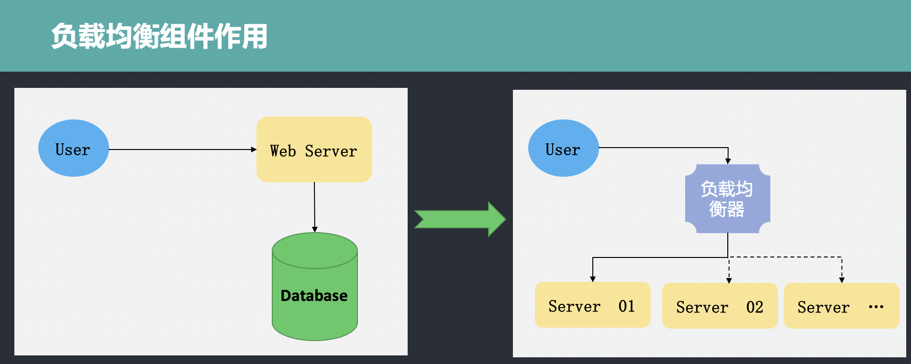

# go-micro use (2)
**@author: Davie**
**Copyright: Beijing Qianfeng Internet Technology Co., Ltd.**

## Micro Load Balancing Components--Selector

### background
In the introduction course in Go-micro, we said that go-micro has a load balancing function. The so-called load balancing, in English, is Load Balance, which means to balance and distribute the load to multiple operation units for execution. For example, Web server, application server, micro-service program server, etc., in order to achieve the goal of high concurrency.

When there is only one service deployment program, there is no load balancing problem. At this time, all requests are processed by the same server. With the increase of business complexity and function iteration, a single server cannot meet the needs of business growth. It is necessary to rely on distributed to improve the scalability of the system, and then there is the problem of load balancing. Therefore, load balancing components or functions need to be added. The difference between the two and the role of load balancing are as follows:



It can be seen from the figure that the user first accesses the load balancer, and then the load balancer processes the request, and then distributes it to the service programs on different servers for processing.

The load balancer mainly handles four types of requests: HTTP, HTTPS, TCP, and UDP.

### Load balancing algorithm
Since the load balancer is responsible for receiving requests and realizing the distribution of requests, it needs to be forwarded according to certain rules. The load balancer can implement request forwarding according to different rules, and the forwarding rules it follows are called load balancing algorithms. The commonly used load balancing algorithms are as follows:

* Round Robin (round training algorithm): The so-called round training algorithm, its meaning is very simple, is to queue up and distribute in a certain order. When a request queue needs to be forwarded, the first server in the available service list is selected for the first request, and the second server in the service list is selected for the next request. Follow this rule to select and distribute in sequence until the last one in the server list is selected. When the list is forwarded for the first time, re-select the first server for distribution, which is a round-robin training.

* Least Connections (least connection): Because there are multiple server programs running in a distributed system, the number of connection requests processed by each server at a certain time is different. Therefore, when a new request needs to be forwarded, in accordance with the principle of the minimum number of connections, the load balancer will limit the selection of the server with the smallest number of current connections as the forwarding rule.

* Source: Another common way is to hash the requested IP, match the server to be forwarded according to the settlement result, and then forward it. This way can ensure to a certain extent that specific users can connect to the same server.

### Mico's Selector
Selector means selector in English. The Selector component is implemented in Micro and runs on the client to achieve load balancing. When the client needs to call the server method, the client will select a service instance in the service registration according to the load balancing strategy specified in its internal selector component. The Selector in Go-micro is based on the Register module and provides a load balancing strategy. It also provides functions such as filtering, caching, and blacklisting.

### Selector definition
First, let us look at the definition of Selector:
```go
type Selector interface {
	Init(opts ...Option) error
	Options() Options
	// Select returns a function which should return the next node
	Select(service string, opts ...SelectOption) (Next, error)
	// Mark sets the success/error against a node
	Mark(service string, node *registry.Node, err error)
	// Reset returns state back to zero for a service
	Reset(service string)
	// Close renders the selector unusable
	Close() error
	// Name of the selector
	String() string
}
```

The above is the definition of Selector in the go-micro framework. The Selector interface definition includes Init, Options, Mark, Reset, Close, and String methods. Among them, Select is the core method, which can implement a custom load balancing strategy, the Mark method is used to mark the status of the service node, and the String method returns the name of the custom load balancer.

### DefaultSelector
In the selector package, in addition to the Selector interface definition, it also contains the definition of DefaultSelector, which is used as the default load balancer of go-micro. DefaultSelector is created by the NewSelector function. The NewSelector function is implemented as follows:
```go
func NewSelector(opts ...Option) Selector {
	sopts := Options{
		Strategy: Random,
	}

	for _, opt := range opts {
		opt(&sopts)
	}

	if sopts.Registry == nil {
		sopts.Registry = registry.DefaultRegistry
	}

	s := ®istrySelector{
		so: sopts,
	}
	s.rc = s.newCache()

	return s
}
```

In NewSelector, the registrySelector object is instantiated and returned. In the process of instantiation, the Options option of Selector is configured. The default configuration is Random. If we look further, we will find that Random is a func, defined as follows:
```go
func Random(services []*registry.Service) Next {
	var nodes []*registry.Node

	for _, service := range services {
		nodes = append(nodes, service.Nodes...)
	}

	return func() (*registry.Node, error) {
		if len(nodes) == 0 {
			return nil, ErrNoneAvailable
		}

		i := rand.Int()% len(nodes)
		return nodes[i], nil
	}
}
```

This algorithm is the default load balancer in go-micro, and a service node is randomly selected for distribution; in addition to the Random algorithm, you can also see the RoundRobin algorithm, as shown below:
```go
func RoundRobin(services []*registry.Service) Next {
	var nodes []*registry.Node

	for _, service := range services {
		nodes = append(nodes, service.Nodes...)
	}

	var i = rand.Int()
	var mtx sync.Mutex

	return func() (*registry.Node, error) {
		if len(nodes) == 0 {
			return nil, ErrNoneAvailable
		}

		mtx.Lock()
		node := nodes[i%len(nodes)]
		i++
		mtx.Unlock()
		return node, nil
	}
}
```

### registrySelector
registrySelector is the structure definition in the default.go file under the selector package. The specific definition is as follows:
```go
type registrySelector struct {
	so Options
	rc cache.Cache
}
```

#### Cache
There is already a load balancer. We can see that in the definition of Selector, there is also a cache.Cache structure type. What does this do?

With the Selector, we have to query the Register component every time we request the load balancer, which invisibly increases the cost and reduces the efficiency, and there is no way to achieve high availability. In order to solve the above problems, a cache is designed when the Selector is designed, and the Selector caches the service list data that it has queried into the local Cache. When forwarding needs to be processed, first look in the cache, and if it can be found, it will be distributed; if it is not in the cache, the request service will be executed to find the registered component, and then cached locally.
The specific implementation mechanism is as follows:
```go
type Cache interface {
	// embed the registry interface
	registry.Registry
	// stop the cache watcher
	Stop()
}

func (c *cache) watch(w registry.Watcher) error {
	// used to stop the watch
	stop := make(chan bool)

	// manage this loop
	go func() {
		defer w.Stop()

		select {
		// wait for exit
		case <-c.exit:
			return
		// we've been stopped
		case <-stop:
			return
		}
	}()

	for {
		res, err := w.Next()
		if err != nil {
			close(stop)
			return err
		}
		c.update(res)
	}
}
```

The update, creation, and removal of the cache are implemented through watch.

#### Blacklist
After understanding the cache, let's look at other methods in Selector. In the definition of the Selector interface, you can also see the declarations of Mark and Resetf. The specific statement is as follows:

```go
// Mark sets the success/error against a node
Mark(service string, node *registry.Node, err error)
// Reset returns state back to zero for a service
Reset(service string)
```
The Mark method can be used to mark the status of a certain node in the service registration and discovery component, because in some cases, the load balancer tracks the execution of the request. If the request is forwarded to the service node on a certain day, and the execution fails for many times, it means that the node status is abnormal. At this time, the node can be set to a blacklist through the Mark method to filter out the abnormal nodes.

Google Translate
মূল পাঠ্য
// Reset returns state back to zero for a service
একটি আরও ভালো অনুবাদ দিন
